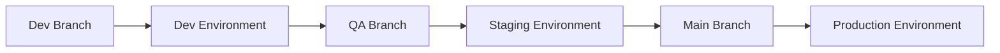

# Infrastructure as Code Pipelines: A Comprehensive Guide

Implementing CI/CD for infrastructure code requires different considerations than application code. This guide explores how to build robust, secure, and efficient pipelines for Terraform deployments.

## Why CI/CD for Infrastructure?

1. **Consistency**
   - Eliminates manual errors
   - Ensures repeatable deployments
   - Maintains configuration drift control

2. **Security**
   - Enforces approval workflows
   - Implements security scanning
   - Manages sensitive credentials

3. **Collaboration**
   - Enables team reviews
   - Maintains deployment history
   - Facilitates knowledge sharing

## Pipeline Design Principles

### 1. Multi-Environment Strategy



### 2. Standard Pipeline Stages

```yaml
stages:
  - validate     # Syntax checking and format validation
  - plan        # Generate and review changes
  - security    # Security scanning and policy checks
  - approve     # Manual approval gate
  - apply       # Apply changes
  - verify      # Post-deployment verification
```

### 3. State Management

```hcl
# backend.tf
terraform {
  backend "s3" {
    bucket         = "terraform-state"
    key            = "env/${TF_WORKSPACE}/terraform.tfstate"
    region         = "us-west-2"
    encrypt        = true
    dynamodb_table = "terraform-locks"
  }
}
```

## Security Best Practices

### 1. Credential Management

```hcl
# Using environment variables
provider "aws" {
  region     = var.region
  assume_role {
    role_arn = var.deployment_role_arn
  }
}
```

### 2. Policy Checks

```hcl
# Example OPA policy
package terraform

deny[msg] {
    resource := input.planned_values.root_module.resources[_]
    resource.type == "aws_s3_bucket"
    not resource.values.server_side_encryption_configuration

    msg = sprintf("S3 bucket %v must have encryption enabled", [resource.address])
}
```

### 3. Access Controls

- Use service accounts for CI/CD
- Implement least privilege access
- Rotate credentials regularly

## Pipeline Components

### 1. Pre-Commit Checks

```yaml
# .pre-commit-config.yaml
repos:
  - repo: https://github.com/antonbabenko/pre-commit-terraform
    rev: v1.83.5
    hooks:
      - id: terraform_fmt
      - id: terraform_docs
      - id: terraform_tflint
      - id: terraform_validate
      - id: terraform_checkov
```

### 2. Validation Steps

```bash
#!/bin/bash
# validate.sh

# Format check
terraform fmt -check

# Initialize Terraform
terraform init -backend=true

# Validate syntax
terraform validate

# Run tflint
tflint --minimum-failure-severity=error

# Run checkov
checkov -d .
```

### 3. Plan Generation

```bash
#!/bin/bash
# plan.sh

# Generate plan
terraform plan -out=tfplan

# Convert to JSON for analysis
terraform show -json tfplan > tfplan.json

# Analyze plan
jq -r '
  .resource_changes[] |
  select(.change.actions[] != "no-op") |
  "\(.change.actions[]) \(.address)"
' tfplan.json
```

### 4. Apply Safeguards

```bash
#!/bin/bash
# apply.sh

# Verify plan is recent
if [ $(( $(date +%s) - $(stat -f %m tfplan) )) -gt 3600 ]; then
  echo "Plan is more than 1 hour old. Please generate a new plan."
  exit 1
fi

# Apply with auto-approve
terraform apply tfplan
```

## Monitoring and Logging

### 1. Pipeline Metrics

```ruby
# Example monitoring configuration
monitoring:
  metrics:
    - name: pipeline_duration
      type: gauge
      labels:
        - environment
        - status
    - name: terraform_changes
      type: counter
      labels:
        - resource_type
        - action
```

### 2. Audit Logging

```hcl
# Enable AWS CloudTrail for API logging
resource "aws_cloudtrail" "terraform_audit" {
  name                          = "terraform-audit-trail"
  s3_bucket_name               = aws_s3_bucket.audit_logs.id
  include_global_service_events = true
  is_multi_region_trail        = true
  
  event_selector {
    read_write_type           = "WriteOnly"
    include_management_events = true
  }
}
```

## Error Handling

### 1. Retry Logic

```bash
#!/bin/bash
# retry-wrapper.sh

MAX_ATTEMPTS=3
DELAY=10

attempt=1
until terraform apply -auto-approve tfplan || [ $attempt -eq $MAX_ATTEMPTS ]; do
  echo "Apply failed, attempt $attempt of $MAX_ATTEMPTS"
  attempt=$((attempt + 1))
  sleep $DELAY
done
```

### 2. Rollback Strategies

```hcl
# Maintain previous state version
terraform {
  backend "s3" {
    bucket         = "terraform-state"
    key            = "env/${TF_WORKSPACE}/terraform.tfstate"
    region         = "us-west-2"
    encrypt        = true
    dynamodb_table = "terraform-locks"
    versioning    = true
  }
}
```

## Best Practices

1. **State Management**
   - Use remote state storage
   - Enable state locking
   - Implement state backup

2. **Change Control**
   - Require peer reviews
   - Implement approval gates
   - Document changes

3. **Testing**
   - Run policy checks
   - Validate configurations
   - Test infrastructure

4. **Security**
   - Scan for vulnerabilities
   - Implement least privilege
   - Encrypt sensitive data

## Next Steps

In the next post, we'll explore platform-specific implementations for:
- Jenkins
- GitLab CI
- CircleCI

Each with detailed examples and best practices for their unique features and capabilities.

## Additional Resources

- [Terraform CI/CD Best Practices](https://www.terraform.io/docs/cloud/guides/recommended-practices/index.html)
- [Infrastructure Testing Guide](https://www.gruntwork.io/guides/testing-best-practices)
- [Security in CI/CD Pipelines](https://owasp.org/www-project-devsecops-guideline/)
