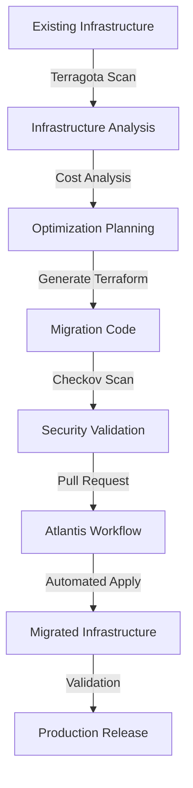

# Advanced Terraform Tooling: A Deep Dive

Managing infrastructure at scale requires specialized tools beyond basic Terraform. This guide explores three powerful tools that can enhance your infrastructure management capabilities: Checkov for security and compliance, Terragota for migration and analysis, and Atlantis for GitOps workflows.

## Checkov: Security and Compliance Scanner

Checkov is an infrastructure-as-code static analysis tool that helps prevent cloud misconfigurations and security issues before deployment.

### Key Features for Migration

```hcl
# Example resource with Checkov annotations
# checkov:skip=CKV_AWS_116:Reason for skipping
resource "aws_s3_bucket" "migration_data" {
  bucket = "migration-data-bucket"
  
  versioning {
    enabled = true  # Required by CKV_AWS_21
  }
  
  server_side_encryption_configuration {
    rule {
      apply_server_side_encryption_by_default {
        sse_algorithm = "AES256"  # Required by CKV_AWS_19
      }
    }
  }
}
```

### Cost-Related Checks

Checkov can identify potential cost issues through custom policies:

```python
# custom_checks/cost_policy.py
from checkov.common.models.enums import CheckResult, CheckCategories
from checkov.terraform.checks.resource.base_resource_check import BaseResourceCheck

class InstanceSizeCheck(BaseResourceCheck):
    def __init__(self):
        name = "Ensure instance sizes are cost-optimized"
        id = "CKV_CUSTOM_1"
        supported_resources = ['aws_instance']
        categories = [CheckCategories.COST]
        super().__init__(name=name, id=id, categories=categories, supported_resources=supported_resources)

    def scan_resource_conf(self, conf):
        if 'instance_type' in conf.keys():
            instance_type = conf['instance_type'][0]
            if instance_type.startswith('x1') or instance_type.startswith('p3'):
                return CheckResult.FAILED, f"Instance type {instance_type} is expensive"
        return CheckResult.PASSED, "Instance type is cost-optimized"
```

### Migration Workflow Integration

```yaml
# .github/workflows/migration-check.yml
name: Migration Security Check
on: [pull_request]

jobs:
  checkov-scan:
    runs-on: ubuntu-latest
    steps:
      - uses: actions/checkout@v2
      - name: Run Checkov scan
        uses: bridgecrewio/checkov-action@master
        with:
          directory: terraform/
          framework: terraform
          soft_fail: true
          output_format: sarif
          download_external_modules: true
```

## Terragota: Infrastructure Analysis and Migration

Terragota helps analyze existing infrastructure and generate Terraform configurations, making it valuable for migration projects.

### Infrastructure Discovery

```bash
# Scan existing AWS infrastructure
terragota scan aws \
  --region us-west-2 \
  --services "ec2,rds,s3" \
  --output-dir terraform/discovered

# Generate cost analysis report
terragota analyze costs \
  --input-dir terraform/discovered \
  --output-format json \
  > cost-analysis.json
```

### Migration Strategy Generation

```hcl
# Example Terragota-generated migration plan
module "migration_phase_1" {
  source = "./modules/migration"
  
  depends_on = [module.prerequisite_resources]
  
  migration_wave = "wave1"
  resources_to_migrate = {
    compute = local.wave1_compute
    storage = local.wave1_storage
    network = local.wave1_network
  }
  
  transition_strategy = {
    parallel_limit = 5
    backup_enabled = true
    rollback_plan  = "automatic"
  }
}
```

### Cost Optimization Features

```hcl
# Terragota cost optimization suggestions
resource "aws_instance" "optimized" {
  # Original: instance_type = "m5.2xlarge"
  # Suggested: Based on usage patterns
  instance_type = "m5.xlarge"
  
  # Original: ebs_optimized = false
  # Suggested: Enable for better performance/cost ratio
  ebs_optimized = true
  
  # Added: Use Spot instances where applicable
  instance_market_options {
    market_type = "spot"
    spot_options {
      max_price = "0.50"
    }
  }
}
```

## Atlantis: GitOps Workflow Automation

Atlantis automates Terraform workflows through pull requests, enabling GitOps practices for infrastructure management.

### Basic Setup

```yaml
# atlantis.yaml
version: 3
projects:
- name: migration-project
  dir: terraform/migration
  workspace: staging
  terraform_version: v1.5.0
  delete_source_branch_on_merge: true
  autoplan:
    when_modified: ["*.tf", "../modules/**/*.tf"]
    enabled: true
```

### Advanced Workflows

```yaml
# Custom workflow for migration projects
workflows:
  migration:
    plan:
      steps:
      - init:
          extra_args: [-backend-config=environments/staging.backend]
      - plan:
          extra_args: [-var-file=environments/staging.tfvars]
      - show:
          extra_args: [-json]
      - run: checkov -d . --quiet
    apply:
      steps:
      - apply:
          extra_args: [-auto-approve]
      - run: ./scripts/post-migration-validation.sh
```

### Cost Control Integration

```yaml
# Cost-aware Atlantis configuration
workflows:
  cost-controlled:
    plan:
      steps:
      - run: infracost breakdown --path .
      - init
      - plan
      - run: |
          if [[ $(infracost output --path . --format json | jq '.totalMonthlyCost') > 1000 ]]; then
            echo "Monthly cost exceeds budget!"
            exit 1
          fi
```

## Best Practices for Tool Integration

1. **Automated Validation Pipeline**
   - Run Checkov scans in CI/CD
   - Use Terragota for infrastructure analysis
   - Implement Atlantis for GitOps workflows

2. **Cost Management**
   - Regular cost analysis with Terragota
   - Budget enforcement in Atlantis
   - Custom Checkov policies for cost optimization

3. **Migration Strategy**
   - Incremental migrations using Terragota
   - Security validation with Checkov
   - Automated approvals through Atlantis

4. **GitOps Implementation**
   - Infrastructure as Code review process
   - Automated plan and apply workflows
   - Audit trail for all changes

## Example: Complete Migration Workflow



## Conclusion

The combination of Checkov, Terragota, and Atlantis provides a robust toolkit for managing infrastructure migrations, controlling costs, and implementing GitOps practices. By leveraging these tools effectively, organizations can ensure secure, cost-effective, and well-managed infrastructure deployments.

## Additional Resources

- [Checkov Documentation](https://www.checkov.io/1.Welcome/What%20is%20Checkov.html)
- [Terragota User Guide](https://terragota.io/docs/)
- [Atlantis Getting Started](https://www.runatlantis.io/guide/getting-started.html)
- [GitOps Best Practices](https://www.weave.works/technologies/gitops/)
- [Infrastructure Cost Optimization](https://aws.amazon.com/architecture/cost-optimization/)
