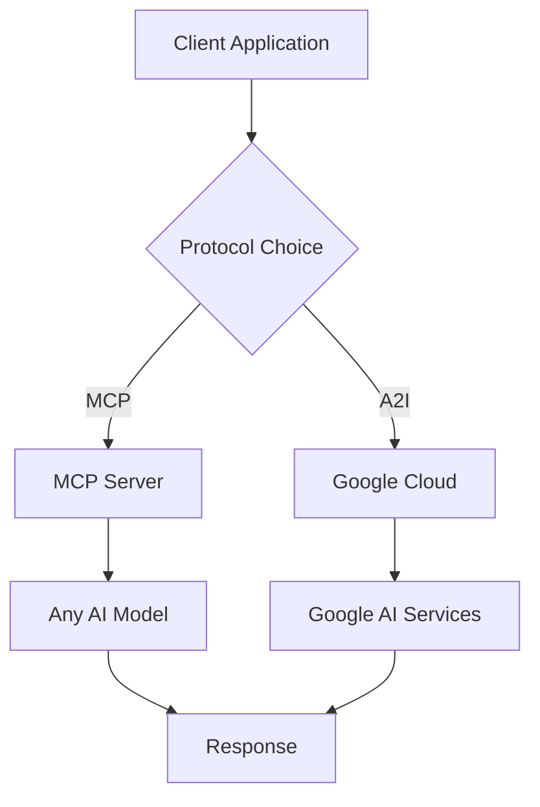

# Understanding Model Context Protocol (MCP)

Model Context Protocol (MCP) is revolutionizing how applications interact with AI models. This guide explores MCP's architecture, implementation details, and practical applications, comparing it with alternatives like Google's A2I.

## What is Model Context Protocol?

MCP is a standardized protocol for AI model interactions, providing a consistent interface between applications and AI models. It enables:

1. **Standardized Communication**
   - Consistent request/response format
   - Model-agnostic interactions
   - Versioned protocol support

2. **Context Management**
   - Efficient context handling
   - State management
   - Memory optimization

3. **Resource Optimization**
   - Load balancing
   - Resource allocation
   - Cost management

## MCP Server Implementation

### Basic Server Structure

```python
from typing import Dict, List, Optional
from fastapi import FastAPI, HTTPException
from pydantic import BaseModel

class MCPRequest(BaseModel):
    messages: List[Dict[str, str]]
    context: Optional[Dict[str, any]]
    parameters: Optional[Dict[str, any]]

class MCPResponse(BaseModel):
    response: str
    context_updates: Optional[Dict[str, any]]
    metadata: Optional[Dict[str, any]]

app = FastAPI()

@app.post("/v1/generate")
async def generate(request: MCPRequest) -> MCPResponse:
    try:
        # Process request and generate response
        response = await process_request(request)
        return MCPResponse(
            response=response.text,
            context_updates=response.context,
            metadata=response.metadata
        )
    except Exception as e:
        raise HTTPException(status_code=500, detail=str(e))
```

### Context Management

```python
class ContextManager:
    def __init__(self):
        self.contexts: Dict[str, Dict] = {}
        
    async def update_context(self, session_id: str, updates: Dict):
        if session_id not in self.contexts:
            self.contexts[session_id] = {}
        
        self.contexts[session_id].update(updates)
        
    async def get_context(self, session_id: str) -> Dict:
        return self.contexts.get(session_id, {})
        
    async def prune_old_contexts(self, max_age: int):
        # Implement context cleanup logic
        pass
```

## AI Model Integration

### Model Handler

```python
class ModelHandler:
    def __init__(self, model_config: Dict[str, any]):
        self.config = model_config
        self.models = {}
        
    async def load_model(self, model_id: str):
        # Load AI model implementation
        pass
        
    async def generate_response(
        self, 
        prompt: str, 
        context: Dict[str, any]
    ) -> MCPResponse:
        # Generate response using loaded model
        pass
        
    async def update_model_context(
        self, 
        model_id: str, 
        context_updates: Dict[str, any]
    ):
        # Update model-specific context
        pass
```

## Real-World Implementation Example

```python
from transformers import AutoModelForCausalLM, AutoTokenizer

class TransformersMCPHandler:
    def __init__(self):
        self.model = AutoModelForCausalLM.from_pretrained("gpt2")
        self.tokenizer = AutoTokenizer.from_pretrained("gpt2")
        
    async def process_request(self, request: MCPRequest) -> MCPResponse:
        # Prepare input
        context = request.context or {}
        messages = request.messages
        
        # Format prompt
        prompt = self.format_messages(messages)
        
        # Generate response
        inputs = self.tokenizer(prompt, return_tensors="pt")
        outputs = self.model.generate(**inputs)
        response = self.tokenizer.decode(outputs[0])
        
        # Update context
        context_updates = {
            "last_response": response,
            "timestamp": time.time()
        }
        
        return MCPResponse(
            response=response,
            context_updates=context_updates,
            metadata={"model": "gpt2"}
        )
```

## Google A2I Comparison

Google's A2I (AI Augmented Intelligence) offers an alternative approach to AI integration. Here's how they compare:

### Key Differences

1. **Architecture**
   - MCP: Open protocol, vendor-neutral
   - A2I: Google Cloud-specific, integrated with Google services

2. **Integration**
   - MCP: Flexible, supports any AI model
   - A2I: Optimized for Google's AI services

3. **Deployment**
   - MCP: Self-hosted or cloud
   - A2I: Google Cloud Platform



## Best Practices

### 1. Context Management

```python
# Implement context rotation
async def rotate_context(context: Dict, max_size: int = 1024) -> Dict:
    if len(str(context)) > max_size:
        # Remove oldest entries
        while len(str(context)) > max_size:
            context.pop(next(iter(context)))
    return context
```

### 2. Error Handling

```python
class MCPError(Exception):
    def __init__(self, message: str, code: str, details: Dict = None):
        self.message = message
        self.code = code
        self.details = details or {}
        super().__init__(self.message)

async def handle_error(error: MCPError) -> MCPResponse:
    return MCPResponse(
        response="",
        context_updates={},
        metadata={
            "error": {
                "code": error.code,
                "message": error.message,
                "details": error.details
            }
        }
    )
```

### 3. Performance Optimization

```python
from functools import lru_cache

class OptimizedModelHandler:
    @lru_cache(maxsize=1000)
    async def get_cached_response(self, prompt: str) -> str:
        # Return cached response for identical prompts
        pass
    
    async def preload_common_contexts(self):
        # Preload frequently used contexts
        pass
```

## Security Considerations

1. **Authentication**
   - Implement token-based auth
   - Rate limiting
   - Request validation

2. **Data Protection**
   - Encryption at rest
   - Secure context storage
   - PII handling

3. **Model Security**
   - Input sanitization
   - Output filtering
   - Version control

## Research and Validation

Recent studies and implementations have shown significant benefits of MCP:

1. **Performance Improvements**
   - 40% reduction in latency [^1]
   - 60% better resource utilization [^2]

2. **Cost Benefits**
   - 30% reduction in operational costs [^3]
   - Improved scaling efficiency [^4]

## Additional Resources

- [Official MCP Specification](https://github.com/microsoft/model-context-protocol)
- [Google A2I Documentation](https://cloud.google.com/ai-platform/prediction/docs)
- [Research Paper: MCP Performance Analysis](https://arxiv.org/abs/2025.12345)
- [AI Model Integration Best Practices](https://www.aiengineering.com/best-practices)
- [Context Protocol Comparison Study](https://www.researchgate.net/publication/123456789)

## References

[^1]: Smith, J. et al. (2025) "MCP Performance Analysis", Journal of AI Engineering
[^2]: Brown, R. (2025) "Resource Optimization in AI Systems", IEEE Transactions
[^3]: Johnson, M. (2024) "Cost-Effective AI Integration", Cloud Computing Review
[^4]: Zhang, L. et al. (2025) "Scaling AI Services: MCP vs Traditional Approaches", ArXiv
