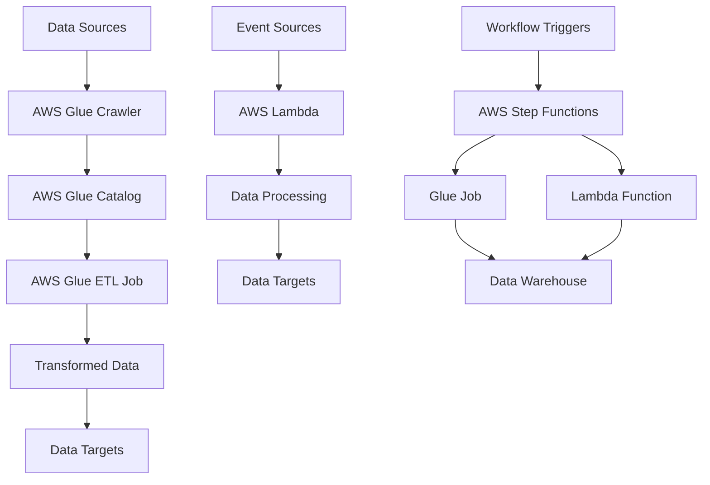

## Introduction

Welcome to Part 2 of our ETL series! In [Part 1](/posts/etl-fundamentals-basics/), we covered ETL fundamentals and built a simple Python-based pipeline. Now we'll dive into **AWS-based ETL solutions**, leveraging cloud services for scalable, managed data processing.

This medium-level guide focuses on AWS services that make ETL pipelines more robust, scalable, and maintainable. We'll cover AWS Glue, Lambda functions, Step Functions, and build complete data workflows.

## AWS ETL Architecture Overview

### Core AWS ETL Services



### Service Comparison

| Service            | Use Case                                 | Scaling        | Management    | Cost                   |
| ------------------ | ---------------------------------------- | -------------- | ------------- | ---------------------- |
| **AWS Glue**       | Batch ETL, complex transformations       | Auto-scaling   | Fully managed | Per DPU-hour           |
| **Lambda**         | Event-driven ETL, lightweight processing | Auto-scaling   | Serverless    | Per request + duration |
| **Step Functions** | Workflow orchestration                   | Manual scaling | Managed       | Per state transition   |
| **Data Pipeline**  | Legacy batch processing                  | Manual scaling | Managed       | Per pipeline hour      |

## AWS Glue: Managed ETL Service

AWS Glue is a fully managed ETL service that makes it easy to prepare and load data for analytics.

### Key Components

#### 1. Glue Crawlers

Automatically discover and catalog data:

```python
# crawler_config.py
import boto3
from botocore.exceptions import ClientError

class GlueCrawlerManager:
    def __init__(self, region='us-east-1'):
        self.client = boto3.client('glue', region_name=region)

    def create_crawler(self, crawler_config):
        """Create a Glue crawler"""
        try:
            response = self.client.create_crawler(**crawler_config)
            print(f"Created crawler: {crawler_config['Name']}")
            return response
        except ClientError as e:
            print(f"Error creating crawler: {e}")
            raise

    def run_crawler(self, crawler_name):
        """Run a crawler to update catalog"""
        try:
            response = self.client.start_crawler(Name=crawler_name)
            print(f"Started crawler: {crawler_name}")
            return response
        except ClientError as e:
            print(f"Error running crawler: {e}")
            raise

# Example crawler configuration
crawler_config = {
    'Name': 'customer-data-crawler',
    'Role': 'AWSGlueServiceRole',
    'DatabaseName': 'customer_db',
    'Description': 'Crawler for customer CSV files',
    'Targets': {
        'S3Targets': [
            {
                'Path': 's3://my-etl-bucket/raw-data/customers/',
                'Exclusions': ['*.tmp', '*.log']
            }
        ]
    },
    'Schedule': 'cron(0 2 * * ? *)',  # Daily at 2 AM
    'SchemaChangePolicy': {
        'UpdateBehavior': 'UPDATE_IN_DATABASE',
        'DeleteBehavior': 'DEPRECATE_IN_DATABASE'
    }
}
```

#### 2. Glue Catalog

Central metadata repository:

```python
class GlueCatalogManager:
    def __init__(self, region='us-east-1'):
        self.client = boto3.client('glue', region_name=region)

    def create_database(self, database_name, description=''):
        """Create a database in Glue Catalog"""
        try:
            response = self.client.create_database(
                DatabaseInput={
                    'Name': database_name,
                    'Description': description
                }
            )
            print(f"Created database: {database_name}")
            return response
        except ClientError as e:
            print(f"Error creating database: {e}")
            raise

    def get_table_metadata(self, database_name, table_name):
        """Get table metadata from catalog"""
        try:
            response = self.client.get_table(
                DatabaseName=database_name,
                Name=table_name
            )
            return response['Table']
        except ClientError as e:
            print(f"Error getting table metadata: {e}")
            raise

    def update_table_schema(self, database_name, table_name, schema_changes):
        """Update table schema"""
        try:
            response = self.client.update_table(
                DatabaseName=database_name,
                TableInput={
                    'Name': table_name,
                    'StorageDescriptor': {
                        'Columns': schema_changes['columns'],
                        'Location': schema_changes['location'],
                        'InputFormat': schema_changes['input_format'],
                        'OutputFormat': schema_changes['output_format'],
                        'SerdeInfo': schema_changes['serde_info']
                    }
                }
            )
            print(f"Updated schema for table: {table_name}")
            return response
        except ClientError as e:
            print(f"Error updating table schema: {e}")
            raise
```

#### 3. Glue ETL Jobs

Write ETL logic in Python or Scala:

```python
# glue_etl_job.py
import sys
from awsglue.transforms import *
from awsglue.utils import getResolvedOptions
from pyspark.context import SparkContext
from awsglue.context import GlueContext
from awsglue.job import Job

## @params: [JOB_NAME]
args = getResolvedOptions(sys.argv, ['JOB_NAME'])

sc = SparkContext()
glueContext = GlueContext(sc)
spark = glueContext.spark_session
job = Job(glueContext)
job.init(args['JOB_NAME'], args)

# Read data from Glue Catalog
datasource0 = glueContext.create_dynamic_frame.from_catalog(
    database="customer_db",
    table_name="customers_raw",
    transformation_ctx="datasource0"
)

# Apply transformations
# 1. Drop duplicates
deduplicated = datasource0.dropDuplicates()

# 2. Filter invalid records
filtered = deduplicated.filter(
    lambda row: row["email"] is not None and "@" in row["email"]
)

# 3. Add derived columns
transformed = filtered.map(
    lambda row: {
        **row,
        "customer_segment": "High" if row["purchase_amount"] > 500
                        else "Medium" if row["purchase_amount"] > 100
                        else "Low",
        "processed_date": datetime.now().isoformat()
    }
)

# 4. Join with reference data
reference_datasource = glueContext.create_dynamic_frame.from_catalog(
    database="reference_db",
    table_name="country_codes",
    transformation_ctx="reference_datasource"
)

joined = transformed.join(
    ["country"],
    reference_datasource,
    ["country_name"],
    "left"
)

# Write to S3 in Parquet format
output_path = "s3://my-etl-bucket/processed-data/customers/"

glueContext.write_dynamic_frame.from_options(
    frame=joined,
    connection_type="s3",
    connection_options={
        "path": output_path,
        "partitionKeys": ["country", "customer_segment"]
    },
    format="parquet",
    transformation_ctx="output"
)

job.commit()
```

### Glue Job Configuration

```yaml
# glue_job_config.yaml
job_name: customer-etl-job
role: arn:aws:iam::123456789012:role/AWSGlueServiceRole
command:
  name: glueetl
  scriptLocation: s3://my-etl-bucket/scripts/glue_etl_job.py
  pythonVersion: 3
default_arguments:
  --job-bookmark-option: job-bookmark-enable
  --enable-metrics: ""
  --enable-spark-ui: "true"
  --spark-event-logs-path: s3://my-etl-bucket/logs/spark-events/
execution_property:
  max_concurrent_runs: 3
timeout: 2880 # 48 hours
max_retries: 2
worker_type: G.2X
number_of_workers: 10
glue_version: 3.0
```

## AWS Lambda: Serverless ETL

Lambda functions are perfect for lightweight ETL tasks and event-driven processing.

### Lambda ETL Patterns

#### 1. S3 Event-Triggered ETL

```python
# lambda_s3_etl.py
import json
import boto3
import pandas as pd
from io import StringIO, BytesIO
import logging

logger = logging.getLogger()
logger.setLevel(logging.INFO)

s3_client = boto3.client('s3')
glue_client = boto3.client('glue')

def lambda_handler(event, context):
    """Process S3 file upload events"""
    try:
        for record in event['Records']:
            bucket = record['s3']['bucket']['name']
            key = record['s3']['object']['key']

            logger.info(f"Processing file: s3://{bucket}/{key}")

            # Process the file
            process_file(bucket, key)

        return {
            'statusCode': 200,
            'body': json.dumps('ETL processing completed')
        }

    except Exception as e:
        logger.error(f"Error processing ETL: {str(e)}")
        raise

def process_file(bucket, key):
    """Process individual file"""
    try:
        # Read file from S3
        response = s3_client.get_object(Bucket=bucket, Key=key)
        content = response['Body'].read().decode('utf-8')

        # Determine file type and process accordingly
        if key.endswith('.csv'):
            df = pd.read_csv(StringIO(content))
            processed_df = transform_csv_data(df)
        elif key.endswith('.json'):
            data = json.loads(content)
            df = pd.json_normalize(data)
            processed_df = transform_json_data(df)
        else:
            logger.warning(f"Unsupported file type: {key}")
            return

        # Write processed data back to S3
        output_key = key.replace('raw-data', 'processed-data').replace(
            '.csv', '.parquet'
        ).replace('.json', '.parquet')

        # Convert to Parquet
        buffer = BytesIO()
        processed_df.to_parquet(buffer, index=False)
        buffer.seek(0)

        s3_client.put_object(
            Bucket=bucket,
            Key=output_key,
            Body=buffer.getvalue()
        )

        # Update Glue catalog (optional)
        update_glue_catalog(bucket, output_key, processed_df)

        logger.info(f"Processed and saved: s3://{bucket}/{output_key}")

    except Exception as e:
        logger.error(f"Error processing file {key}: {str(e)}")
        raise

def transform_csv_data(df):
    """Transform CSV data"""
    # Remove duplicates
    df = df.drop_duplicates()

    # Handle missing values
    df = df.fillna({
        'name': 'Unknown',
        'email': 'unknown@example.com',
        'amount': 0
    })

    # Add processing timestamp
    df['processed_at'] = pd.Timestamp.now()

    # Data validation
    df = df[df['amount'] >= 0]  # Remove negative amounts

    return df

def transform_json_data(df):
    """Transform JSON data"""
    # Similar transformations for JSON data
    df = df.drop_duplicates()
    df['processed_at'] = pd.Timestamp.now()

    return df

def update_glue_catalog(bucket, key, df):
    """Update Glue catalog with new table metadata"""
    try:
        # This is a simplified example
        # In production, you'd create proper table definitions
        table_name = key.split('/')[-1].replace('.parquet', '')

        # Trigger Glue crawler or manually update catalog
        glue_client.start_crawler(Name='processed-data-crawler')

    except Exception as e:
        logger.warning(f"Failed to update Glue catalog: {str(e)}")
```

#### 2. API Data Ingestion

```python
# lambda_api_ingestion.py
import json
import boto3
import requests
from datetime import datetime, timedelta
import logging

logger = logging.getLogger()
logger.setLevel(logging.INFO)

s3_client = boto3.client('s3')
ssm_client = boto3.client('ssm')

def lambda_handler(event, context):
    """Ingest data from external APIs"""
    try:
        # Get API credentials from SSM Parameter Store
        api_key = get_parameter('/etl/api-key')
        api_url = get_parameter('/etl/api-url')

        # Ingest data from multiple endpoints
        endpoints = [
            'customers',
            'products',
            'orders'
        ]

        for endpoint in endpoints:
            data = fetch_api_data(f"{api_url}/{endpoint}", api_key)
            if data:
                save_to_s3(data, endpoint)

        return {
            'statusCode': 200,
            'body': json.dumps('API ingestion completed')
        }

    except Exception as e:
        logger.error(f"API ingestion failed: {str(e)}")
        raise

def get_parameter(parameter_name):
    """Get parameter from SSM"""
    try:
        response = ssm_client.get_parameter(
            Name=parameter_name,
            WithDecryption=True
        )
        return response['Parameter']['Value']
    except Exception as e:
        logger.error(f"Failed to get parameter {parameter_name}: {str(e)}")
        raise

def fetch_api_data(url, api_key, params=None):
    """Fetch data from API"""
    headers = {
        'Authorization': f'Bearer {api_key}',
        'Content-Type': 'application/json'
    }

    try:
        response = requests.get(url, headers=headers, params=params)
        response.raise_for_status()

        data = response.json()

        # Add metadata
        if isinstance(data, list):
            for item in data:
                item['_ingested_at'] = datetime.now().isoformat()
        else:
            data['_ingested_at'] = datetime.now().isoformat()

        logger.info(f"Fetched {len(data) if isinstance(data, list) else 1} records from {url}")
        return data

    except requests.exceptions.RequestException as e:
        logger.error(f"API request failed for {url}: {str(e)}")
        return None

def save_to_s3(data, endpoint):
    """Save data to S3"""
    try:
        timestamp = datetime.now().strftime('%Y%m%d_%H%M%S')
        key = f"raw-api-data/{endpoint}/{endpoint}_{timestamp}.json"

        s3_client.put_object(
            Bucket='my-etl-bucket',
            Key=key,
            Body=json.dumps(data, indent=2),
            ContentType='application/json'
        )

        logger.info(f"Saved {len(data) if isinstance(data, list) else 1} records to s3://my-etl-bucket/{key}")

    except Exception as e:
        logger.error(f"Failed to save data to S3: {str(e)}")
        raise
```

### Lambda Configuration

```yaml
# lambda_config.yaml
function_name: etl-s3-processor
runtime: python3.9
handler: lambda_s3_etl.lambda_handler
memory_size: 1024
timeout: 900 # 15 minutes
environment_variables:
  LOG_LEVEL: INFO
  S3_BUCKET: my-etl-bucket
  GLUE_DATABASE: customer_db

# IAM permissions needed
iam_policies:
  - arn:aws:iam::aws:policy/service-role/AWSLambdaBasicExecutionRole
  - arn:aws:iam::aws:policy/AmazonS3FullAccess
  - arn:aws:iam::aws:policy/AWSGlueConsoleFullAccess
  - arn:aws:iam::aws:policy/AmazonSSMReadOnlyAccess

# S3 trigger configuration
s3_trigger:
  bucket: my-etl-bucket
  events:
    - s3:ObjectCreated:*
  prefix: raw-data/
  suffix: .csv
```

## AWS Step Functions: Workflow Orchestration

Step Functions coordinate complex ETL workflows involving multiple services.

### Step Function Definition

```json
{
  "Comment": "ETL Workflow Orchestration",
  "StartAt": "CheckSourceData",
  "States": {
    "CheckSourceData": {
      "Type": "Task",
      "Resource": "arn:aws:lambda:us-east-1:123456789012:function:check-source-data",
      "Next": "BranchOnDataAvailability"
    },
    "BranchOnDataAvailability": {
      "Type": "Choice",
      "Choices": [
        {
          "Variable": "$.dataAvailable",
          "BooleanEquals": true,
          "Next": "RunGlueETL"
        }
      ],
      "Default": "NoDataAvailable"
    },
    "RunGlueETL": {
      "Type": "Task",
      "Resource": "arn:aws:states:::glue:startJobRun",
      "Parameters": {
        "JobName": "customer-etl-job"
      },
      "Next": "CheckETLStatus"
    },
    "CheckETLStatus": {
      "Type": "Task",
      "Resource": "arn:aws:lambda:us-east-1:123456789012:function:check-etl-status",
      "Next": "ETLSuccessChoice"
    },
    "ETLSuccessChoice": {
      "Type": "Choice",
      "Choices": [
        {
          "Variable": "$.etlStatus",
          "StringEquals": "SUCCEEDED",
          "Next": "UpdateDataCatalog"
        }
      ],
      "Default": "ETLFailed"
    },
    "UpdateDataCatalog": {
      "Type": "Task",
      "Resource": "arn:aws:states:::glue:startCrawler",
      "Parameters": {
        "CrawlerName": "processed-data-crawler"
      },
      "Next": "SendSuccessNotification"
    },
    "SendSuccessNotification": {
      "Type": "Task",
      "Resource": "arn:aws:states:::sns:publish",
      "Parameters": {
        "TopicArn": "arn:aws:sns:us-east-1:123456789012:etl-notifications",
        "Message": "ETL workflow completed successfully"
      },
      "End": true
    },
    "ETLFailed": {
      "Type": "Task",
      "Resource": "arn:aws:states:::sns:publish",
      "Parameters": {
        "TopicArn": "arn:aws:sns:us-east-1:123456789012:etl-alerts",
        "Message": "ETL workflow failed",
        "Subject": "ETL Pipeline Alert"
      },
      "End": true
    },
    "NoDataAvailable": {
      "Type": "Pass",
      "Result": "No data to process",
      "End": true
    }
  }
}
```

### Supporting Lambda Functions

```python
# check_source_data.py
import boto3
import json
from datetime import datetime, timedelta

s3_client = boto3.client('s3')

def lambda_handler(event, context):
    """Check if new data is available for processing"""
    bucket = 'my-etl-bucket'
    prefix = 'raw-data/'

    # Check for files modified in last hour
    cutoff_time = datetime.now() - timedelta(hours=1)

    try:
        response = s3_client.list_objects_v2(
            Bucket=bucket,
            Prefix=prefix
        )

        if 'Contents' in response:
            recent_files = [
                obj for obj in response['Contents']
                if obj['LastModified'] > cutoff_time
            ]

            return {
                'dataAvailable': len(recent_files) > 0,
                'fileCount': len(recent_files),
                'files': [obj['Key'] for obj in recent_files]
            }

        return {
            'dataAvailable': False,
            'fileCount': 0,
            'files': []
        }

    except Exception as e:
        print(f"Error checking source data: {str(e)}")
        raise
```

```python
# check_etl_status.py
import boto3
import json
import time

glue_client = boto3.client('glue')

def lambda_handler(event, context):
    """Check status of Glue ETL job"""
    job_name = 'customer-etl-job'

    try:
        # Get the latest job run
        response = glue_client.get_job_runs(
            JobName=job_name,
            MaxResults=1
        )

        if response['JobRuns']:
            job_run = response['JobRuns'][0]
            status = job_run['JobRunState']

            return {
                'etlStatus': status,
                'jobRunId': job_run['Id'],
                'startTime': job_run.get('StartedOn', '').isoformat() if job_run.get('StartedOn') else None,
                'endTime': job_run.get('CompletedOn', '').isoformat() if job_run.get('CompletedOn') else None,
                'errorMessage': job_run.get('ErrorMessage', '')
            }

        return {
            'etlStatus': 'NOT_FOUND',
            'errorMessage': 'No job runs found'
        }

    except Exception as e:
        print(f"Error checking ETL status: {str(e)}")
        raise
```

## Complete AWS ETL Pipeline

Let's build a comprehensive ETL pipeline combining all these services.

### Infrastructure as Code (CloudFormation)

```yaml
# etl-pipeline.yaml
AWSTemplateFormatVersion: "2010-09-09"
Description: "Complete ETL Pipeline Infrastructure"

Resources:
  # S3 Buckets
  RawDataBucket:
    Type: AWS::S3::Bucket
    Properties:
      BucketName: !Sub "${AWS::StackName}-raw-data-${AWS::AccountId}"

  ProcessedDataBucket:
    Type: AWS::S3::Bucket
    Properties:
      BucketName: !Sub "${AWS::StackName}-processed-data-${AWS::AccountId}"

  ScriptsBucket:
    Type: AWS::S3::Bucket
    Properties:
      BucketName: !Sub "${AWS::StackName}-scripts-${AWS::AccountId}"

  # Glue Database
  GlueDatabase:
    Type: AWS::Glue::Database
    Properties:
      CatalogId: !Ref AWS::AccountId
      DatabaseInput:
        Name: customer_analytics_db
        Description: Database for customer analytics ETL

  # Glue Crawler
  RawDataCrawler:
    Type: AWS::Glue::Crawler
    Properties:
      Name: raw-data-crawler
      Role: !GetAtt GlueServiceRole.Arn
      DatabaseName: !Ref GlueDatabase
      Targets:
        S3Targets:
          - Path: !Sub "s3://${RawDataBucket}/raw-data/"
      Schedule:
        ScheduleExpression: "cron(0 2 * * ? *)"

  # Glue ETL Job
  GlueETLJob:
    Type: AWS::Glue::Job
    Properties:
      Name: customer-etl-job
      Role: !GetAtt GlueServiceRole.Arn
      Command:
        Name: glueetl
        ScriptLocation: !Sub "s3://${ScriptsBucket}/scripts/glue_etl_job.py"
        PythonVersion: "3"
      DefaultArguments:
        "--job-bookmark-option": "job-bookmark-enable"
        "--enable-metrics": ""
      ExecutionProperty:
        MaxConcurrentRuns: 3
      Timeout: 2880
      MaxRetries: 2
      GlueVersion: "3.0"

  # Lambda Functions
  S3ProcessorFunction:
    Type: AWS::Lambda::Function
    Properties:
      FunctionName: s3-etl-processor
      Runtime: python3.9
      Handler: lambda_s3_etl.lambda_handler
      Code:
        ZipFile: |
          # Lambda code here
      MemorySize: 1024
      Timeout: 900
      Environment:
        Variables:
          RAW_BUCKET: !Ref RawDataBucket
          PROCESSED_BUCKET: !Ref ProcessedDataBucket
      Role: !GetAtt LambdaExecutionRole.Arn

  # Step Function
  ETLPipelineStateMachine:
    Type: AWS::StepFunctions::StateMachine
    Properties:
      StateMachineName: etl-pipeline-orchestrator
      RoleArn: !GetAtt StepFunctionsRole.Arn
      DefinitionString: !Sub |
        {
          "Comment": "ETL Pipeline Orchestrator",
          "StartAt": "ProcessData",
          "States": {
            "ProcessData": {
              "Type": "Task",
              "Resource": "arn:aws:lambda:${AWS::Region}:${AWS::AccountId}:function:s3-etl-processor",
              "Next": "RunETLJob"
            },
            "RunETLJob": {
              "Type": "Task",
              "Resource": "arn:aws:states:::glue:startJobRun",
              "Parameters": {
                "JobName": "${GlueETLJob}"
              },
              "End": true
            }
          }
        }

  # IAM Roles
  GlueServiceRole:
    Type: AWS::IAM::Role
    Properties:
      RoleName: GlueServiceRole
      AssumeRolePolicyDocument:
        Version: "2012-10-17"
        Statement:
          - Effect: Allow
            Principal:
              Service: glue.amazonaws.com
            Action: sts:AssumeRole
      ManagedPolicyArns:
        - arn:aws:iam::aws:policy/service-role/AWSGlueServiceRole

  LambdaExecutionRole:
    Type: AWS::IAM::Role
    Properties:
      RoleName: LambdaExecutionRole
      AssumeRolePolicyDocument:
        Version: "2012-10-17"
        Statement:
          - Effect: Allow
            Principal:
              Service: lambda.amazonaws.com
            Action: sts:AssumeRole
      ManagedPolicyArns:
        - arn:aws:iam::aws:policy/service-role/AWSLambdaBasicExecutionRole
        - arn:aws:iam::aws:policy/AmazonS3FullAccess

  StepFunctionsRole:
    Type: AWS::IAM::Role
    Properties:
      RoleName: StepFunctionsRole
      AssumeRolePolicyDocument:
        Version: "2012-10-17"
        Statement:
          - Effect: Allow
            Principal:
              Service: states.amazonaws.com
            Action: sts:AssumeRole
      Policies:
        - PolicyName: StepFunctionsPolicy
          PolicyDocument:
            Version: "2012-10-17"
            Statement:
              - Effect: Allow
                Action:
                  - lambda:InvokeFunction
                  - glue:StartJobRun
                Resource: "*"
```

### Deployment and Monitoring

```bash
# Deploy the infrastructure
aws cloudformation deploy \
  --template-file etl-pipeline.yaml \
  --stack-name etl-pipeline-stack \
  --capabilities CAPABILITY_NAMED_IAM

# Upload ETL scripts
aws s3 cp glue_etl_job.py s3://etl-scripts-bucket/scripts/
aws s3 cp lambda_s3_etl.py s3://etl-scripts-bucket/lambda/

# Start the ETL pipeline
aws stepfunctions start-execution \
  --state-machine-arn arn:aws:states:us-east-1:123456789012:stateMachine:etl-pipeline-orchestrator \
  --name "daily-etl-run-$(date +%Y%m%d)"
```

### Monitoring and Alerting

```python
# monitoring.py
import boto3
import json
from datetime import datetime, timedelta

cloudwatch = boto3.client('cloudwatch')
sns = boto3.client('sns')

def create_etl_alarms():
    """Create CloudWatch alarms for ETL monitoring"""

    # Glue Job Failure Alarm
    cloudwatch.put_metric_alarm(
        AlarmName='GlueETLJobFailure',
        AlarmDescription='Alert when Glue ETL job fails',
        MetricName='glue.driver.aggregate.numFailedTasks',
        Namespace='Glue',
        Statistic='Sum',
        Dimensions=[
            {
                'Name': 'JobName',
                'Value': 'customer-etl-job'
            }
        ],
        Period=300,
        Threshold=1,
        ComparisonOperator='GreaterThanThreshold',
        EvaluationPeriods=1
    )

    # Lambda Error Alarm
    cloudwatch.put_metric_alarm(
        AlarmName='LambdaETLError',
        AlarmDescription='Alert when Lambda function errors occur',
        MetricName='Errors',
        Namespace='AWS/Lambda',
        Statistic='Sum',
        Dimensions=[
            {
                'Name': 'FunctionName',
                'Value': 's3-etl-processor'
            }
        ],
        Period=300,
        Threshold=1,
        ComparisonOperator='GreaterThanThreshold',
        EvaluationPeriods=1
    )

def send_alert(message, subject="ETL Alert"):
    """Send SNS alert"""
    sns.publish(
        TopicArn='arn:aws:sns:us-east-1:123456789012:etl-alerts',
        Message=message,
        Subject=subject
    )

def get_etl_metrics():
    """Get ETL pipeline metrics"""
    # Get Glue job metrics
    glue_metrics = cloudwatch.get_metric_statistics(
        Namespace='Glue',
        MetricName='glue.driver.aggregate.elapsedTime',
        Dimensions=[
            {
                'Name': 'JobName',
                'Value': 'customer-etl-job'
            }
        ],
        StartTime=datetime.now() - timedelta(hours=24),
        EndTime=datetime.now(),
        Period=3600,
        Statistics=['Average', 'Maximum']
    )

    # Get Lambda metrics
    lambda_metrics = cloudwatch.get_metric_statistics(
        Namespace='AWS/Lambda',
        MetricName='Duration',
        Dimensions=[
            {
                'Name': 'FunctionName',
                'Value': 's3-etl-processor'
            }
        ],
        StartTime=datetime.now() - timedelta(hours=24),
        EndTime=datetime.now(),
        Period=3600,
        Statistics=['Average', 'Maximum']
    )

    return {
        'glue_metrics': glue_metrics,
        'lambda_metrics': lambda_metrics
    }
```

## Cost Optimization Strategies

### 1. Right-Sizing Resources

```python
# auto_scaling.py
import boto3
from datetime import datetime

def optimize_glue_job(job_name, data_size_gb):
    """Optimize Glue job configuration based on data size"""

    # Determine worker configuration based on data size
    if data_size_gb < 10:
        worker_config = {
            'WorkerType': 'G.1X',
            'NumberOfWorkers': 2
        }
    elif data_size_gb < 100:
        worker_config = {
            'WorkerType': 'G.2X',
            'NumberOfWorkers': 5
        }
    else:
        worker_config = {
            'WorkerType': 'G.4X',
            'NumberOfWorkers': 10
        }

    glue_client = boto3.client('glue')

    # Update job configuration
    glue_client.update_job(
        JobName=job_name,
        JobUpdate={
            'WorkerType': worker_config['WorkerType'],
            'NumberOfWorkers': worker_config['NumberOfWorkers']
        }
    )

    return worker_config
```

### 2. Spot Instances for Development

```yaml
# spot_instance_config.yaml
development_environment:
  glue_job_config:
    --worker-type: G.2X
    --number-of-workers: 10
    --use-spot-instances: "true"
    --spot-instance-max-price: "0.10"

production_environment:
  glue_job_config:
    --worker-type: G.4X
    --number-of-workers: 20
    --use-on-demand-instances: "true"
```

### 3. Data Partitioning and Compression

```python
# data_optimization.py
import boto3
import pandas as pd

def optimize_data_storage(df, partition_keys=None):
    """Optimize data for storage and querying"""

    # Compress data
    compression_options = {
        'method': 'gzip',
        'level': 6
    }

    # Partition data if specified
    if partition_keys:
        # Write partitioned Parquet files
        df.to_parquet(
            's3://bucket/optimized-data/',
            partition_cols=partition_keys,
            compression='gzip',
            index=False
        )
    else:
        # Write single optimized file
        df.to_parquet(
            's3://bucket/optimized-data/data.parquet.gzip',
            compression='gzip',
            index=False
        )

    return f"Data optimized and saved with {compression_options['method']} compression"
```

## Security Best Practices

### 1. IAM Least Privilege

```json
{
  "Version": "2012-10-17",
  "Statement": [
    {
      "Effect": "Allow",
      "Action": ["s3:GetObject", "s3:PutObject", "s3:ListBucket"],
      "Resource": ["arn:aws:s3:::my-etl-bucket", "arn:aws:s3:::my-etl-bucket/*"]
    },
    {
      "Effect": "Allow",
      "Action": ["glue:GetJob", "glue:StartJobRun", "glue:GetJobRun"],
      "Resource": "arn:aws:glue:us-east-1:123456789012:job/customer-etl-job"
    }
  ]
}
```

### 2. Data Encryption

```python
# encryption.py
import boto3
from cryptography.fernet import Fernet
import base64

def encrypt_sensitive_data(data, kms_key_id):
    """Encrypt sensitive data using KMS"""
    kms_client = boto3.client('kms')

    # Encrypt data key
    data_key_response = kms_client.generate_data_key(
        KeyId=kms_key_id,
        KeySpec='AES_256'
    )

    encrypted_data_key = data_key_response['CiphertextBlob']
    plaintext_data_key = data_key_response['Plaintext']

    # Encrypt data with data key
    fernet = Fernet(base64.b64encode(plaintext_data_key))
    encrypted_data = fernet.encrypt(data.encode())

    return {
        'encrypted_data': encrypted_data,
        'encrypted_data_key': encrypted_data_key
    }

def decrypt_sensitive_data(encrypted_data, encrypted_data_key, kms_key_id):
    """Decrypt sensitive data"""
    kms_client = boto3.client('kms')

    # Decrypt data key
    decrypted_data_key = kms_client.decrypt(
        CiphertextBlob=encrypted_data_key
    )['Plaintext']

    # Decrypt data
    fernet = Fernet(base64.b64encode(decrypted_data_key))
    decrypted_data = fernet.decrypt(encrypted_data).decode()

    return decrypted_data
```

## Conclusion

In this medium-level ETL guide, we've covered comprehensive AWS ETL solutions:

- **AWS Glue**: Managed ETL service with crawlers, catalog, and ETL jobs
- **Lambda**: Serverless ETL for event-driven processing
- **Step Functions**: Workflow orchestration for complex pipelines
- **Complete pipeline**: Infrastructure as code, monitoring, and optimization

### Key Takeaways

1. **Service Selection**: Choose the right AWS service based on your ETL needs
2. **Infrastructure as Code**: Use CloudFormation for reproducible deployments
3. **Monitoring**: Implement comprehensive monitoring and alerting
4. **Cost Optimization**: Right-size resources and use appropriate instance types
5. **Security**: Implement least privilege and data encryption

### What's Next

In Part 3, we'll explore **Advanced ETL Patterns**, including:

- Real-time ETL with Kinesis
- Machine learning integration
- Multi-cloud ETL architectures
- Performance optimization techniques
- Enterprise ETL governance

Stay tuned for advanced ETL concepts and architectures!

## Resources

- [AWS Glue Documentation](https://docs.aws.amazon.com/glue/)
- [AWS Lambda Developer Guide](https://docs.aws.amazon.com/lambda/)
- [AWS Step Functions Documentation](https://docs.aws.amazon.com/step-functions/)
- [ETL Best Practices on AWS](https://aws.amazon.com/blogs/big-data/etl-best-practices/)

Happy cloud ETL engineering! ☁️🔄📊
