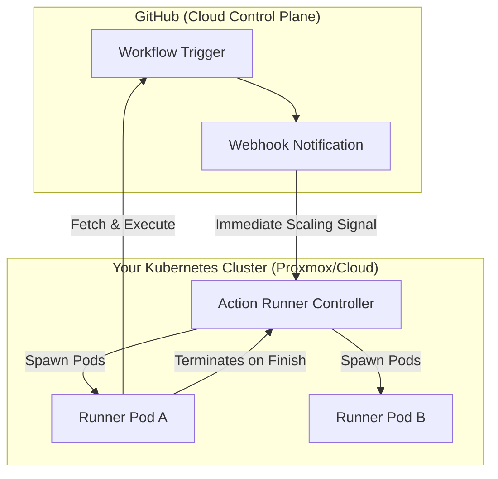

## The Core Analogy
Think of the **Action Runner Controller (ARC)** as an **Elastic Factory**.

A standard self-hosted runner is like a factory with a fixed number of machines that stay powered on 24/7, even if nobody is using them. This is wasteful and expensive.

**ARC** is like a magical factory that creates new machines out of thin air exactly when a customer order (a CI job) arrives. If 100 orders arrive at once, the factory instantly grows to 100 machines. As soon as a machine finishes its task, it is completely dismantled. If there are zero orders, the factory is empty and costs you nothing.

## Visual Architecture: Scaling on Demand



## Technical Logic (How it Works)

1.  **Kubernetes Native Operator**: ARC is a Kubernetes Operator that uses Custom Resource Definitions (CRDs). This means you manage your runners using standard K8s tools like `kubectl` and Helm, treating your CI infrastructure as just another workload.
2.  **Ephemeral Runners (Fresh Starts)**: Every job runs in a brand-new, clean Pod. Once the job finishes, the Pod is deleted. This eliminates the "Dirty Workspace" problem where files left over from a previous build cause the next build to fail mysteriously.
3.  **Horizontal Autoscaling**: ARC monitors your GitHub organization's job queue. It can scale from **zero** runners up to hundreds in seconds, ensuring that developers never have to wait in a queue for their CI to start.
4.  **Webhook-Driven Responsiveness**: Unlike standard runners that "poll" GitHub (checking for work every few seconds), ARC can be configured to listen for GitHub Webhooks. This allows it to start spinning up a runner the millisecond a PR is opened.
5.  **Docker-in-Docker (DinD) Support**: ARC is pre-configured to handle Docker builds within the runner pods. This allows you to build, tag, and push Docker images to your registry (like GHCR.io) from within your own private infrastructure.

## Strategic Impact

*   **Business Value**: **Zero Waste & Low Cost.** By scaling to zero when not in use, you eliminate the cost of idle VMs. It provides the speed of an "enterprise" CI system on a "startup" budget.
*   **Technical Value**: **Security & Isolation.** Because each runner is destroyed after one use, there is no risk of sensitive data (like tokens or secrets) leaking between different build jobs.

---

## Deep Dive: Deployment & Configuration

To implement ARC, you first install the controller and then define a **Runner Scale Set**.

### 1. Installation via Helm

```bash
# Add the GitHub Actions Runner Controller repository
helm repo add actions-runner-controller https://actions-runner-controller.github.io/actions-runner-controller/

# Install the controller to its own namespace
helm install arc actions-runner-controller/actions-runner-controller \
    --namespace actions-runner-system \
    --create-namespace
```

### 2. Defining an Autoscaling Runner Set (`runner-set.yaml`)

This configuration tells ARC how many runners to allow and which repository to watch.

```yaml
apiVersion: actions.github.com/v1alpha1
kind: AutoscalingRunnerSet
metadata:
  name: proxmox-runner-set
spec:
  githubConfigUrl: https://github.com/YOUR_ORG/YOUR_REPO
  githubConfigSecret: github-app-credentials # Secret containing GitHub App private key
  maxRunners: 10
  minRunners: 0 # Scale to zero when idle
  template:
    spec:
      containers:
        - name: runner
          image: ghcr.io/actions/actions-runner:latest
          command: ["/home/runner/run.sh"]
```

---
*If you enjoyed this technical deep dive, stay tuned for more posts on Kubernetes automation and MLOps!*
