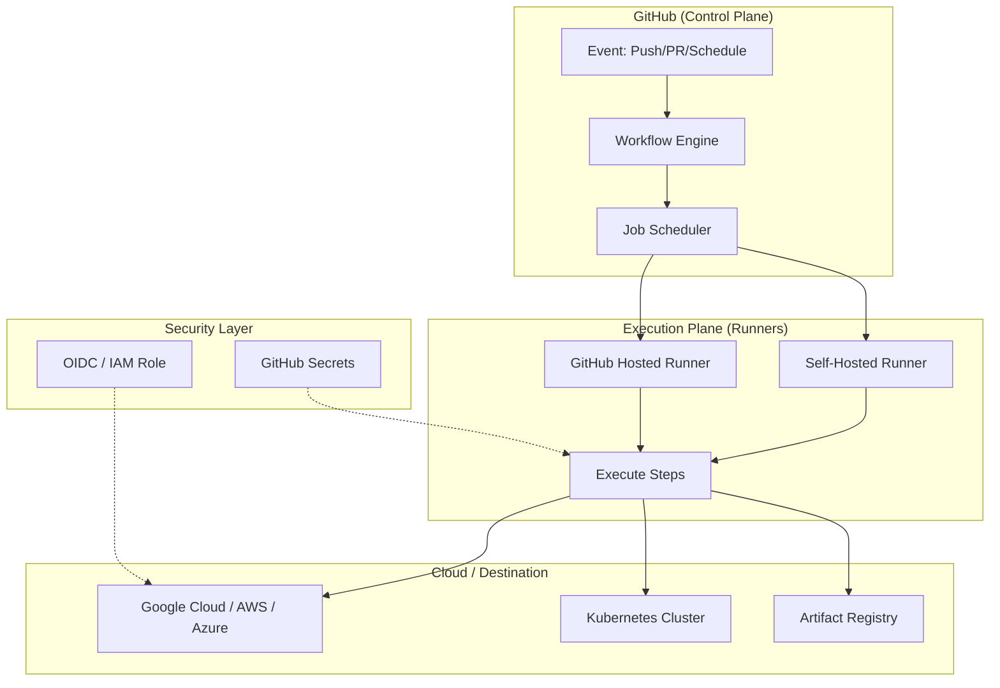

## 1. Introduction and Philosophy

GitHub Actions is a distributed, event-driven automation platform. Its philosophy is to treat the CI/CD pipeline as part of the application's source code, allowing for version-controlled, reproducible, and transparent automation.

---

## 2. Architecture Diagram

This diagram illustrates how GitHub (The Control Plane) interacts with Runners (The Execution Plane) and Cloud Providers (The Destination).



---

## 3. Foundational Concepts (Basic)

### 3.1 The Runner Environment
Runners are the virtual machines or containers where your code executes.
*   **Ephemeral**: GitHub-hosted runners are destroyed after every job, ensuring no "leftover" state.
*   **Persistent**: Self-hosted runners can maintain state (e.g., local caches), which can speed up builds but requires more maintenance.

---

## 4. Architectural Mechanics (Intermediate)

### 4.1 Job Parallelism and Dependencies
Jobs run in parallel by default. To create a sequential pipeline, use the `needs` keyword.

### 4.2 Caching Strategy
Caching is critical for reducing build times. GitHub provides a `cache` action that stores dependencies based on a hash of your lock files (e.g., `package-lock.json` or `go.sum`).

---

## 5. Implementation Blueprint (Advanced)

### 5.1 Production-Grade GKE Deployment Workflow
This example demonstrates a secure, OIDC-based deployment to a Google Kubernetes Engine (GKE) cluster.

```yaml
name: Production Deployment
on:
  push:
    branches: [main]

permissions:
  contents: 'read'
  id-token: 'write' # Mandatory for OIDC

jobs:
  build-and-deploy:
    runs-on: ubuntu-latest
    environment: production
    steps:
      - name: Checkout Code
        uses: actions/checkout@v4

      - name: Authenticate to Google Cloud
        uses: google-github-actions/auth@v2
        with:
          workload_identity_provider: 'projects/123/locations/global/workloadIdentityPools/my-pool/providers/my-provider'
          service_account: 'github-actions-deployer@my-project.iam.gserviceaccount.com'

      - name: Setup GCloud SDK
        uses: google-github-actions/setup-gcloud@v2

      - name: Build and Push Docker Image
        run: |
          gcloud auth configure-docker us-central1-docker.pkg.dev
          docker build -t us-central1-docker.pkg.dev/my-project/my-repo/app:${{ github.sha }} .
          docker push us-central1-docker.pkg.dev/my-project/my-repo/app:${{ github.sha }}

      - name: Deploy to GKE
        run: |
          gcloud container clusters get-credentials my-cluster --zone us-central1
          # Use envsubst to inject the new image tag into the k8s manifest
          cat k8s/deployment.yaml | sed "s|IMAGE_TAG|${{ github.sha }}|g" | kubectl apply -f -
```

---

## 6. Expert Zone: Security and Scalability

### 6.1 Hardening GitHub Actions
*   **OIDC**: Eliminates the need for long-lived Service Account keys.
*   **Step-Level Permissions**: Use the `permissions` block at the job level to follow the Principle of Least Privilege.
*   **Action Pinning**: Always use commit SHAs for third-party actions to prevent supply chain attacks.

---

## 7. MLOps Integration

GitHub Actions serves as the **Continuous Training (CT)** engine.
1. A data scientist pushes a new feature definition to Git.
2. GitHub Actions triggers a training run on a self-hosted GPU runner.
3. The runner executes the training, generates evaluation metrics, and uploads them as a **Pull Request Comment** using the GitHub API.

---

*Stay tuned for our next deep dive into Kubernetes networking and Zero Trust security!*
