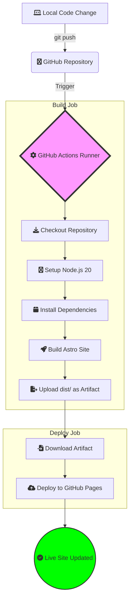

What started as a simple Jekyll project has evolved. As my needs for performance, customization, and "Everything-as-Code" grew, I migrated this blog to **Astro**. This shift wasn't just about a new look—it was about building a professional-grade DevOps workbench.

Here is the breakdown of the current architecture powering this site.

---

## The Modern Stack

The current iteration of this blog is built for speed and developer experience:

*   **Astro 4.x**: A modern web framework that pulls "Islands of Interactivity" into static HTML for lightning-fast loads.
*   **TailwindCSS & DaisyUI**: Utility-first styling with a premium component library for consistent, beautiful UI.
*   **GitHub Actions**: A robust CI/CD pipeline that handles the build-and-deploy cycle automatically.
*   **GitHub Pages**: Reliable, global hosting for our static assets.

---

## The Automation Pipeline (GitHub Actions)

Manual deployments are a thing of the past. I've implemented a **GitOps workflow** where every push to the `master` branch triggers an automated build and deployment pipeline. This ensures that the production site always reflects the latest committed state without manual intervention.

### Deployment Flow Visualization

The following diagram illustrates how a code change travels from my local machine to the live site:

### Deep Dive into the Workflow

My GitHub Actions pipeline handles the heavy lifting in two distinct jobs:

1.  **The Build Job**:
    *   **Environment**: Runs on `ubuntu-latest`.
    *   **Node.js Setup**: Uses `actions/setup-node@v4` with Node 20 to ensure a consistent build environment.
    *   **Build Process**: Executes `npm run build`, which invokes Astro's static site generator to create the production-ready `dist/` folder.
    *   **Artifact Preservation**: The output is uploaded using `actions/upload-pages-artifact@v3`, keeping the build and deploy stages separated for security and reliability.

2.  **The Deploy Job**:
    *   **Permissions**: Utilizes high-security `id-token: write` and `pages: write` permissions.
    *   **Deployment**: Uses the official `actions/deploy-pages@v4` to safely transfer the build artifact to the GitHub Pages infrastructure.

> [!IMPORTANT]
> This "Everything-as-Code" approach means that if I ever need to move hosting or change build parameters, I simply update a single YAML file, and the entire system adapts.

---

## Design & Customization

The new architecture provides a structure that supports more than just blog posts:
*   **Component-Based Design**: Reusable Astro components for headers, footers, and sidebars.
*   **Dynamic Tagging**: Automated tag indexing and subject clouds for easier discovery.
*   **Responsive Layouts**: A mobile-first approach powered by Tailwind’s grid and flexbox utilities.
*   **Rich Navigation**: Integrated Table of Contents and series navigation for better readability.

---

## The Results

The migration to Astro has resulted in:
*   **Perfect Lighthouse Scores**: Near-instant page loads and better SEO.
*   **Low Maintenance**: GitHub Actions manages the lifecycle, letting me focus on writing content.
*   **Scalability**: Easy to add new features like a project store, CV section, or custom interactive dashboards.

> [!TIP]
> **Ready to Build Your Own Command Center?**
> If you're inspired by this architecture and want to set up your own professional-grade DevOps workbench on macOS or Ubuntu, check out my [Zero-Day DevOps Setup Guide](/blog/2026-05-13-devops-setup-guide).

---
