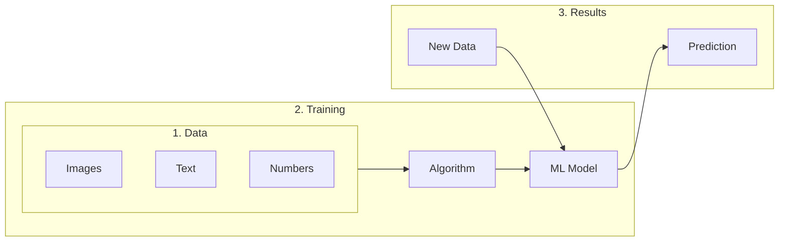

Have you ever wondered how Netflix knows what shows you might like? Or how your email knows which messages are spam? That's machine learning in action!

Let's break it down in simple terms.

## What is Machine Learning?

Machine learning is like teaching a computer to learn from examples, rather than explicitly programming it with rules. Think of it like teaching a child:

- **Traditional Programming**: You give specific rules ("If it's red and round, it's an apple")
- **Machine Learning**: You show many examples of apples, and the computer learns to recognize patterns

## The Three Main Types of Machine Learning

### 1. Supervised Learning
Like learning with a teacher. You give the computer examples and the correct answers, and it learns to predict answers for new examples.

**Real-world example**: Teaching a computer to recognize cats by showing it thousands of pictures labeled "cat" or "not cat".

### 2. Unsupervised Learning
Like discovering patterns without a teacher. The computer finds structure in data on its own.

**Real-world example**: Grouping customers into different types based on their shopping habits, without telling the computer what groups to look for.

### 3. Reinforcement Learning
Like learning through trial and error. The computer tries different actions and learns from the results.

**Real-world example**: A computer learning to play chess by playing many games and learning which moves lead to winning.

## Why Should You Care?

Machine learning is everywhere in our daily lives:
- 📱 Face recognition in your phone
- 🎵 Music recommendations in Spotify
- 🚗 Self-driving cars
- 💳 Fraud detection in your credit card

## What's Coming Next?

### Basics Series (Start Here)
1. [Part 1: Introduction (You Are Here)](/posts/machine-learning-basics-introduction/)
2. [Part 2: Supervised Learning - Regression](/posts/machine-learning-regression/)
3. [Part 3: Supervised Learning - Classification](/posts/machine-learning-classification/)
4. [Part 4: Unsupervised Learning](/posts/machine-learning-unsupervised/)
5. [Part 5: Reinforcement Learning](/posts/machine-learning-reinforcement/)
6. [Data Science Fundamentals: Data Preparation and Model Fitting](/posts/data-science-fundamentals/)

### Intermediate Series (Coming Soon)
7. [Feature Engineering: The Art of Creating Better Data](/posts/machine-learning-feature-engineering/)
8. [Model Evaluation: Beyond Accuracy](/posts/machine-learning-model-evaluation/)
9. [Cross-Validation and Overfitting](/posts/machine-learning-cross-validation/)
10. [Ensemble Methods: Combining Models](/posts/machine-learning-ensemble-methods/)
11. [Hyperparameter Tuning](/posts/machine-learning-hyperparameter-tuning/)

### Deep Learning Series (Advanced)
12. [Introduction to Neural Networks](/posts/deep-learning-neural-networks/)
13. [Convolutional Neural Networks (CNNs)](/posts/deep-learning-cnn/)
14. [Recurrent Neural Networks (RNNs)](/posts/deep-learning-rnn/)
15. [Transformers and Attention](/posts/deep-learning-transformers/)
16. [Generative AI and GANs](/posts/deep-learning-generative-ai/)

### Expert Series (Cutting Edge)
17. [Chain of Thought: Teaching AI to Reason](/2025/07/04/expert-chain-of-thought/)
18. [Mixture of Experts: Many Brains Are Better Than One](/2025/07/04/expert-mixture-of-experts/)
19. [Retrieval-Augmented Generation (RAG)](/2025/07/04/expert-retrieval-augmented-generation/)
20. [Constitutional AI: Teaching AI Right from Wrong](/2025/07/04/expert-constitutional-ai/)
21. [Few-Shot and Zero-Shot Learning](/2025/07/04/expert-few-shot-learning/)

### Future and Ethics Series
22. [The Path to AGI and ASI: Understanding Superintelligence](/2025/07/05/future-superintelligence/)
23. [AI Safety: Navigating the Risks of Advanced AI](/2025/07/05/ai-safety-risks/)

Stay tuned!
