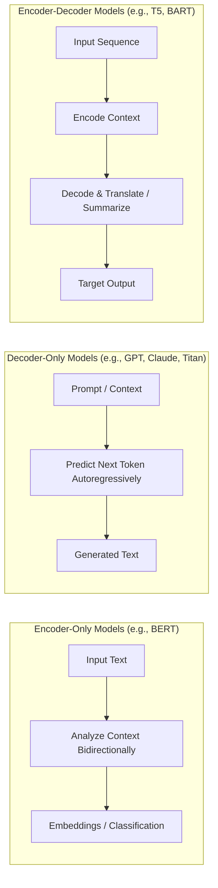
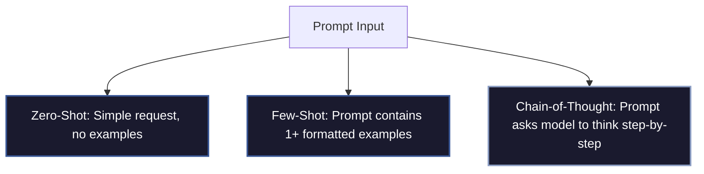

Welcome to Domain 2 of the AWS Certified AI Practitioner (AIF-C01) certification series! This domain covers the core concepts, architectures, and capabilities of Generative AI (GenAI).

**Domain 2 accounts for 24% of the exam** and focuses on the underlying technologies that power models, GenAI terminology, and the art of prompt engineering.

---

## 💡 Generative AI vs. Traditional Machine Learning

Before diving in, it is critical to understand the distinction between traditional machine learning and generative AI.

| Characteristic | Traditional Machine Learning | Generative AI |
| :--- | :--- | :--- |
| **Primary Goal** | Classify data, identify patterns, or make predictions (numbers/classes). | Create entirely new, original content (text, images, audio, video, code). |
| **Model Type** | **Discriminative**: Learns decision boundaries between classes. | **Generative**: Learns the probability distribution of data. |
| **Input/Output** | Structured/unstructured inputs $\rightarrow$ Single labels or numerical predictions. | Natural language prompts $\rightarrow$ High-dimensional creative sequences. |
| **Example Use Case** | Churn prediction, spam filtering, demand forecasting. | Drafting blog posts, generating code, synthesizing images. |

---

## 🏗️ Transformer Architecture: The Engine of GenAI

Modern Generative AI models (like Large Language Models) are built using the **Transformer architecture**, introduced in 2017. Transformers replaced older sequence models (like RNNs) by introducing a mechanism called **Self-Attention**.

### The Self-Attention Mechanism


Traditional models read sentences word-by-word and forgot early words in long sentences. Self-attention allows a model to look at **every word in a sentence simultaneously** and determine which words are most relevant to one another, regardless of their distance.

*   *Example:* In the sentence *"The bank of the river was muddy, so the bank manager didn't walk there,"* self-attention helps the model distinguish between a *river bank* and a *financial bank* by looking at surrounding words like "river/muddy" vs. "manager/walk".

### Encoders vs. Decoders

The Transformer architecture is split into two halves: the Encoder and the Decoder. Depending on the task, models can be Encoder-only, Decoder-only, or Seq2Seq (Encoder-Decoder).



1.  **Encoder-Only Models (e.g., BERT):**
    *   **How they work:** Process text in both directions (left-to-right and right-to-left) to build a deep understanding of context.
    *   **Best for:** Sentiment analysis, named entity recognition, text classification, and search indexing.
2.  **Decoder-Only Models (e.g., GPT, Claude, Amazon Titan Text):**
    *   **How they work:** Predict the next word in a sequence based *only* on the preceding words (autoregressive).
    *   **Best for:** Conversational AI, creative writing, code generation, and open-ended text completion.
3.  **Encoder-Decoder Models (e.g., T5, BART):**
    *   **How they work:** The encoder processes the input, and the decoder maps it to a new sequence.
    *   **Best for:** Machine translation, document summarization, and question-answering.

---

## 📖 Key Generative AI Terminology

To pass Domain 2, you must know these foundational terms and how they affect model performance:

### 1. Tokens
Computers do not read words directly; they break text down into **tokens**. A token can be a single character, a syllable, a word, or part of a word.
*   **Rule of Thumb:** On average, 100 English words represent about 133 tokens.
*   **Why it matters:** Model usage, rate limits, and billing on AWS (such as Amazon Bedrock) are calculated based on the number of input and output tokens.

### 2. Context Window
The context window is the maximum number of tokens a model can process in a single interaction (including both the prompt and the generated response).
*   **Small context window (e.g., 4,000 tokens):** Suitable for short emails or quick questions.
*   **Large context window (e.g., 200,000+ tokens):** Can analyze whole books, entire codebases, or hours of audio.
*   *Exam Tip:* Exceeding the context window will cause the model to forget the earliest parts of the conversation.

### 3. Chunking
When building AI applications with long documents, you must break the text into smaller, digestible segments. This process is called **chunking**.
*   Proper chunking ensures that relevant pieces of information are preserved without overflowing the context window or losing local semantic context.

### 4. Embeddings
An embedding is a numerical representation of a piece of data (text, image, audio) formatted as a high-dimensional vector. Words or concepts with similar meanings are located close to one another in this multi-dimensional space.
*   *Example:* The vector for "King" minus "Man" plus "Woman" yields a vector extremely close to "Queen".

### 5. Vector Databases
Vector databases (such as Amazon OpenSearch Serverless or PGVector on Amazon Aurora) store and index embeddings. They allow models to perform incredibly fast similarity searches, which is the foundational technology for Retrieval-Augmented Generation (RAG).

### 6. Temperature and Top-P (Inference Parameters)
Inference parameters control how creative or predictable a model's output is:
*   **Temperature (Range: 0.0 to 1.0):**
    *   **Low Temperature (e.g., 0.2):** Highly analytical, repetitive, and predictable. Ideal for coding, mathematical calculations, and facts.
    *   **High Temperature (e.g., 0.8+):** Diverse, creative, and random. Ideal for brainstorming, fiction, and marketing copy.
*   **Top-P (Nucleus Sampling):** Controls the pool of words the model considers based on their cumulative probability. Setting Top-P to 0.9 means the model only chooses from the top 90% most likely words, filtering out highly unusual choices.

---

## ✍️ Prompt Engineering Strategies

Prompt engineering is the practice of designing inputs (prompts) to get the best possible output from a Foundation Model without modifying the model's weights.



```yaml
Basic Prompt Components:
  - Instruction: The specific task you want the model to perform.
  - Context: Background information or database constraints.
  - Examples: Demonstrations of input-output pairs (few-shot).
  - Output Formatter: Instructions on how to structure the result (JSON, Markdown, YAML).
```

### 1. Zero-shot Prompting
Asking the model a question or giving an instruction directly without any examples.
*   *Prompt:* `"Translate 'Hello, how are you?' into Spanish."`
*   *When to use:* Simple, straightforward tasks where the model's base knowledge is sufficient.

### 2. Few-shot Prompting
Providing the model with one or more examples of the expected input and output format before asking the actual question.
*   *Prompt:*
    ```text
    Tweet: "I hate waiting in line!" -> Sentiment: Negative
    Tweet: "This new coffee flavor is okay, but not my favorite." -> Sentiment: Neutral
    Tweet: "Absolutely loved the customer support today!" -> Sentiment: Positive
    Tweet: "The packaging was damaged upon arrival." -> Sentiment:
    ```
*   *When to use:* Complex categorization, maintaining exact output styles (e.g., JSON syntax), or domain-specific formatting.

### 3. Chain-of-Thought (CoT) Prompting
Asking the model to explain its reasoning step-by-step before outputting the final answer. This dramatically reduces logical and mathematical errors.
*   *Prompt:* `"A farmer has 15 sheep. All but 8 run away. How many sheep are left? Walk me through your thinking step-by-step."`
*   *Why it works:* It forces the model to generate intermediate tokens for logic, mimicking "thinking out loud," rather than rushing to a predicted end answer.

### 4. Role-based Prompting
Instructing the model to adopt a specific persona to tailor its tone, complexity, and expertise level.
*   *Prompt:* `"You are a senior AWS Solutions Architect. Review the following architecture diagram for single-points-of-failure..."`

---

## 🎓 Exam Cram Summary

*   **Discriminative models** classify/predict; **Generative models** create.
*   **Transformers** use **Self-Attention** to process context bidirectionally and globally.
*   **BERT** is Encoder-only (understanding); **GPT/Claude/Titan** are Decoder-only (generating).
*   **Tokens** are word parts; billing and context windows are defined in tokens.
*   **Embeddings** turn text/images into vectors of numbers representing meaning.
*   **Low temperature** = factual/coding; **High temperature** = creative writing.
*   Use **Chain-of-Thought** to improve logical reasoning in prompt outputs.
*   Use **Few-shot prompting** to train the model's output formatting on the fly.

In the next post, we will dive into **Domain 3: Applications of Foundation Models**, where we will explore how to select, customize (using RAG and fine-tuning), and deploy these models using **Amazon Bedrock** and **Amazon SageMaker**.
