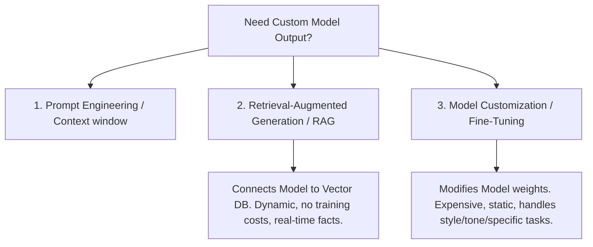

Welcome to Domain 3 of the AWS Certified AI Practitioner (AIF-C01) certification series! This is the most heavily weighted domain on the exam.

**Domain 3 accounts for 28% of the exam** and focuses on how to select, customize, and deploy Foundation Models (FMs) using AWS services like Amazon Bedrock and Amazon SageMaker, as well as the suite of pre-trained AWS AI services.

---

## 🛠️ Model Customization: RAG vs. Fine-Tuning

When you consume a Foundation Model (FM), its default training might not know about your private company data or specific industry jargon. You have three main paths to customize its performance.

### 1. Retrieval-Augmented Generation (RAG)
RAG connects a foundation model to an external database (usually a Vector DB) containing your company’s private or real-time data.
*   **How it works:**
    1. The user asks a question: *"What is our company policy on remote work?"*
    2. A search engine retrieves matching documents from the internal database.
    3. The documents are added to the user's prompt as context.
    4. The model generates a response based *only* on the retrieved context.
*   **Benefits:** Highly dynamic, zero model training costs, stops hallucinations by pinning answers to factual sources, and allows easy document access control.

### 2. Fine-Tuning (Full vs. PEFT)
Fine-tuning updates the internal weights of the foundation model using a curated dataset of labeled examples.
*   **Full Fine-Tuning:** Updates all parameters of the model. Highly expensive and resource-intensive.
*   **Parameter-Efficient Fine-Tuning (PEFT):** Updates only a small set of parameters (like **LoRA** - Low-Rank Adaptation). It is faster, cheaper, and prevents the model from forgetting its base capabilities.
*   **When to use:** When you need the model to learn a specific style, voice, formatting structure (like generating custom medical codes), or deep domain-specific knowledge that cannot be passed in prompts.

---

## ☁️ Amazon Bedrock: Serverless GenAI Platform

Amazon Bedrock is a fully managed, serverless service that provides access to industry-leading foundation models (Anthropic Claude, Meta Llama, AI21 Jurassic, Cohere, Stability AI, and Amazon Titan) via a single API.

### Core Bedrock Features to Know
*   **Playgrounds:** Web interface consoles inside AWS where developers can test text, chat, and image models visually without writing code.
*   **Knowledge Bases for Amazon Bedrock:** A fully managed RAG workflow. You point Bedrock to an S3 bucket with documents; it automatically chunks, embeds, and stores them in a vector database (like OpenSearch Serverless).
*   **Agents for Amazon Bedrock:** Multi-step assistants that can execute business tasks by calling APIs (via AWS Lambda) and looking up files. E.g., an agent can look up an order, process a refund, and email the receipt automatically.
*   **Model Evaluation:** Allows you to compare different models side-by-side using human evaluators or automated benchmarks to determine which model is best for your criteria (accuracy, speed, cost).

### Amazon Titan Model Family
Amazon Titan is AWS's proprietary family of foundation models:
1.  **Titan Text (Lite, Express, Premier):** Models designed for summarization, copywriting, Q&A, and code generation.
2.  **Titan Image Generator:** Text-to-image generator with built-in invisible watermarking to prevent deepfakes and identify AI-generated content.
3.  **Titan Multimodal Embeddings:** Translates text and images into numerical vectors to build semantic search engines.

---

## 🧪 Amazon SageMaker: The Complete ML Lifecycle

For workloads where you need to build, train, deploy, and manage custom machine learning models from scratch, use **Amazon SageMaker**.

*   **SageMaker Studio:** An integrated development environment (IDE) that unites notebooks, pipelines, and endpoints in a single interface.
*   **SageMaker JumpStart:** A hub containing pre-trained models, built-in algorithms, and quick-deploy templates (including popular open-source models like Llama and Mistral).
*   **SageMaker Autopilot:** Automated Machine Learning (AutoML). You upload a tabular dataset (CSV), highlight a column to predict, and Autopilot automatically cleans data, selects algorithms, trains models, and lists them by accuracy.
*   **SageMaker Ground Truth:** A managed data labeling service that utilizes a workforce (public, private, or mechanical turk) to label raw data (images, text) for training.
*   **SageMaker Model Registry:** A catalog to version-control models, track metadata (performance metrics), and manage release approval status.

---

## 🤖 Pre-Trained AWS AI Services (Low Code / No Code)

AWS provides specialized, pre-trained AI services. You do not need machine learning expertise to use these; you interact with them via simple API calls.

### 👁️ Computer Vision
*   **Amazon Rekognition:** Detects objects, scenes, faces, text, and inappropriate content (moderation) in images and video.
*   **Amazon Lookout for Vision:** Specialized industrial anomaly detector that uses cameras to find manufacturing defects on assembly lines.

### ✍️ Natural Language Processing (NLP)
*   **Amazon Comprehend:** Extracts insights, sentiment, key phrases, and languages from unstructured text. Includes *Comprehend Medical* for extracting healthcare entities (dosage, diseases).
*   **Amazon Translate:** Real-time, fluent language translation.
*   **Amazon Polly:** Text-to-speech service that converts written text into lifelike speech (neural and standard voices). Supports SSML.
*   **Amazon Transcribe:** Speech-to-text service that transcribes audio files or live speech into text.
*   **Amazon Kendra:** Intelligent enterprise search engine that uses ML to search across various corporate data repositories (SharePoint, S3, databases) and answer natural language questions.

### 📈 Business & Personalization
*   **Amazon Personalize:** Real-time recommendation engine modeled after Amazon.com.
*   **Amazon Forecast:** Time-series forecasting tool designed to predict demand, sales, and inventory levels.
*   **Amazon Lookout for Metrics:** Automatically monitors metrics (like web traffic or server load) and alerts on anomalies.

---

## 🎓 Exam Cram Summary

*   Use **RAG** for real-time data lookup without retraining weights.
*   Use **Fine-Tuning (PEFT/LoRA)** to customize style, tone, or specific tasks.
*   **Amazon Bedrock** is serverless and offers Anthropic, Llama, and Titan via APIs.
*   **Bedrock Knowledge Bases** automate RAG; **Bedrock Agents** automate actions.
*   Use **SageMaker Studio/JumpStart** for custom models; use **Autopilot** for no-code tabular ML.
*   **Kendra** is an enterprise search engine; **Comprehend** is for text sentiment; **Rekognition** is for image analysis; **Polly** is speech output; **Transcribe** is speech input.

In the next post, we will look at **Domain 4: Guidelines for Responsible AI**, exploring how to detect bias, establish explainability, and configure safety guardrails.
