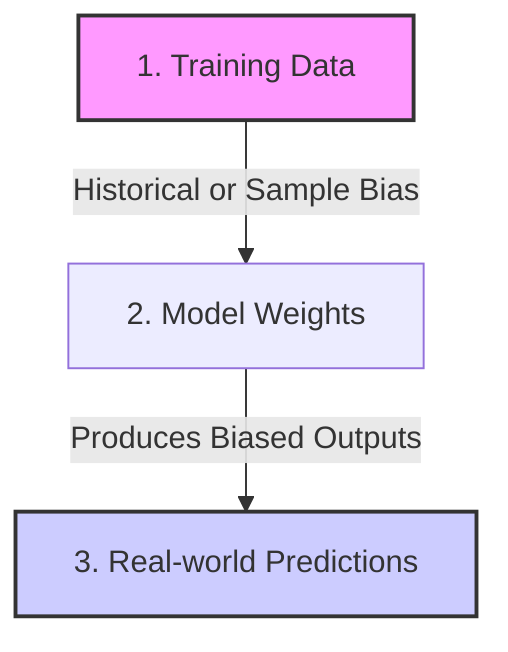

Welcome to Domain 4 of the AWS Certified AI Practitioner (AIF-C01) certification series! This domain evaluates your understanding of safety, fairness, and governance in AI systems.

**Domain 4 accounts for 14% of the exam** and focuses on identifying ethical issues in AI (such as bias and toxicity), understanding model explanation metrics, and configuring safety tools on AWS.

---

## ⚖️ Core Concepts of Responsible AI

AWS defines Responsible AI through several key pillars. When deploying models, organizations must ensure their systems adhere to these values:

1.  **Fairness:** Models should make unbiased predictions and treat all demographic groups equally.
2.  **Explainability:** System predictions should be understandable to developers and end-users, rather than behaving as "black boxes".
3.  **Transparency:** Providing documentation (like *Model Cards*) that details training sources, boundaries, and model limitations.
4.  **Privacy and Security:** Protecting customer data (PII) from leakages or manipulation.
5.  **Safety:** Mitigating toxic outputs, hate speech, or dangerous instructions.

---

## 🔍 Understanding Bias and Toxicity

Bias and security issues can creep into machine learning models at different stages. Understanding how they manifest is critical for the exam.



### Sources of Bias
*   **Historical Bias:** Training data contains human biases from historical events. E.g., an automated hiring model trained on historical executive résumés might learn to unfairly downgrade female applicants.
*   **Representation Bias:** The dataset fails to represent the actual population. E.g., a facial recognition model trained on 90% light-skinned faces will perform poorly on darker-skinned individuals.
*   **Measurement Bias:** Measurement tools introduce errors (e.g., faulty sensor outputs or misleading survey forms).

### Toxic and Unwanted Behaviors in GenAI
*   **Toxicity:** Generating hateful, offensive, or derogatory text.
*   **Hallucinations:** When a generative model writes false information with high confidence. E.g., citing a non-existent law in a legal summary.
*   **Plagiarism & Copyright Violations:** Reproducing copyrighted code or text verbatim from training resources.

---

## 🧠 Explainability: SHAP vs. LIME

Explainable AI (XAI) helps humans understand *why* a model made a specific prediction.

*   **SHAP (SHapley Additive exPlanations):**
    *   **How it works:** Based on cooperative game theory. It calculates the exact contribution of each feature to the model's final prediction by testing all combinations of features.
    *   **Pros:** Highly accurate and mathematically robust.
*   **LIME (Local Interpretable Model-agnostic Explanations):**
    *   **How it works:** Approximates the "black box" model locally by training a simpler, explainable model (like a linear model) around the specific prediction point.
    *   **Pros:** Much faster than SHAP; works on any machine learning model.

---

## 🛡️ AWS Responsible AI Tooling

AWS provides native tools to audit models, identify bias, and filter harmful inputs/outputs.

### 1. Amazon SageMaker Clarify
SageMaker Clarify evaluates datasets and models for bias and generates feature importance explanations.
*   **Pre-training Bias:** Identifies imbalance in data before training begins (e.g., checking if one age group is underrepresented).
*   **Post-training Bias:** Identifies discrepancies in predictions across demographic groups after training (e.g., checking if loans are rejected more frequently for specific groups).
*   **Explainability reports:** Uses SHAP values to output charts showing which features (e.g., credit history, income, age) had the biggest impact on prediction outcomes.

### 2. Guardrails for Amazon Bedrock
Guardrails allow you to build safety filters for foundation models at the API layer. They apply to *any* model in Bedrock (Claude, Titan, Llama, etc.).

```yaml
Guardrail Filter Types:
  - Content Filters: Detect and block inputs/outputs matching hate speech, violence, sexual content, or insults.
  - Denied Topics: Stop models from answering specific business topics (e.g., preventing a retail bot from offering investment advice).
  - Word Filters: Block custom lists of words or profanities.
  - Sensitive Information Filters: Redact or block Personally Identifiable Information (PII) like SSNs, emails, or phone numbers.
```

### 3. Amazon SageMaker Model Monitor
Model Monitor monitors production endpoints. If the incoming data changes over time (**Data Drift**) or the prediction behavior changes (**Concept Drift**), it alerts developers so they can retrain models before bias or errors compound.

---

## 🎓 Exam Cram Summary

*   **SageMaker Clarify** detects bias (pre-training/post-training) and calculates feature importance via **SHAP**.
*   **Guardrails for Amazon Bedrock** filters toxicity, denylist topics, and blocks PII across all Bedrock models.
*   **Data Drift** is when the incoming production data changes from the training data distribution.
*   **Concept Drift** is when the real-world relationships change (e.g., pre-COVID vs. post-COVID shopping habits).
*   **Toxicity** is offensive text; **Hallucinations** are confident lies; **Plagiarism** is copying training sources.

In the final post of our study guide series, we will look at **Domain 5: Security, Compliance, and Governance for AI Solutions**, covering data isolation, IAM policies, and encryption.
