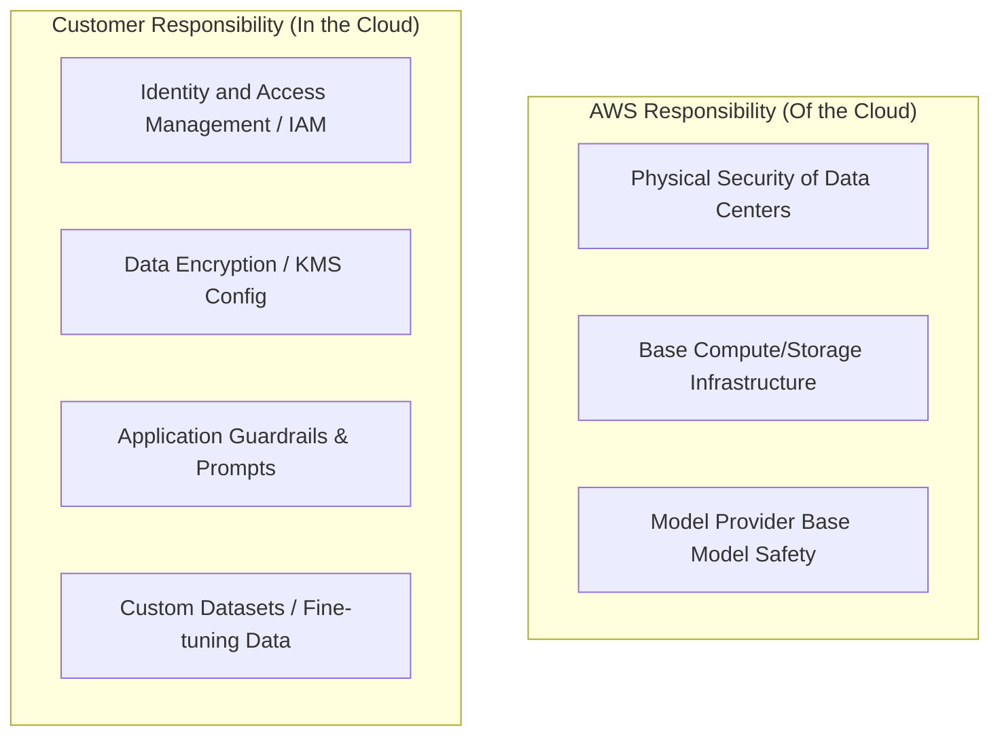
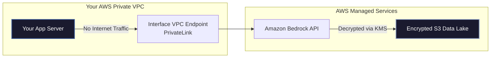

Welcome to Domain 5 of the AWS Certified AI Practitioner (AIF-C01) certification series! This final domain covers security, privacy, compliance, and governance.

**Domain 5 accounts for 14% of the exam** and ensures you know how to protect data, manage user permissions, and ensure compliance for your AI solutions on AWS.

---


---

## The Shared Responsibility Model for AI

The standard AWS Shared Responsibility Model separates security tasks into **"Security of the Cloud" (AWS's job)** and **"Security in the Cloud" (Your job)**. When working with AI, specifically Amazon Bedrock and SageMaker, this division updates depending on how you deploy models.



### 1. Fully Managed AI Services (e.g., Amazon Bedrock, Rekognition, Polly)
*   **AWS Handles:** Securing the underlying hardware, patch management, operating systems, base foundation model safety, and physical data center security.
*   **Customer Handles:** Configuring Identity & Access Management (IAM) permissions, data encryption keys, app-level guardrails, input prompts, and fine-tuning datasets.

### 2. Custom Model Environments (e.g., Amazon SageMaker, Custom EC2 instances)
*   **AWS Handles:** Physical security, global cloud network, virtualization hypervisors, and hosting baseline environments.
*   **Customer Handles:** Configuring security groups, patching operating systems (on EC2), data encryption, model access policies, notebook environment configurations, and model registry governance.

---

## Access Control and IAM Policies

AWS Identity and Access Management (IAM) is the gatekeeper for AI resources. For the exam, know how to write or interpret policies that restrict model access.

### Restricting Access to Specific Models in Amazon Bedrock
You should enforce the **Principle of Least Privilege** (users only get access to what they need). Here is an example of an IAM policy that allows a developer to invoke *only* the Amazon Titan Text model on Bedrock, blocking all other models (such as Claude).

```json
{
  "Version": "2012-10-17",
  "Statement": [
    {
      "Effect": "Allow",
      "Action": [
        "bedrock:InvokeModel"
      ],
      "Resource": "arn:aws:bedrock:*:*:foundation-model/amazon.titan-text-express-v1"
    }
  ]
}
```

### SageMaker Role Configurations
SageMaker notebooks require an **execution role** (an IAM Role assumed by the service) to perform tasks on your behalf, such as reading data from an S3 bucket or registering models in the Registry.

---

## Data Protection, Privacy, and Network Isolation

Securing your proprietary business datasets and customer prompts is paramount when deploying Generative AI.

### 1. Data Isolation & Privacy (Bedrock Guarantee)
A common concern is that public prompts might train public models. **Amazon Bedrock guarantees that your data (prompts and custom fine-tuning datasets) is encrypted, isolated to your AWS account, and NEVER used to train or improve the base models of third-party model providers.**

### 2. Encryption (AWS KMS)
*   **Data at Rest:** All datasets (S3), model artifacts (SageMaker), and vector databases should be encrypted at rest using **AWS Key Management Service (KMS)**. You can use AWS-managed keys or customer-managed keys (CMK) to control rotation policies.
*   **Data in Transit:** All traffic flowing between S3, Bedrock, and SageMaker is automatically encrypted using Transport Layer Security (TLS 1.2+).

### 3. Network Isolation (Amazon VPC)
To prevent traffic from traversing the public internet:
*   Configure **VPC Endpoints (powered by AWS PrivateLink)** to route queries from your private network directly to Bedrock or SageMaker internally.
*   Set up SageMaker instances inside a private subnet with no internet access (no NAT Gateway) if working with highly classified research datasets.



---

## Compliance, Governance, and Auditing

AWS provides several governance tools to audit your AI applications and ensure compliance with medical, financial, and governmental guidelines.

### 1. Amazon Macie (PII Detection)
*   **Use case:** Scans S3 buckets automatically to locate Personally Identifiable Information (PII) like credit card numbers, social security numbers, or passwords.
*   **Why it matters for AI:** You must run Macie on S3 datasets *before* using them for model pre-training or fine-tuning to prevent model leakages of user data.

### 2. AWS CloudTrail (Audit Trail)
*   **Use case:** Records every API call made in your AWS account.
*   **Why it matters for AI:** CloudTrail records who called `bedrock:InvokeModel`, who launched a SageMaker notebook instance, or who modified an IAM role. Essential for compliance audits and security analysis.

### 3. AWS Artifact (Compliance Reports)
*   **Use case:** An on-demand portal to download AWS’s security and compliance documents (e.g., SOC 2 reports, ISO certifications, and PCI compliance).
*   **Why it matters for AI:** If your AI app must comply with medical rules (**HIPAA**), you download AWS's Business Associate Addendum (BAA) and SOC reports from AWS Artifact to prove the infrastructure is certified.

## 💡 Real-World Analogies and Concepts

> [!TIP]
> **Analogy: Shared Responsibility Model**
> - **Renting a Serviced Apartment (Amazon Bedrock):** The landlord maintains the structure, the plumbing, and the door locks (AWS secures infrastructure and base models). You are responsible for who you invite in, locking your personal safe, and keeping your items tidy (You secure IAM access, prompt variables, and fine-tuning datasets).
> - **Building Your Own House (Amazon SageMaker):** The builder delivers the concrete shell and physical utilities, but you are responsible for running the internal security alarms, painting, and maintenance (You secure the operating system, notebooks, networking rules, and data storage configurations).

---

### Common Exam Traps

> [!WARNING]
> **Trap 1: AWS Artifact vs. AWS CloudTrail**
> - **AWS Artifact:** A portal to download **static compliance reports** (SOC 2, ISO, HIPAA documents) created by external auditors to prove AWS infrastructure meets global standards.
> - **AWS CloudTrail:** A service that **dynamically records active API calls** (who called Bedrock, when, and from what IP) inside your AWS account. It is for user activity monitoring and forensic auditing.
>
> **Trap 2: AWS PrivateLink (VPC Endpoints) vs. Public Internet**
> - The exam will ask how to connect an EC2 application server inside a **private VPC subnet** to Amazon Bedrock without sending traffic over the public internet.
> - Choose **VPC Endpoint / interface endpoint (powered by AWS PrivateLink)**. Do NOT choose Internet Gateways, NAT Gateways, or public proxies.

---

## 📝 Scenario-Based Practice Questions

### Question 1
A compliance officer in a hospital wants to verify that the AWS infrastructure hosting their medical transcription AI tool is certified under the Health Insurance Portability and Accountability Act (HIPAA) standards. Where should the officer go to download the official AWS HIPAA compliance documentation and Business Associate Addendum (BAA)?
A) AWS CloudTrail console
B) AWS Artifact portal
C) Amazon SageMaker Model Registry
D) Amazon Macie reports

**Answer: B**
*Explanation: AWS Artifact is the dedicated, self-service portal for downloading AWS compliance reports (e.g., SOC, ISO) and managing agreements like the HIPAA Business Associate Addendum (BAA).*

### Question 2
A financial corporation requires that all customer transaction prompts submitted to Amazon Bedrock be completely isolated from the public internet. The app server runs in a private subnet. What should the network engineer configure to fulfill this requirement?
A) An Internet Gateway connected to the private subnet.
B) A NAT Gateway to translate private IPs to public IPs.
C) An Interface VPC Endpoint (AWS PrivateLink) for Amazon Bedrock.
D) A public proxy server in a public subnet.

**Answer: C**
*Explanation: Interface VPC Endpoints (powered by AWS PrivateLink) allow services inside a private VPC subnet to communicate privately with AWS services like Bedrock over the AWS internal network, avoiding the public internet entirely.*

### Question 3
A security engineer wants to ensure that no developer accidentally uses an S3 bucket containing raw customer credit card details to fine-tune a foundation model. Which AWS service should be used to scan the S3 buckets for this sensitive data before model training?
A) Amazon Macie
B) AWS Key Management Service (KMS)
C) AWS CloudTrail
D) Amazon SageMaker Clarify

**Answer: A**
*Explanation: Amazon Macie is a fully managed data security and privacy service that uses machine learning and pattern matching to discover and protect sensitive data, such as PII (Personally Identifiable Information like credit card numbers), in Amazon S3.*

---

## Exam Cram Summary

*   **Shared Responsibility Model:** AWS manages model hosting infrastructure; you manage IAM policies, KMS encryption keys, and prompts.
*   **Data Privacy Guarantee:** Amazon Bedrock never uses your inputs/outputs to train base models.
*   **IAM Policies:** Use `bedrock:InvokeModel` with specific model ARNs to enforce least privilege.
*   **AWS KMS** secures datasets at rest; **AWS PrivateLink (VPC Endpoints)** secures data in transit over private networks.
*   **Amazon Macie** scans S3 for PII before training datasets are consumed.
*   **AWS CloudTrail** logs all API activities for security audits; **AWS Artifact** provides compliance reports (HIPAA, SOC 2).

Congratulations on finishing the study guide series for the AWS Certified AI Practitioner! By mastering these five domains, you are fully prepared to pass the AIF-C01 exam.

