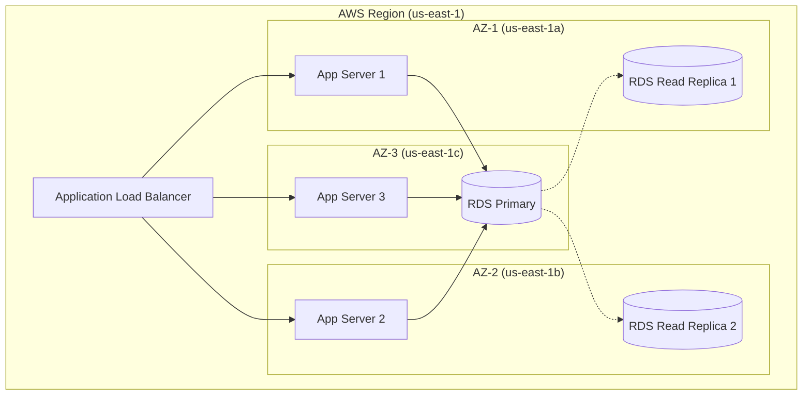
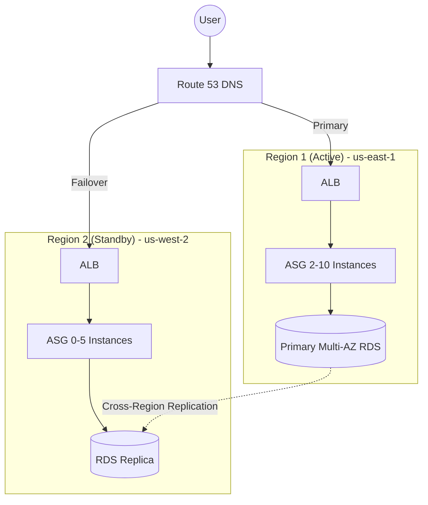

## Introduction

Domain 1 of the AWS Solutions Architect Associate certification focuses on designing resilient architectures that can withstand failures and maintain availability. This domain accounts for approximately 30% of the exam.

## Multi-AZ Deployment Strategy

### Understanding Availability Zones

AWS regions are divided into multiple Availability Zones (AZs). Each AZ:

- Is a separate data center
- Has independent power and cooling
- Connected via redundant network links
- Isolated from failures in other AZs

### Multi-AZ RDS Deployment

```yaml
DBInstance:
  Engine: postgres
  MultiAZ: true
  BackupRetentionPeriod: 30
  PreferredBackupWindow: "03:00-04:00"
  PreferredMaintenanceWindow: "sun:04:00-sun:05:00"

Failover:
  Automatic: true
  Duration: 1-2 minutes
```

### Multi-AZ Application Architecture

Visualizing a highly available, multi-tier application across three Availability Zones:



## Elastic Load Balancing

### Application Load Balancer (ALB)

Best for HTTP/HTTPS traffic with advanced routing.

```yaml
LoadBalancer:
  Type: application
  Scheme: internet-facing
  Listeners:
    - Port: 80
      Protocol: HTTP
      DefaultAction: redirect-to-https
    - Port: 443
      Protocol: HTTPS
      DefaultAction: forward-to-target-group

  TargetGroup:
    Port: 8080
    Protocol: HTTP
    HealthCheck:
      Path: /health
      Interval: 30
      SuccessCount: 2
      UnhealthyThreshold: 3
```

### Network Load Balancer (NLB)

Extreme performance for millions of requests per second.

```bash
aws elbv2 create-load-balancer \
  --name my-nlb \
  --type network \
  --scheme internet-facing \
  --subnets subnet-1 subnet-2
```

### Classic Load Balancer (ELB)

Legacy load balancer (not recommended for new applications).

## Auto Scaling

### Launch Templates and Configurations

```yaml
LaunchTemplate:
  ImageId: ami-12345
  InstanceType: t3.medium
  SecurityGroupIds:
    - sg-12345
  TagSpecifications:
    - ResourceType: instance
      Tags:
        - Key: Name
          Value: app-server
```

### Auto Scaling Group Configuration

```bash
aws autoscaling create-auto-scaling-group \
  --auto-scaling-group-name app-asg \
  --launch-template LaunchTemplateName=app-lt \
  --min-size 2 \
  --max-size 10 \
  --desired-capacity 4 \
  --vpc-zone-identifier "subnet-1,subnet-2,subnet-3"
```

### Scaling Policies

**Target Tracking Scaling**

```json
{
  "TargetTrackingConfiguration": {
    "TargetValue": 70.0,
    "PredefinedMetricSpecification": {
      "PredefinedMetricType": "ASGAverageCPUUtilization"
    },
    "ScaleOutCooldown": 300,
    "ScaleInCooldown": 300
  }
}
```

**Step Scaling**

```bash
aws autoscaling put-scaling-policy \
  --auto-scaling-group-name app-asg \
  --policy-name scale-up \
  --policy-type StepScaling \
  --metric-aggregation-type Average
```

## RTO and RPO

### Definitions

- **RTO (Recovery Time Objective)**: Maximum acceptable downtime
- **RPO (Recovery Point Objective)**: Maximum acceptable data loss

```yaml
Tier 1 - Critical:
  RTO: 1 hour
  RPO: 15 minutes
  Strategy: Multi-region active-active

Tier 2 - Important:
  RTO: 4 hours
  RPO: 1 hour
  Strategy: Multi-region active-passive

Tier 3 - Standard:
  RTO: 24 hours
  RPO: 24 hours
  Strategy: Single region with backups
```

## Backup and Recovery Strategies

### AWS Backup

```bash
# Create backup plan
aws backup create-backup-plan \
  --backup-plan file://backup-plan.json

# Assign resources
aws backup create-backup-selection \
  --backup-plan-id plan-123 \
  --backup-selection file://backup-selection.json
```

### Cross-Region Backup

```bash
# Enable cross-region replication for RDS
aws rds modify-db-instance \
  --db-instance-identifier prod-db \
  --enable-cloudwatch-logs-exports error,general
```

## Fault-Tolerant Architecture Pattern

For mission-critical applications, a multi-region active-passive strategy ensures continuity even if an entire AWS region experiences an outage.



## Health Checks

### ELB Health Check Configuration

```yaml
HealthCheck:
  Target: HTTP:8080/health
  Interval: 30 seconds
  Timeout: 5 seconds
  HealthyThreshold: 2
  UnhealthyThreshold: 3
```

### Custom Health Checks

```python
from flask import Flask, jsonify
import psutil

app = Flask(__name__)

@app.route('/health', methods=['GET'])
def health_check():
    checks = {
        'database': check_database(),
        'disk_space': check_disk_space(),
        'memory': check_memory()
    }

    status = 'healthy' if all(checks.values()) else 'unhealthy'
    return jsonify({'status': status, 'checks': checks})
```

## Common Exam Questions

**Q: What is the maximum RTO for a Multi-AZ RDS failover?**
A: 1-2 minutes for automatic failover

**Q: Can you use the same security group across AZs?**
A: Yes, security groups are region-specific but can span AZs

**Q: What happens during an ASG scale-in event?**
A: Instances are terminated based on termination policies (oldest launch config, oldest instance, etc.)

## Key Takeaways

1. Design for multiple AZs within a region
2. Use Auto Scaling for elasticity
3. Implement health checks properly
4. Define RTO/RPO for each application tier
5. Use appropriate load balancing strategy
6. Regular backup and testing of recovery procedures

## Resources

- [AWS Well-Architected Framework - Reliability Pillar](https://docs.aws.amazon.com/wellarchitected/latest/reliability-pillar/)
- [AWS Auto Scaling Documentation](https://docs.aws.amazon.com/autoscaling/)
- [Elastic Load Balancing Guide](https://docs.aws.amazon.com/elasticloadbalancing/)
