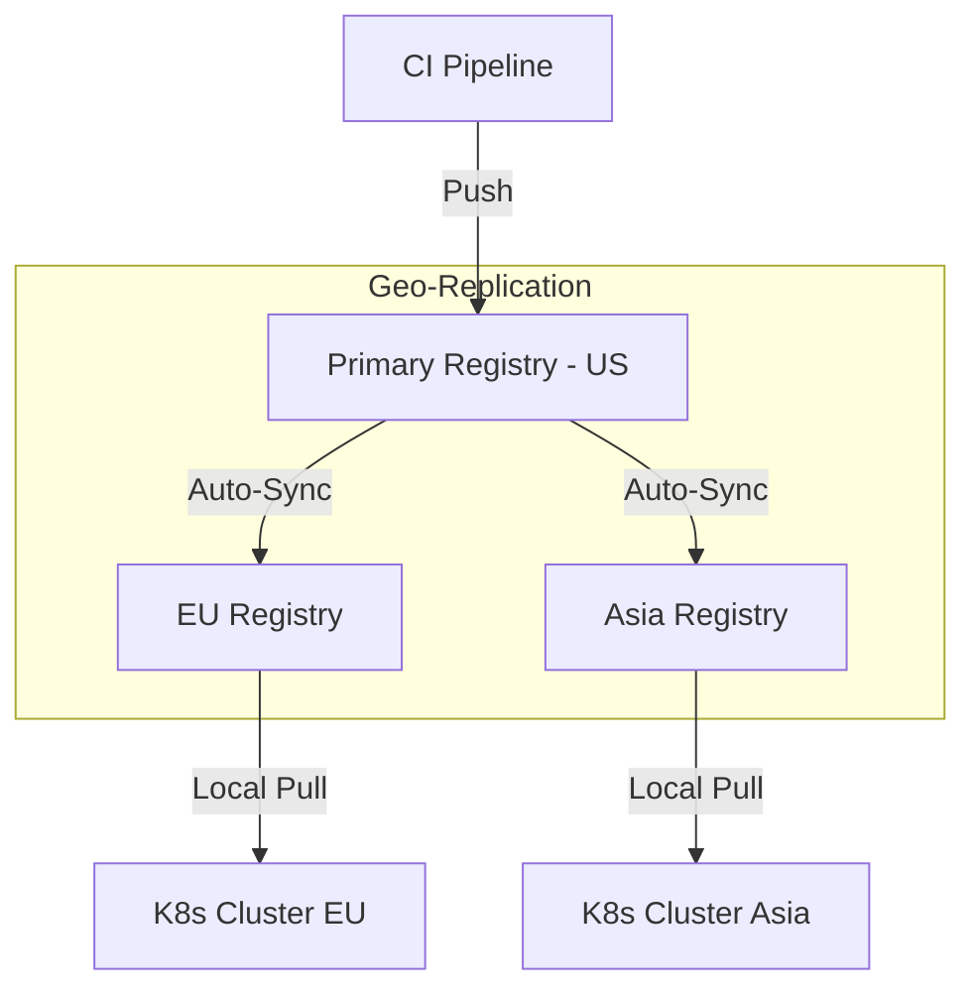
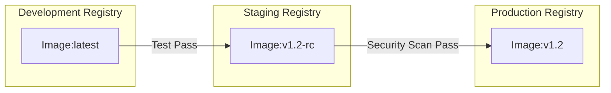
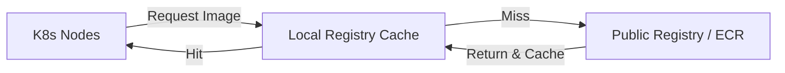

## Introduction

As your Kubernetes clusters grow, how you store and distribute container images becomes a critical bottleneck. A poorly designed registry architecture leads to slow deployments, high egress costs, and potential single points of failure.

In this guide, we’ll explore the patterns used by elite DevOps teams to manage the lifecycle of their container images across global environments.

---

## 1. The Global Geo-Replicated Pattern

Ideal for organizations with a global footprint. You push once to a primary registry, and the service automatically replicates the image to regions closer to your target clusters.

### The Flow

### When to Use It
*   **Global Teams:** When you have developers and clusters in multiple continents.
*   **Performance:** Drastically reduces "Time to First Byte" for large image pulls.
*   **High Availability:** If one region goes down, clusters can failover to a nearby replica.

---

## 2. The Promotion-Based Registry Pattern

This pattern enforces security and stability by having separate registries (or projects) for different lifecycle stages. Images are "promoted" from Dev to Prod only after passing scans and tests.

### The Flow

### When to Use It
*   **Compliance:** You need to prove that only scanned/approved images reach production.
*   **Isolation:** Prevents accidental deployment of "bleeding edge" development code.
*   **Enterprise Scale:** Ideal for Harbor or Artifactory implementations.

---

## 3. The Pull-Through Cache Pattern

For edge locations or local developer environments, a pull-through cache sits between your cluster and the main registry (like Docker Hub). It caches images locally to save bandwidth and speed up future pulls.

### The Flow

### When to Use It
*   **Cost Control:** Reduces NAT Gateway and egress costs significantly.
*   **Network Constraints:** Ideal for on-premise data centers with limited external bandwidth.
*   **Reliability:** Provides limited protection against public registry outages.

---

## Comparison Matrix: Registry Architectures

| Pattern | Speed | Reliability | Complexity | Best For |
| :--- | :--- | :--- | :--- | :--- |
| **Geo-Replicated** | Very High | Excellent | High | Global SaaS, Multi-region apps |
| **Promotion-Based** | High | High | Medium | Fintech, Medtech, Enterprise |
| **Pull-Through Cache** | High | Medium | Low | On-prem, Edge, Local Dev |

---

## Human in the Loop: Image Governance

A registry is more than just storage; it’s a **Gatekeeper**.

1.  **Immutable Tags:** Never use `latest` in production. Use semantic versioning or commit SHAs.
2.  **Vulnerability Scanning:** Ensure every push triggers a scan (Clair, Trivy, or native cloud scanners).
3.  **Retention Policies:** Automatically prune old images that are no longer in use to keep storage costs predictable.

### Final Recommendation
For 90% of teams, a **Cloud-Native Registry (ECR/GCR/ACR)** with **Promotion-Based projects** is the winning strategy. It provides the best balance of security and operational simplicity.

---

## Resources
- [Project Harbor Documentation](https://goharbor.io/docs/)
- [AWS ECR Replication Guide](https://docs.aws.amazon.com/AmazonECR/latest/userguide/replication.html)
- [Docker Hub Cache Strategy](https://docs.docker.com/docker-hub/mirror/)
