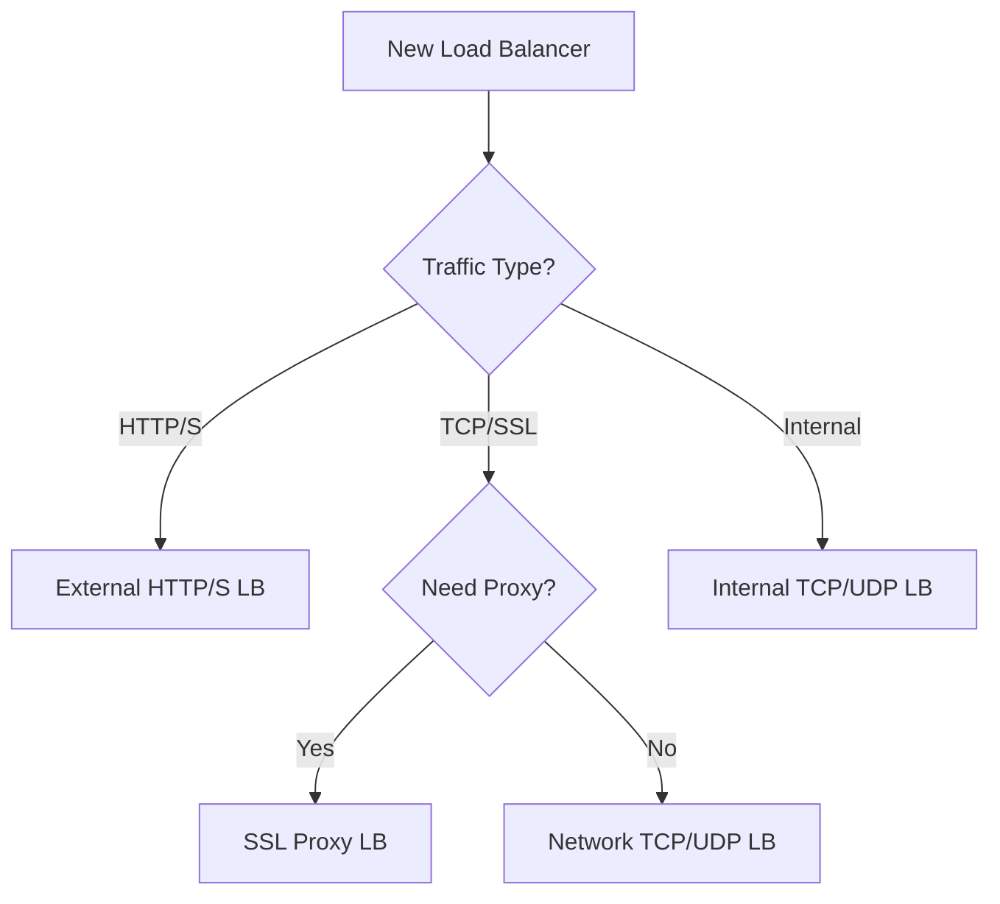

Welcome to Part 3 of our **Google Cloud ACE** series. Today we tackle the "plumbing" of the cloud: **Networking and Deployment**. For the exam, networking is often the most challenging section because it involves complex concepts like IP CIDR ranges, firewall rules, and global load balancing.

## Virtual Private Cloud (VPC) Fundamentals

A VPC is a global resource in Google Cloud. Unlike other providers where VPCs are regional, Google's network spans the globe.

### VPC Types
1. **Auto Mode**: Automatically creates one subnet per region with a `/20` CIDR range. Great for labs, bad for production.
2. **Custom Mode**: No subnets created automatically. You define exactly what you need. **This is the recommended approach for production.**

### Subnets
Subnets are regional. Resources in different subnets but the same VPC can communicate via internal IP addresses by default.

```bash
# Create a custom VPC
gcloud compute networks create ace-vpc --subnet-mode=custom

# Create a subnet in us-central1
gcloud compute networks subnets create public-subnet \
    --network=ace-vpc \
    --range=10.0.1.0/24 \
    --region=us-central1
```

## Securing the Network with Firewalls

Google Cloud uses a **distributed firewall**. Firewall rules are applied to the VPC but enforced at the instance level.

### Key Characteristics
- **Implicit Deny Ingress**: All incoming traffic is blocked by default.
- **Implicit Allow Egress**: All outgoing traffic is allowed by default.
- **Priority**: A lower number means higher priority (e.g., priority `100` beats `1000`).

```bash
# Allow HTTP traffic to instances with the 'http-server' tag
gcloud compute firewall-rules create allow-http \
    --network=ace-vpc \
    --allow=tcp:80 \
    --target-tags=http-server \
    --description="Allow port 80 for web servers"
```

## Cloud Load Balancing (CLB)

Google Cloud offers several types of load balancers. Choosing the right one is a classic ACE exam question.



### Global vs. Regional
- **Global**: HTTP/S, SSL Proxy, and TCP Proxy. Use these for cross-region traffic and CDNs (Cloud CDN).
- **Regional**: Network LB (External TCP/UDP) and Internal LB. These are used within a single region.

### Health Checks
Load balancers use health checks to ensure they only send traffic to "healthy" instances. If a health check fails, the instance is removed from the rotation.

## Deployment Tooling: Infrastructure-as-Code

While the exam focuses on `gcloud` and the Console, you should know the primary IaC tool: **Deployment Manager**.

- **Deployment Manager**: Native to GCP, uses YAML/Python/Jinja2 templates.
- **Cloud Foundation Toolkit**: A set of best-practice templates for Terraform.

```bash
# Deploy a configuration
gcloud deployment-manager deployments create my-infra --config config.yaml
```

## Networking Checklist for ACE

- [ ] Know the difference between Auto and Custom VPC modes.
- [ ] Understand that Subnets are regional but VPCs are global.
- [ ] Practice creating firewall rules using `target-tags`.
- [ ] Memorize the Load Balancer decision tree (External HTTP/S vs. Network TCP/UDP).
- [ ] Understand that Internal Load Balancers are used for internal tiers (e.g., App to DB).

In **Part 4**, we'll dive into **Operations**, focusing on Managed Instance Groups (MIGs) and Kubernetes Engine (GKE) operations.

---
*This is Part 3 of our Google Cloud ACE Series. [Part 4: Operations and GKE Management →](/blog/google-cloud-ace-series-part-4-operations-and-gke-management)*
