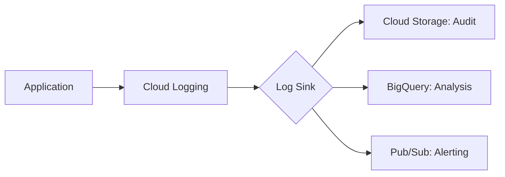

Welcome to Part 4 of our **Google Cloud ACE** series. This domain, **Ensuring Successful Operation of a Cloud Solution**, accounts for a significant portion of the exam. It’s all about the day-to-day tasks: monitoring, scaling, and maintaining your deployments.

## Managed Instance Groups (MIGs)

MIGs are the backbone of scalable GCE workloads. They allow you to manage a group of identical VMs as a single entity.

### Key Features
- **Autoscaling**: Automatically add or remove VMs based on CPU, load balancing capacity, or custom metrics.
- **Autohealing**: Uses health checks to recreate instances that fail.
- **Rolling Updates**: Update your application with zero downtime.

```bash
# Create an instance template
gcloud compute instance-templates create ace-template \
    --machine-type=e2-medium \
    --image-family=debian-11 \
    --image-project=debian-cloud

# Create a MIG using that template
gcloud compute instance-groups managed create ace-mig \
    --template=ace-template \
    --size=3 \
    --zone=us-central1-a
```

## Google Kubernetes Engine (GKE) Operations

GKE is a complex topic for ACE, but you mostly need to know how to *operate* the cluster, not necessarily how to build complex YAML files.

### Cluster Management
- **Standard**: You manage the nodes. You pay for the VMs.
- **Autopilot**: Google manages the nodes. You pay for the Pods you run.

### Essential `kubectl` Commands
You must know how to interact with the cluster via CLI:

```bash
# Get credentials for your cluster
gcloud container clusters get-credentials ace-cluster --region us-central1

# View running pods
kubectl get pods

# Inspect a specific pod
kubectl describe pod [POD_NAME]

# Scale a deployment
kubectl scale deployment [DEPLOYMENT_NAME] --replicas=5

# View logs from a pod
kubectl logs [POD_NAME]
```

## Google Cloud Operations Suite (Stackdriver)

Formerly known as Stackdriver, this is the observability layer of GCP.

### 1. Cloud Monitoring
- **Dashboards**: Visualize metrics.
- **Alerting**: Set up notifications (Email, SMS, Pub/Sub) when a threshold is met (e.g., CPU > 80%).
- **Uptime Checks**: Verify that your service is reachable from around the world.

### 2. Cloud Logging
- **Log Explorer**: Search and filter logs across all services.
- **Log Sinks**: Export logs to **Cloud Storage** (long-term archive), **BigQuery** (analysis), or **Pub/Sub** (real-time processing).



## Operational Tasks Checklist

- [ ] **Snapshots**: Know how to take a snapshot of a persistent disk for backup.
- [ ] **MIG Resizing**: Practice scaling a MIG manually and via autoscaler.
- [ ] **GKE Upgrades**: Understand that GKE can automatically upgrade nodes and masters.
- [ ] **Custom Metrics**: Know that you can install the Ops Agent to collect OS-level metrics like RAM usage.

## Summary for Part 4

- [ ] MIGs provide **Autohealing** and **Autoscaling**.
- [ ] Use `kubectl` for container-level operations and `gcloud` for cluster-level operations.
- [ ] Cloud Logging sinks allow for long-term retention in BigQuery or GCS.
- [ ] Monitoring alerts help you respond to issues before they become outages.

In **Part 5**, our final post, we'll cover **Access and Security**, focusing on IAM and Service Accounts.

---
*This is Part 4 of our Google Cloud ACE Series. [Part 5: Access, Security, and IAM →](/blog/google-cloud-ace-series-part-5-access-security-and-iam)*
