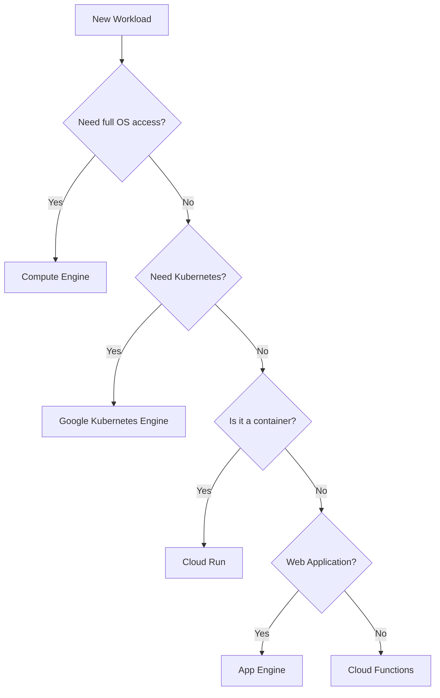

Planning is the second domain of the **Google Cloud Associate Cloud Engineer (ACE)** exam. This section tests your ability to map business requirements to technical services. The most critical decision you'll face is: **Which compute service should I use?**

In this post, we'll build a mental framework for choosing compute and storage, and explore how to estimate costs using the Google Cloud Pricing Calculator.

## Choosing the Right Compute Service

Google Cloud offers a spectrum of compute options, from full control (IaaS) to fully managed (PaaS/Serverless).



### 1. Compute Engine (GCE) - Infrastructure-as-a-Service
Use this when you need:
- Specific OS versions or kernels.
- Legacy software that requires low-level configuration.
- Bare metal or GPUs.
- **Exam Tip**: Know your machine families! (E2 for general purpose, N2 for balanced, C2 for compute-intensive).

### 2. Google Kubernetes Engine (GKE) - Managed Kubernetes
Use this when you have:
- Microservices architectures.
- High-scale container orchestration needs.
- **Autopilot vs. Standard**: In the exam, Autopilot is the hands-off, "pay-per-pod" model, while Standard gives you node-level control.

### 3. Cloud Run - Serverless Containers
The modern favorite. It's built on Knative and scales from **zero to N**.
- **Use Case**: Web APIs, data processing tasks, microservices that don't need the full overhead of GKE.

### 4. App Engine (GAE) - Platform-as-a-Service
- **Standard**: Scales quickly, restricted runtimes (Java, Python, Go, Node), scales to zero.
- **Flexible**: Runs Docker containers, handles consistent traffic better, does *not* scale to zero.

## Selecting the Correct Storage

Data storage choice is based on **Data Structure** and **Access Patterns**.

| Service | Type | Use Case |
| :--- | :--- | :--- |
| **Cloud Storage** | Object | Media files, backups, logs, static web assets. |
| **Cloud SQL** | Relational | Regional MySQL, PostgreSQL, SQL Server. |
| **Cloud Spanner** | Relational | Global scale, horizontal scaling, high availability. |
| **Firestore** | NoSQL | Mobile/Web app profiles, hierarchical data. |
| **Bigtable** | NoSQL | High-throughput, low-latency (IoT, Analytics). |
| **BigQuery** | Analytics | Data warehousing, SQL-based big data analysis. |

### Cloud Storage Classes
For the ACE exam, remember the "Time to Access" and "Minimum Duration":
- **Standard**: Hot data, frequent access.
- **Nearline**: Access < once a month (30-day min).
- **Coldline**: Access < once a quarter (90-day min).
- **Archive**: Long-term storage (365-day min).

## Estimating Costs

You must know how to use the **Google Cloud Pricing Calculator**.
- **ACE Logic**: If a scenario asks for the "most cost-effective" solution, look for **Preemptible/Spot VMs** or **Committed Use Discounts (CUDs)**.
- **Preemptible VMs**: Up to 80% cheaper, but Google can take them back with a 30-second warning. Great for fault-tolerant batch jobs.

## Planning Tools Checklist

1. **Pricing Calculator**: Use it for baseline estimates.
2. **Cloud SDK (gcloud)**: Use it to check available machine types in a region.
   ```bash
   gcloud compute machine-types list --filter="zone:us-central1-a"
   ```
3. **Data Lifecycle Manager**: Use it to automate the movement of Cloud Storage objects from Standard to Coldline/Archive.

## Summary for Part 2

- [ ] Memorize the Compute Decision Tree.
- [ ] Understand the differences between Cloud SQL and Cloud Spanner.
- [ ] Know the four classes of Cloud Storage and their retention requirements.
- [ ] Remember that Spot VMs are for "interruptible" workloads.

In **Part 3**, we'll move from planning to **Deployment and Networking**, where we'll build VPCs and set up Load Balancers.

---
*This is Part 2 of our Google Cloud ACE Series. [Part 3: Deployment and Networking →](/blog/google-cloud-ace-series-part-3-deployment-and-networking)*
