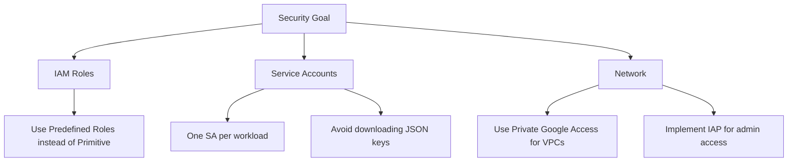

Welcome to the final installment of our **Google Cloud Associate Cloud Engineer (ACE)** series. We saved the most important for last: **Configuring access and security**. In the cloud, identity is the new perimeter. Understanding how to manage who can do what is critical for passing the exam and for professional excellence.

## 🆔 Identity and Access Management (IAM)

Google Cloud IAM lets you grant granular access to specific Google Cloud resources.

### The IAM Equation
**Who** (Member/Identity) + **Can do what** (Role/Permissions) + **On which resource**.

### 1. Members (Who)
- **Google Account**: A specific user (e.g., `user@gmail.com`).
- **Service Account**: An account for an application or workload.
- **Google Group**: A collection of users.
- **Cloud Identity Domain**: All users in a Workspace/Cloud Identity domain.

### 2. Roles (What)
- **Primitive Roles**: `Owner`, `Editor`, `Viewer`. (Too broad, avoid for production).
- **Predefined Roles**: Fine-grained roles like `Compute Instance Admin` or `Storage Object Viewer`.
- **Custom Roles**: You define the exact set of permissions.

```bash
# Add a role to a user at the project level
gcloud projects add-iam-policy-binding ace-project-123 \
    --member="user:engineer@example.com" \
    --role="roles/compute.instanceAdmin.v1"
```

## 🤖 Service Accounts: The Power Players

Service accounts are special accounts used by applications rather than people. They are identified by an email address like `account-name@project-id.iam.gserviceaccount.com`.

### Key Security Practices
- **Principle of Least Privilege**: Grant only the permissions necessary for the task.
- **Key Rotation**: If using JSON keys, rotate them frequently (or better yet, use Workload Identity).
- **Service Account Impersonation**: Allow users to "act as" a service account without downloading a key.

```bash
# Create a service account
gcloud iam service-accounts create web-app-sa \
    --display-name="Web App Service Account"

# Grant the service account access to Cloud Storage
gcloud projects add-iam-policy-binding ace-project-123 \
    --member="serviceAccount:web-app-sa@ace-project-123.iam.gserviceaccount.com" \
    --role="roles/storage.objectViewer"
```

## 🛡️ Other Security Services

While IAM is the focus of ACE, you should be familiar with these supporting services:

1. **Identity-Aware Proxy (IAP)**: Control access to applications running on GCP based on identity/context, without needing a VPN.
2. **Cloud Armor**: Protect against DDoS attacks and Web Application Firewall (WAF) threats.
3. **Cloud KMS**: Manage encryption keys (Customer-Managed Encryption Keys - CMEK).
4. **Secret Manager**: Securely store API keys, passwords, and certificates.

## 🔒 Security Best Practices for the ACE Exam



## 🎓 Final ACE Exam Tips

As you wrap up your study, keep these "Exam Logic" pointers in mind:
- **Least Privilege**: Always choose the role that provides the *minimum* required permissions.
- **Inheritance**: Remember that policies set at the Folder level *cannot* be restricted at the Project level (they can only be expanded).
- **Hierarchy**: Resource hierarchy is the foundation. If you see a question about organization-wide control, look for **Organization Policy Service**.

## 🏁 Series Wrap-up

Congratulations! You’ve covered the core domains of the Google Cloud Associate Cloud Engineer exam:
- [Part 1: Resource Hierarchy & Setup](/blog/2026-04-27-gcp-ace-setup-hierarchy)
- [Part 2: Planning & Compute Fit](/blog/2026-04-27-gcp-ace-planning-compute)
- [Part 3: Deployment & Networking](/blog/2026-04-27-gcp-ace-deployment-networking)
- [Part 4: Operations & GKE](/blog/2026-04-27-gcp-ace-operations-gke)
- **Part 5: Access & Security**

The next step is **Hands-on Practice**. Open the Google Cloud Console, use the `gcloud` SDK, and build something!

Good luck on your certification journey! 🚀

---
*This concludes our Google Cloud ACE Series. Check out our other [DevOps and Cloud guides](/blog) for more technical deep dives.*
