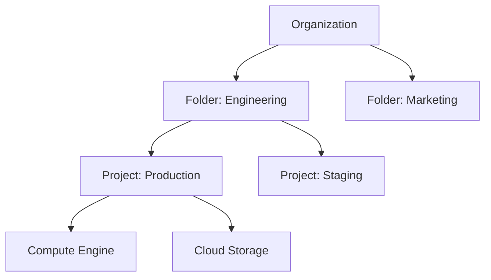

Welcome to the first part of our **Google Cloud Associate Cloud Engineer (ACE)** mastery series. The ACE exam isn't just about knowing services; it's about knowing how to *operate* them within the Google Cloud ecosystem. 

In this post, we'll dive deep into the first domain of the exam: **Setting up a cloud solution environment**. We'll cover the resource hierarchy, project management, and the critical (but often overlooked) world of billing and quotas.

## 🏗️ The Google Cloud Resource Hierarchy

Before you can deploy a single VM, you need to understand where it lives. Google Cloud uses a strictly hierarchical structure to manage resources and inheritance.



### 1. The Organization
The root node in the hierarchy. It represents your company and is linked to a Google Workspace or Cloud Identity domain.
- **Key Takeaway**: IAM policies applied at this level are inherited by everything below.

### 2. Folders
Folders provide an additional grouping mechanism between the Organization and Projects.
- **Use Case**: Separate by department (HR, Finance) or environment (Dev, Prod).

### 3. Projects
The fundamental unit for enabling services, managing APIs, and billing.
- **Project ID**: Globally unique, immutable.
- **Project Number**: Generated by Google, immutable.
- **Project Name**: User-defined, can be changed.

## 🛠️ Managing Projects via CLI

For the ACE exam, you must be comfortable with `gcloud`. Here are the essential commands for project setup:

```bash
# List all projects
gcloud projects list

# Create a new project
gcloud projects create my-ace-lab-project-123 --name="ACE Lab"

# Set the active project in your local config
gcloud config set project my-ace-lab-project-123

# Describe a project to see its Number and ID
gcloud projects describe my-ace-lab-project-123
```

## 🔐 Enabling APIs and Services

In Google Cloud, services are disabled by default to save costs and reduce security surface. You must enable them before use.

```bash
# List available services in the project
gcloud services list --available

# Enable Compute Engine API
gcloud services enable compute.googleapis.com

# Enable Kubernetes Engine API
gcloud services enable container.googleapis.com
```

## 💰 Billing, Budgets, and Quotas

Billing is a major part of the ACE exam. You need to know how to prevent "bill shock" and handle resource limits.

### Billing Accounts
- Linked to one or more projects.
- Projects *without* a billing account cannot use paid services.

### Budgets and Alerts
Budgets don't stop spending; they only **alert** you.
- **Exam Tip**: You can set alerts at 50%, 90%, and 100% of your budget.

### Billing Export to BigQuery
For advanced analysis, you should export your billing data to BigQuery.
1. Create a BigQuery dataset.
2. Enable "Billing Export" in the Billing console.
3. Use SQL to analyze trends.

### Quotas: The Safety Valves
Google Cloud enforces quotas to prevent runaway costs and protect its infrastructure.
- **Rate Quotas**: Limits on API calls (e.g., 1000 requests per minute).
- **Allocation Quotas**: Limits on total resources (e.g., 24 CPUs in a region).

```bash
# Check your compute quotas in a specific region
gcloud compute project-info describe --project [PROJECT_ID]
```

## 🏁 Summary Checklist for Part 1

- [ ] Understand the Org -> Folder -> Project hierarchy.
- [ ] Know the difference between Project ID, Name, and Number.
- [ ] Practice `gcloud config` and `gcloud projects` commands.
- [ ] Understand that Budgets do not cap spending (they only alert).
- [ ] Know how to request a quota increase (via the console).

In **Part 2**, we'll tackle **Planning and Configuring a Cloud Solution**, including how to choose the right compute and storage options for your workload.

---
*This is Part 1 of our Google Cloud ACE Series. [Part 2: Planning and Compute Fit →](/blog/2026-04-27-gcp-ace-planning-compute)*
