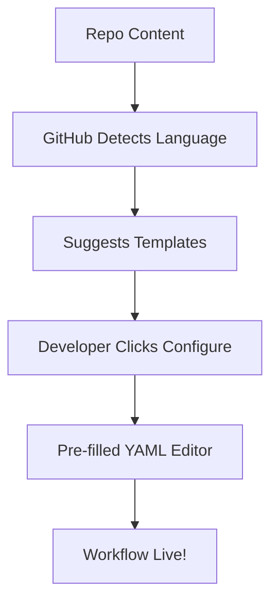

Automating your software development lifecycle shouldn't feel like a chore. While YAML is the language of GitHub Actions, you don't always need to start with a blank file. GitHub provides a powerful library of **Workflow Templates** that can get your CI/CD pipelines running in seconds.

In this first part of our series, we’ll cover the basics of using these templates to standardize and speed up your development.

---

## 1. Why Use Workflow Templates?

Workflow templates are pre-configured YAML files designed for specific languages, frameworks, and deployment targets. Instead of scouring the internet for the "perfect" Node.js or Python configuration, you can use a template that is:
- **Maintained by GitHub:** Always up-to-date with security best practices.
- **Context-Aware:** Suggested based on the code already in your repository.
- **Customizable:** A starting point that you can tweak to fit your specific needs.

---

## 2. How to Use a Suggested Template

GitHub's UI makes it incredibly easy to find the right template.

1.  Navigate to your repository on GitHub.com.
2.  Click on the **Actions** tab.
3.  If you don't have any workflows yet, you'll see a list of "suggested" templates based on your codebase.
4.  Find the template that matches your stack (e.g., "Node.js", "Docker Image") and click **Configure**.

### Visualizing the Setup Flow


---

## 3. Understanding the Anatomy of a Basic Template

When you open a template, you'll see a structure similar to this:

```yaml
name: Node.js CI

on:
  push:
    branches: [ "main" ]
  pull_request:
    branches: [ "main" ]

jobs:
  build:
    runs-on: ubuntu-latest
    steps:
    - uses: actions/checkout@v4
    - name: Use Node.js
      uses: actions/setup-node@v4
      with:
        node-version: '20.x'
    - run: npm ci
    - run: npm run build --if-present
    - run: npm test
```

### Key Components:
- **`on`:** The events that trigger the workflow (e.g., pushing code).
- **`jobs`:** A collection of tasks that run on a fresh virtual machine (the `runs-on` property).
- **`steps`:** Individual tasks, like checking out code or running a script.
- **`uses`:** References to external **Actions** (pre-written code blocks) that do the heavy lifting.

---

## 4. Best Practices for Beginners

- **Start Simple:** Use the suggested template without changes first to ensure it passes.
- **Use `workflow_dispatch`:** Add `workflow_dispatch: {}` to your `on:` section so you can trigger the workflow manually for testing.
- **Check the Logs:** Click into the "Actions" tab to see exactly where a build fails. GitHub provides rich logs for every step.

---

## Bonus: Managing Workflows from VS Code

While the GitHub UI is great for setup, you can manage your running workflows directly from **VS Code**. 

Install the [Official GitHub Actions Extension](https://marketplace.visualstudio.com/items?itemName=GitHub.vscode-github-actions) to:
- **Monitor Runs:** See build status in your sidebar.
- **Trigger Manually:** Run `workflow_dispatch` events without leaving your editor.
- **View Logs:** Stream live job logs directly into a VS Code output channel.

---

## Conclusion

Workflow templates are the fastest way to move from "code only" to "CI/CD enabled." In the next part of this series, we’ll go beyond the defaults and learn how to create **Organization-wide Templates** to standardize DevOps across your entire team.

**Ready for more?** Move on to [Part 2: Custom Organization Templates](/blog/github-actions-masterclass-part-2-custom-organization-templates).
