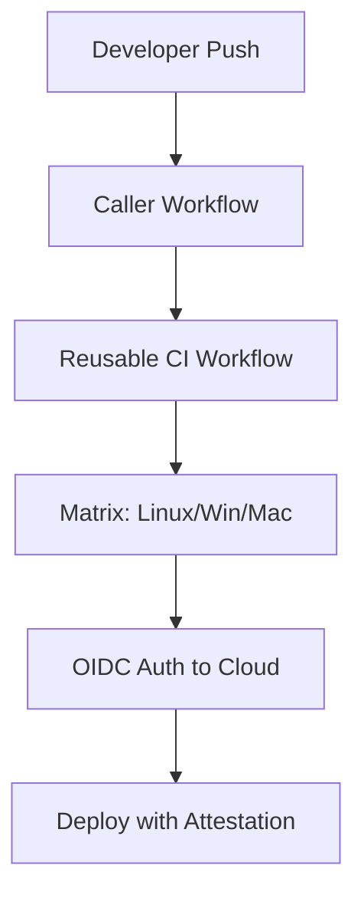

# GitHub Actions Masterclass Part 3: Reusable Workflows and Advanced Logic

We've covered [Basics](./2026-04-27-github-actions-part1-basics-workflow-templates) and [Organization Templates](./2026-04-27-github-actions-part2-intermediate-organization-templates). Now, it’s time to talk about the "holy grail" of GitHub Actions: **DRY (Don't Repeat Yourself)** pipelines.

In this final part, we’ll dive into Reusable Workflows and advanced security practices that separate the hobbyists from the professional DevOps engineers.

---

## 1. Reusable Workflows (`workflow_call`)

Templates are great for starting a project, but if you update a template, it doesn't automatically update the 50 repositories already using it. **Reusable Workflows** solve this by allowing one workflow to "call" another, much like a function call in programming.

### The "Callable" Workflow (`reusable-ci.yml`)
```yaml
name: Reusable CI
on:
  workflow_call:
    inputs:
      node-version:
        required: true
        type: string
    secrets:
      DEPLOY_TOKEN:
        required: true

jobs:
  test:
    runs-on: ubuntu-latest
    steps:
      - uses: actions/checkout@v4
      - uses: actions/setup-node@v4
        with:
          node-version: ${{ inputs.node-version }}
      - run: npm test
```

### The "Caller" Workflow (`main.yml`)
```yaml
jobs:
  call-ci:
    uses: our-org/central-repo/.github/workflows/reusable-ci.yml@v1
    with:
      node-version: '20'
    secrets:
      DEPLOY_TOKEN: ${{ secrets.GLOBAL_DEPLOY_TOKEN }}
```

By using `@v1`, you can version your infrastructure. If you need to upgrade to Node 22, you update the reusable workflow once, and everyone benefits!

---

## 2. Advanced Matrix Strategies

Why run tests on one OS when you can run them on three? A matrix allows you to spawn multiple job variations from a single definition.

```yaml
jobs:
  test:
    runs-on: ${{ matrix.os }}
    strategy:
      matrix:
        os: [ubuntu-latest, windows-latest, macos-latest]
        node: [18, 20, 22]
        # Exclude specific combinations
        exclude:
          - os: windows-latest
            node: 18
    steps:
      - uses: actions/setup-node@v4
        with:
          node-version: ${{ matrix.node }}
```

This generates **9 separate jobs** (3 OS x 3 Node versions), ensuring your software is truly cross-platform.

---

## 3. Security Hardening: OIDC & Artifact Attestations

Advanced GitHub Actions isn't just about speed; it's about trust.

### OpenID Connect (OIDC)
Stop using long-lived cloud secrets (like AWS Access Keys). Instead, use OIDC to let GitHub Actions "talk" to AWS/Azure/GCP using a short-lived, identity-based token.
```yaml
permissions:
  id-token: write # Required for OIDC
  contents: read
```

### Artifact Attestations
Ensure that the Docker image or binary you are deploying actually came from *your* GitHub Action and hasn't been tampered with.
```yaml
- name: Attest build provenance
  uses: actions/attest-build-provenance@v1
  with:
    subject-path: 'dist/my-app.bin'
```

---

## 4. Visualizing the Enterprise Pipeline



---

## Conclusion

Congratulations! You’ve gone from selecting a basic template to architecting a global, secure, and reusable CI/CD ecosystem. GitHub Actions is a deep pool, and the best way to keep learning is to keep building.

### Summary of the Series:
- **Part 1:** Getting started with GitHub's suggested templates.
- **Part 2:** Standardizing your team with Organization Templates.
- **Part 3:** Scaling with Reusable Workflows and OIDC.

**What will you automate next?**
