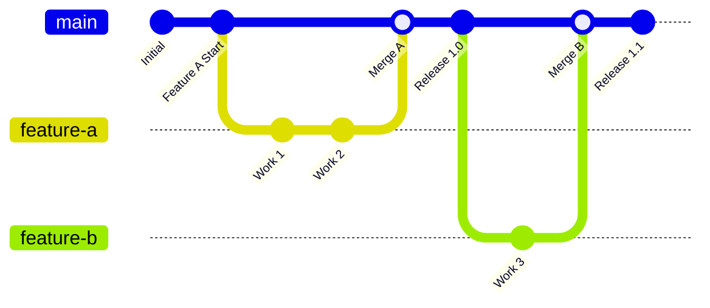
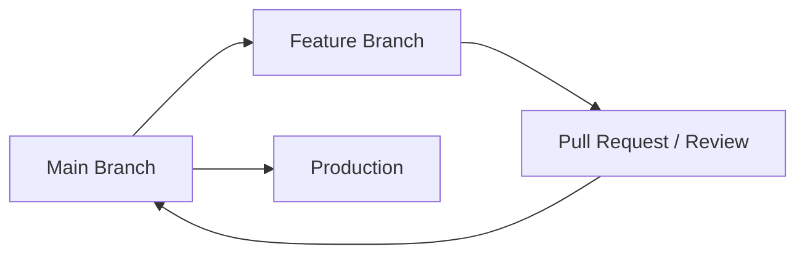
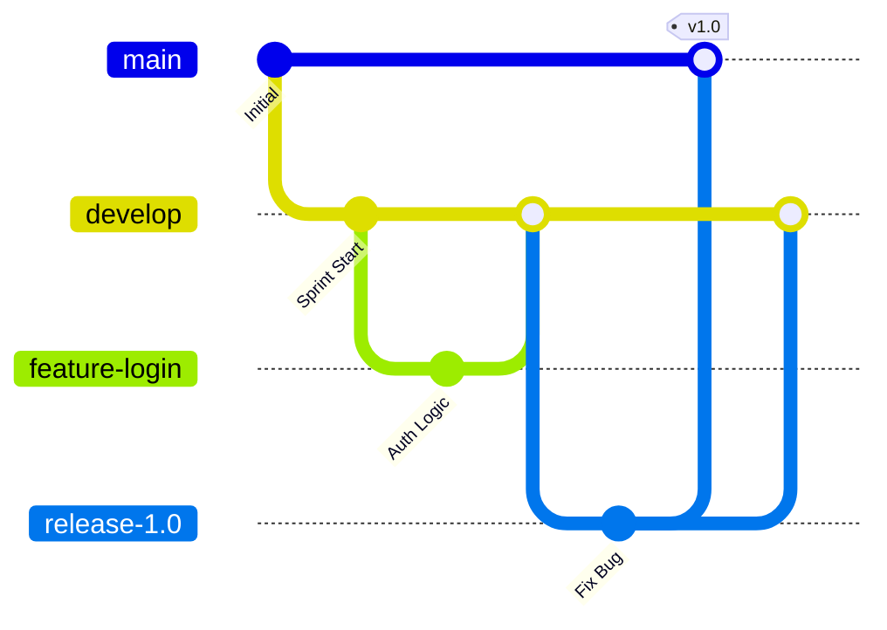
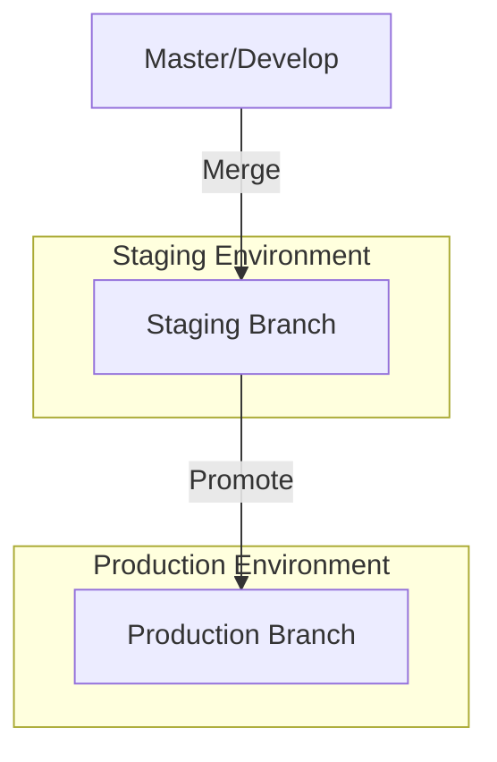

## Introduction

In the world of DevOps and Platform Engineering, code is the foundation of everything. But as teams grow, how you manage that code becomes as important as the code itself. A well-chosen **Git Branching Strategy** is the difference between a high-velocity CI/CD pipeline and a "merge hell" that grinds development to a halt.

In this guide, we’ll explore the most popular branching strategies, visualize their flows using Mermaid, and help you decide which one fits your team’s culture and delivery goals.

---

## 1. Trunk-Based Development (TBD)

Trunk-Based Development is the gold standard for high-performing DevOps teams. Developers collaborate on a single branch (usually `main` or `master`) and perform small, frequent commits.

### The Flow

### When to Use It
*   **High Seniority Teams:** Requires discipline to keep the trunk always deployable.
*   **Microservices:** Ideal for smaller repositories with frequent releases.
*   **CI/CD Maturity:** You need robust automated testing to catch issues immediately.

---

## 2. GitHub Flow (Short-Lived Feature Branches)

GitHub Flow is a simplified version of GitFlow. It focuses on the idea that anything in the `main` branch is always deployable. It uses short-lived feature branches and Pull Requests (PRs) for code review.

### The Flow

### When to Use It
*   **Web Applications:** Perfect for continuous deployment where you ship multiple times a day.
*   **Open Source:** The standard for managing contributions from diverse groups.
*   **Agile Teams:** Great for teams that prioritize fast feedback loops and code reviews.

---

## 3. GitFlow (The Classic)

GitFlow is a strict branching model designed around the project release. It uses multiple long-lived branches: `master`, `develop`, `feature`, `release`, and `hotfix`.

### The Flow

### When to Use It
*   **Scheduled Releases:** If you release on a fixed cadence (e.g., every 2 weeks).
*   **Mobile Apps:** Where versions must be curated before hitting the App Store.
*   **Highly Regulated Environments:** Where multiple levels of QA and approval are required.

---

## 4. GitLab Flow (Environment-Based)

GitLab Flow bridges the gap between GitFlow and GitHub Flow by introducing **Environment Branches** (e.g., `staging`, `pre-production`, `production`).

### The Flow

### When to Use It
*   **Enterprise Apps:** Where code must pass through specific physical or virtual environments before reaching customers.
*   **Infrastructure as Code (IaC):** Perfect for managing Terraform states across Dev, Stage, and Prod environments.

---

## Comparison Table: Which One for You?

| Strategy | Complexity | Velocity | Best For |
| :--- | :--- | :--- | :--- |
| **Trunk-Based** | Low | Very High | DevOps, Microservices, CI/CD |
| **GitHub Flow** | Low | High | Web Apps, Small-Medium Teams |
| **GitLab Flow** | Medium | Medium | Environment-specific deployments |
| **GitFlow** | High | Low | Versioned Software, Mobile, Regulated |

---

## Human in the Loop: The "Golden Rule"

Regardless of the strategy you choose, remember the **Human in the Loop** principle: **Automate the toil, but keep the reasoning visible.** 

1.  **Automate Testing:** Your branching strategy is only as good as your test suite.
2.  **Lint Everything:** Don't let code style debates stall your PRs.
3.  **Visual Evidence:** Use Mermaid (like we did here!) in your internal documentation and READMEs so every team member knows exactly where code is flowing.

### Choosing Your Path
If you are just starting out, **GitHub Flow** is the safest bet. It provides a balance of speed and safety. As your team matures and your automated testing reaches 90%+ coverage, move toward **Trunk-Based Development** to achieve elite DevOps status.

---

## Resources
- [GitFlow Original Post](https://nvie.com/posts/a-successful-git-branching-model/)
- [Google Cloud: Trunk-based Development](https://cloud.google.com/architecture/devops/devops-tech-trunk-based-development)
- [Atlassian Git Tutorial](https://www.atlassian.com/git/tutorials/comparing-workflows)
