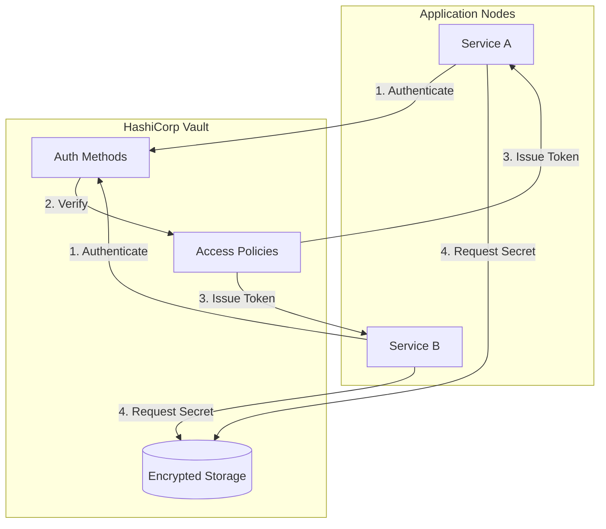
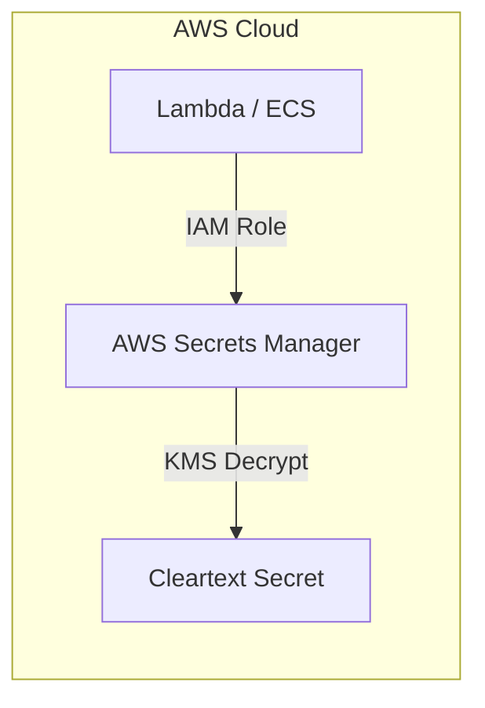
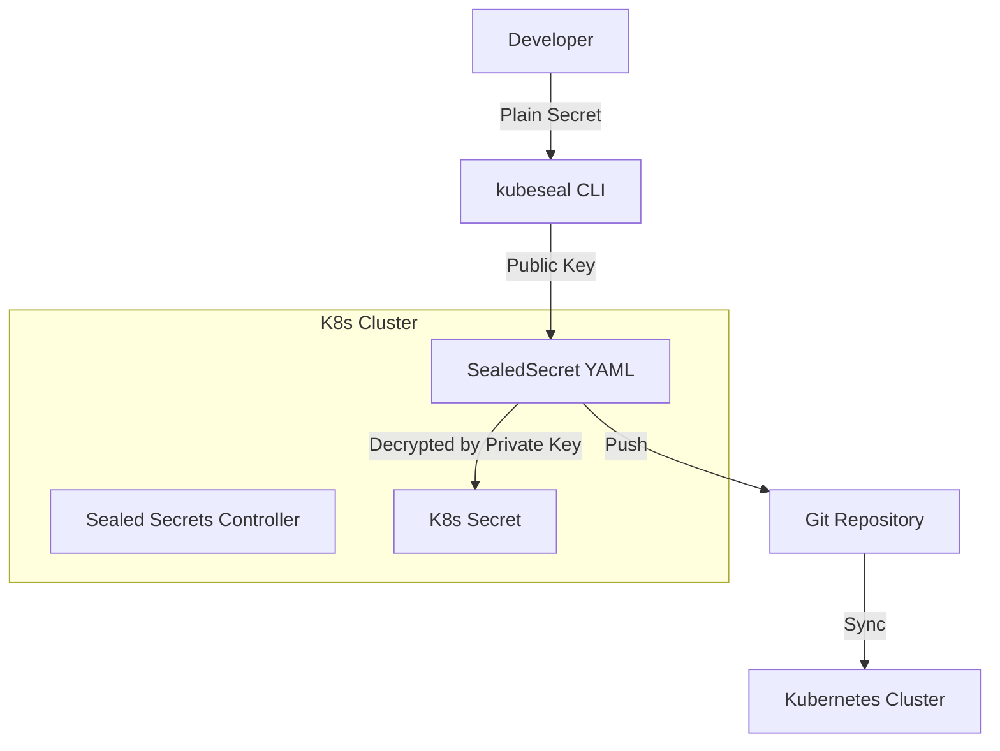

## Introduction

In the age of automated infrastructure, "Secret Sprawl" is one of the greatest security risks. Hardcoded API keys, database passwords in environment variables, and unencrypted secrets in Git repositories are the low-hanging fruit for attackers.

Choosing the right **Secret Management Strategy** is about balancing security, ease of use, and operational overhead. In this guide, we’ll break down the three primary patterns for managing secrets at scale.

---

## 1. Centralized Vault Strategy (e.g., HashiCorp Vault)

The "Standard Bearer" for enterprise security. A centralized vault provides a single source of truth for all secrets across different clouds and on-premise environments.

### The Flow

### When to Use It
*   **Multi-Cloud Environments:** You need secrets to work across AWS, Azure, and On-Prem.
*   **Dynamic Secrets:** You want to generate temporary database credentials that expire after an hour.
*   **Audit Requirements:** You need strict logging of *who* accessed *which* secret and *when*.

---

## 2. Cloud-Native Managed Secrets (e.g., AWS Secrets Manager)

Leveraging the managed services provided by your cloud vendor. This is often the "path of least resistance" for teams already deep in a specific ecosystem.

### The Flow

### When to Use It
*   **Single-Cloud Teams:** If you are 100% on AWS or Azure, the native integration with IAM is unbeatable.
*   **Low Operational Overhead:** No vault clusters to maintain or patch.
*   **Automatic Rotation:** Native support for rotating RDS and other cloud resource passwords.

---

## 3. GitOps-Friendly Secrets (e.g., Sealed Secrets)

For Kubernetes-native teams following GitOps, managing secrets can be tricky because you shouldn't check unencrypted secrets into Git. **Sealed Secrets** solves this by allowing you to store "encrypted-at-rest" secrets in your repository.

### The Flow

### When to Use It
*   **Pure GitOps Workflows:** You want your secrets to follow the same CI/CD path as your manifests.
*   **Small-Medium K8s Clusters:** When you don't want the complexity of an external Vault.
*   **Disaster Recovery:** Your entire cluster state (including secrets) is backed up in Git.

---

## Comparison Matrix

| Strategy | Security Level | Operational Complexity | Cost | Best For |
| :--- | :--- | :--- | :--- | :--- |
| **Centralized Vault** | Elite | High | High | Large Enterprises, Multi-Cloud |
| **Cloud Native** | High | Low | Medium | AWS/Azure/GCP shops |
| **GitOps / Sealed** | Medium-High | Low | Free | K8s-native teams, Startups |

---

## The "Human in the Loop" Security Policy

At **Human in the Loop**, we advocate for the **Three Pillars of Secret Hygiene**:

1.  **Never Check-in Plaintext:** If a secret is in Git history, it is compromised. Use `git-filter-repo` or `trufflehog` to audit.
2.  **Short-Lived over Static:** Favor dynamic secrets (issued on the fly) over long-lived keys that stay in a file for years.
3.  **Visibility through Auditing:** Secrets management isn't just about storage; it's about seeing the "access trails."

### Choosing Your Strategy
If you are starting your journey, **Cloud-Native Secrets** are the safest and easiest choice. As your compliance and scale requirements grow, graduating to a **Centralized Vault** is the natural evolution for platform engineering teams.

---

## Resources
- [HashiCorp Vault Documentation](https://www.vaultproject.io/docs)
- [Bitnami Sealed Secrets](https://github.com/bitnami-labs/sealed-secrets)
- [AWS Secrets Manager Best Practices](https://docs.aws.amazon.com/secretsmanager/latest/userguide/best-practices.html)
