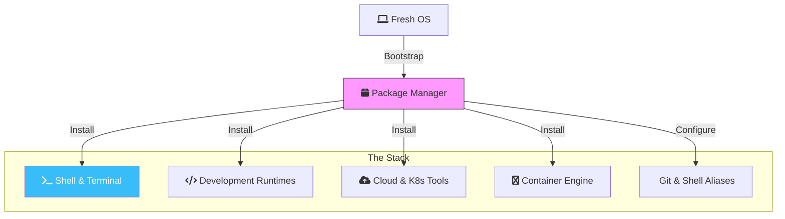

There is nothing quite like the feeling of unboxing a new machine. The screen is pristine, the fans are silent, and the storage is empty. But for a DevOps engineer, a "naked" OS is just a canvas. Our goal is to transform this machine into a high-performance "Everything-as-Code" command center as quickly as possible.

Whether you are on **macOS** (the industry favorite for local development) or **Ubuntu** (the king of the cloud), this guide will get you from zero to production-ready in under 30 minutes.

## The Strategy: Automate Everything

We don't "click" to install things. We use package managers. 



## 1. The Foundation: Package Managers

### macOS: Homebrew
If you're on a Mac, the first thing you do—before even signing into iCloud—is install Homebrew.
```bash
/bin/bash -c "$(curl -fsSL https://raw.githubusercontent.com/Homebrew/install/HEAD/install.sh)"
```

### Ubuntu: APT & Snap
Ubuntu comes with `apt`, but for the latest DevOps tools, you'll often want to add specific repositories or use `snap` for things like the Google Cloud SDK.

## 2. The Command Line: Your Real Home

You're going to spend 90% of your time in the terminal. Make it comfortable and powerful.

- **Shell**: Use **Zsh** (default on macOS).
- **Framework**: **Oh My Zsh** for plugin management.
- **Prompt**: **Starship**. It’s written in Rust, incredibly fast, and works across any shell.
- **Terminal Emulator**: 
  - **macOS**: iTerm2 or Warp.
  - **Ubuntu**: Tilix or Alacritty.

### Modern CLI Tooling (The "Rust" Revolution)
In 2026, we don't use the standard GNU tools. We use their modern, faster counterparts:
- **`zoxide`**: A smarter `cd` command (it learns where you go).
- **`fzf`**: A fuzzy finder for everything (files, history, branches).
- **`bat`**: `cat` with syntax highlighting and git integration.
- **`eza`**: A modern `ls` with icons and colors.
- **`jq` / `yq`**: Essential for parsing JSON/YAML from APIs.

```bash
# macOS install
brew install zoxide fzf bat eza jq yq
```

## 3. The DevOps Toolchain

Instead of installing these one-by-one, we can use a "Brewfile" on Mac or a simple script on Ubuntu.

### Core Infrastructure
- **Terraform / OpenTofu**: For IaC.
- **Kubectl**: The K8s steering wheel.
- **Helm**: For Kubernetes packaging.
- **AWS/GCP/Azure CLIs**: Depending on your cloud of choice.

### Development Runtimes (Use Version Managers!)
Never install Node or Python directly into your system path. It will break things.
- **Node.js**: Use `nvm` or `fnm`.
- **Python**: Use `pyenv`.
- **Go**: Use `asdf` or direct binary management.

## 4. Containers: The Engine Room

### macOS
Forget the heavy "Docker Desktop." For a faster, lighter experience, use **OrbStack** or **Colima**. They are significantly more resource-efficient on Apple Silicon.

### Ubuntu
Install the native Docker Engine. It's more stable than the Snap version for professional work. Once installed, dive into my [Docker Mastery Series](/blog/docker-mastery-part-1-advanced-networking-multi-host-connectivity) to learn how to scale and secure your containers.

```bash
# Quick Ubuntu Docker Install
curl -fsSL https://get.docker.com -o get-docker.sh
sudo sh get-docker.sh
```

## 5. Automation & Shortcuts

### Essential Git Aliases
Add these to your `~/.gitconfig` to save thousands of keystrokes over your career:

```ini
[alias]
  st = status -sb
  co = checkout
  cb = checkout -b
  cm = commit -m
  lg = log --graph --oneline --all
  please = push --force-with-lease
  undo = reset --soft HEAD~1
  # The DevOps Lifesaver: Trigger an empty commit to restart CI
  trigger = commit --allow-empty -m "chore: re-trigger pipeline"
```

### Productivity Shell Aliases
Add these to your `~/.zshrc` or `~/.bashrc`:

```bash
# Kubernetes
alias k='kubectl'
alias kgp='kubectl get pods'
alias kgs='kubectl get services'
alias kga='kubectl get all'

# Docker
alias d='docker'
alias dc='docker-compose'

# Navigation (zoxide)
alias cd='z'

# Modern tools replacements
alias ls='eza --icons'
alias cat='bat'

# For deeper automation patterns, see my guide on [Taskfile.dev](/blog/beyond-makefiles-modern-devops-automation-with-taskfiledev).
```

## 6. The "Secret Sauce": Dotfiles

The true "Expert" move is to have your entire configuration (your `.zshrc`, `.gitconfig`, Starship config, etc.) stored in a private Git repository. 

When I get a new machine, I simply:
1. Install Homebrew.
2. Clone my `dotfiles` repo.
3. Run a `setup.sh` script inside that repo.

Within 10 minutes, my new machine looks and feels **exactly** like my old one.

## Conclusion

Setting up a machine manually is a rite of passage, but doing it twice is a waste of time. By using package managers and versioning your configuration, you ensure that your DevOps workbench is portable, reproducible, and ready for whatever the cloud throws at you.

**Now go build something great!**

> [!TIP]
> **Next Step: AI-Powered Terminal**
> Now that your environment is ready, take it to the next level with an AI assistant. Check out my [Gemini CLI Getting Started Guide](/blog/gemini-cli-getting-started) to integrate Google's latest models directly into your new workflow.
