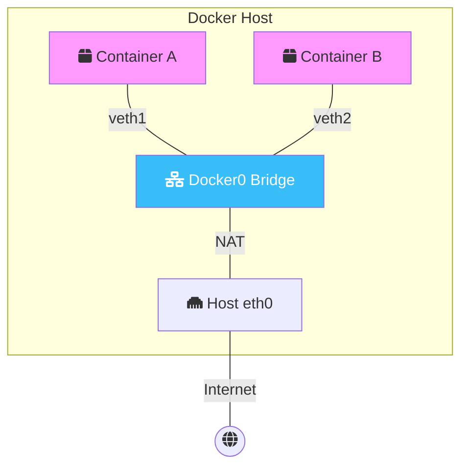
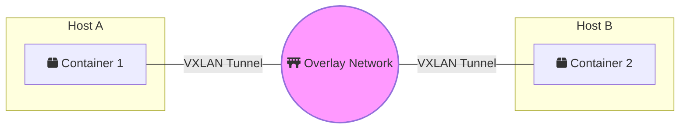

Most developers stop at `docker run -p 80:80`. While that works for local development, production-grade containerization requires a deep understanding of how packets move between isolated environments. 

Welcome to the **Docker Mastery** series. In this first installment, we are diving deep into the plumbing of container communication. If you're just starting with a fresh machine and need a robust local Docker environment, see my [Zero-Day DevOps Setup Guide](/blog/2026-05-13-devops-setup-guide).

## The Networking Stack: Under the Hood

Docker uses Linux kernel features like **Network Namespaces** and **Virtual Ethernet (veth) pairs** to isolate containers. When you create a network, Docker is essentially managing a virtual switch on your host.

### Visualizing the Bridge Network



## 1. Custom Bridge Networks (The Professional Way)

The default `bridge` network is convenient but limited. For production, you should always create **User-Defined Bridge Networks**.

**Why?**
- **Automatic DNS Resolution**: Containers on a custom bridge can talk to each other by *name* (e.g., `web` can talk to `db`). On the default bridge, you'd have to use IP addresses.
- **Better Isolation**: Only containers on the same custom network can communicate.

```bash
# Create a dedicated network for your microservice
docker network create --driver bridge my-app-net

# Attach containers
docker run -d --name db --network my-app-net postgres:alpine
docker run -d --name web --network my-app-net my-web-app
```

## 2. The Host & Macvlan Drivers

When performance is critical, or you need containers to appear as physical devices on your network:

- **Host Network**: Removes the isolation between the container and the Docker host. The container shares the host’s IP and port space.
- **Macvlan**: Assigns a MAC address to a container, making it appear as a physical device on your network. This is common in legacy networking environments or specialized hardware integrations.

## 3. Overlay Networks (Multi-Host)

This is the "Expert Level" of Docker networking. **Overlay networks** allow containers running on *different* Docker hosts to communicate as if they were on the same local network.

This is the foundation of **Docker Swarm** and other orchestration platforms.



### Deep Research Insight: VXLAN Encapsulation
Overlay networks work by wrapping container packets inside standard UDP packets (VXLAN). This allows container traffic to traverse any network that supports UDP, effectively creating a Layer 2 virtual network on top of a Layer 3 physical network. This is how Docker manages "East-West" traffic in a cluster without complex router configurations.

## Conclusion

Understanding the difference between a simple bridge and a complex overlay is what separates a developer from a DevOps engineer. 

In **Part 2**, we will leverage these networking concepts to build a resilient, scalable cluster using **Docker Swarm and Advanced Compose**.

---
_This is Part 1 of the **Docker Mastery** series. Stay tuned for Part 2!_
