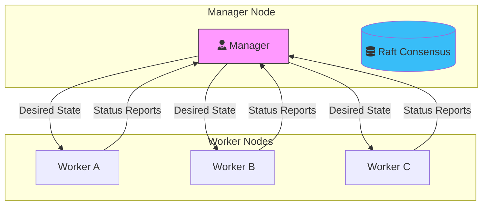

Running a single container is easy. Running a fleet of containers that can self-heal, scale on demand, and update without downtime is the true challenge of DevOps. 

In [Part 1](/blog/docker-mastery-part-1-advanced-networking-multi-host-connectivity), we mastered the networking. Now, we're going to put those networks to work with **Orchestration**.

## Advanced Docker Compose

Before moving to multiple hosts, we must master the "Advanced" side of Docker Compose.

### 1. Multi-Environment Overrides
Don't duplicate your `docker-compose.yml`. Instead, use **overrides**. Docker Compose automatically looks for `docker-compose.override.yml`. You can also chain them:

```bash
# Combine base, production settings, and secrets
docker-compose -f docker-compose.yml -f docker-compose.prod.yml up -d
```

### 2. Profiles
Profiles allow you to define optional services (like a debug tool or a database migration job) that only run when explicitly called.

```yaml
services:
  db-admin:
    image: adminer
    profiles: ["debug"] # Only starts with --profile debug
```

## Docker Swarm: The "Native" Orchestrator

While Kubernetes is the industry heavyweight, **Docker Swarm** remains the best choice for teams that want a "Docker-native" experience with lower overhead.

### Swarm Architecture



### Key Orchestration Concepts:

*   **Nodes**: Individual Docker engines in the cluster.
*   **Services**: The definition of how a container should run (image, replicas, ports).
*   **Tasks**: The actual containers running on the nodes to fulfill the service requirement.
*   **Replicated vs. Global**: Replicated services run a specific number of instances; Global services run one instance on *every* node.

## Deploying a Stack

A **Stack** is a collection of services that share a common goal (like a frontend, backend, and db). You deploy them using a Compose file in Swarm mode.

```bash
# Initialize the swarm
docker swarm init

# Deploy your stack
docker stack deploy -c docker-compose.yml my-awesome-app
```

## Deep Research Insight: Self-Healing & Health Checks
Orchestration is nothing without **Self-Healing**. By adding a `healthcheck` to your service definition, Docker Swarm can detect if an application is "running" but "unresponsive." If the health check fails consistently, Swarm will automatically kill the unhealthy task and start a fresh one on a healthy node.

```yaml
healthcheck:
  test: ["CMD", "curl", "-f", "http://localhost/health"]
  interval: 30s
  timeout: 10s
  retries: 3
```

## Conclusion

We've moved from single-host management to cluster-wide orchestration. You can now scale your app with a single command and manage multi-environment complexity with ease.

In **Part 3**, we'll address the most critical topic in any production environment: **Security Hardening and Secret Management**.

---
_This is Part 2 of the **Docker Mastery** series. Stay tuned for Part 3!_
