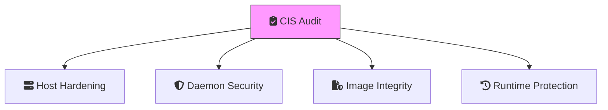

"Containers are secure by default." This is one of the most dangerous myths in DevOps. While containers provide isolation, they share the host’s kernel, and a misconfigured container can be a gateway to your entire infrastructure.

In this third part of the **Docker Mastery** series, we are putting on our security hats.

## 1. The Root Problem: Rootless Mode

By default, the Docker daemon runs as `root`. This means if an attacker escapes a container, they potentially have root access to your host.

**The Solution**: **Rootless Mode**.
Running the Docker daemon and containers as a non-root user significantly reduces the "blast radius" of a container escape.

```bash
# Setup rootless mode
dockerd-rootless-setuptool.sh install
export DOCKER_HOST=unix:///run/user/1000/docker.sock
```

## 2. Image Hardening & Scanning

Security starts with the image. If your base image is bloated, it has a larger attack surface.

### Strategies for Hardening:
- **Use Minimal Base Images**: Prefer `alpine` or `distroless` images.
- **Multi-Stage Builds**: (We'll dive deeper into this in Part 4, but it's essential for security as it keeps build tools out of your final image).
- **Scanning with Docker Scout**: Use `docker scout quickview` to see vulnerabilities in your images before you push them.

```bash
# Scan an image for vulnerabilities
docker scout cves my-app:latest
```

## 3. Secret Management (The Right Way)

**NEVER** put passwords, API keys, or certificates in:
- Environment variables (they are visible in `docker inspect`).
- Dockerfiles (they are stored in the image layers).
- Git repositories.

### Using Docker Secrets (Swarm Mode)
Docker Secrets allows you to store sensitive data securely and mount it as a file inside the container at `/run/secrets/`.

```bash
# Create a secret
echo "my-super-secret-password" | docker secret create db_password -

# Use it in a service
docker service create --name my-app --secret db_password my-app-image
```

## 4. Resource Constraints & Quotas

A simple security threat is a **Denial of Service (DoS)** from within your own cluster. A single compromised or buggy container can consume all CPU/RAM on the host.

Always implement the **Principle of Least Privilege** for resources:

```yaml
deploy:
  resources:
    limits:
      cpus: '0.50'
      memory: 512M
    reservations:
      cpus: '0.25'
      memory: 256M
```

## Deep Research Insight: The CIS Docker Benchmark
The Center for Internet Security (CIS) provides a comprehensive benchmark for securing Docker environments. It covers everything from host configuration to image best practices. Modern DevOps teams use tools like **Docker Bench for Security** to automatically audit their environments against these industry standards.



## Conclusion

Security isn't a one-time setup; it's a continuous process. By implementing rootless mode, secret management, and resource quotas, you've built a resilient perimeter around your applications.

In the final installment, **Part 4**, we'll look at the "Day 2 Operations": **Observability, Logging, and Deep Troubleshooting**.

---
_This is Part 3 of the **Docker Mastery** series. Stay tuned for Part 4!_
