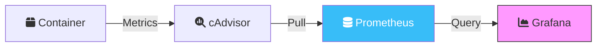

Your containers are networked, orchestrated, and secured. But do you know what they're actually doing? In production, you don't use `docker logs -f` and hope for the best. You need a structured approach to **Observability**.

In this final part of the **Docker Mastery** series, we focus on operational excellence.

## 1. Advanced Logging Drivers

By default, Docker uses the `json-file` logging driver. On a busy host, this can quickly fill up your disk. For production, you should move to a centralized logging system.

### Popular Drivers:
- **`syslog`**: Send logs to a local or remote syslog server.
- **`splunk`** / **`fluentd`**: Send logs to specialized log aggregators.
- **`journald`**: Integration with the native Linux logging system.

```yaml
# Configuring a driver in docker-compose.yml
logging:
  driver: "json-file"
  options:
    max-size: "200k"
    max-file: "10"
```

## 2. Monitoring & Metrics

To understand performance, you need to collect metrics like CPU, Memory, I/O, and Network usage.

### The "Gold Standard" Stack:
- **cAdvisor**: Analyzes resource usage and performance characteristics of running containers.
- **Prometheus**: Scrapes and stores the metrics.
- **Grafana**: Visualizes the metrics in beautiful dashboards.



## 3. Deep Troubleshooting: Going Inside

When a container fails, `docker logs` might not be enough. Here are the "Pro" tools for debugging:

### `docker inspect` & `docker stats`
- `docker inspect`: Get the full metadata of a container (IP, mounts, config).
- `docker stats`: Live stream of container resource usage statistics.

### `docker exec` vs. `nsenter`
If a container is stripped down (like `distroless`) and has no shell, you can't use `docker exec`.
**The Pro move**: Use `nsenter`. This allows you to enter the container's namespace from the host, using the host's tools (like `ip`, `ls`, `cat`) to debug the container's environment.

```bash
# Get the PID of the container
PID=$(docker inspect --format '{{ .State.Pid }}' container_name)

# Enter the namespace
nsenter -t $PID -n -u -i -p
```

## 4. Multi-Stage Builds (The Optimization Masterstroke)

The final key to a production-grade container is size. A smaller image is faster to pull, faster to start, and more secure.

```dockerfile
# Stage 1: Build
FROM golang:1.21-alpine AS builder
WORKDIR /app
COPY . .
RUN go build -o myapp

# Stage 2: Final (The "Expert" way)
FROM alpine:latest
WORKDIR /root/
COPY --from=builder /app/myapp .
CMD ["./myapp"]
```

**Result**: Your image goes from 800MB (Go full env) to 15MB (Alpine + Binary).

## Series Conclusion

You've done it! We've traversed the entire landscape of **Advanced Docker Operations**:
1.  **Networking**: From simple bridges to cross-host overlays.
2.  **Orchestration**: Mastering Swarm and high-level Compose patterns.
3.  **Security**: Hardening your perimeter and protecting your secrets.
4.  **Observability**: Monitoring, logging, and multi-stage optimizations.

The journey doesn't end here. The container world is constantly evolving, but with these foundations, you are ready to build, scale, and secure anything.

---
_Thank you for following the **Docker Mastery** series. For more cloud-native guides, stay tuned to the blog!_
