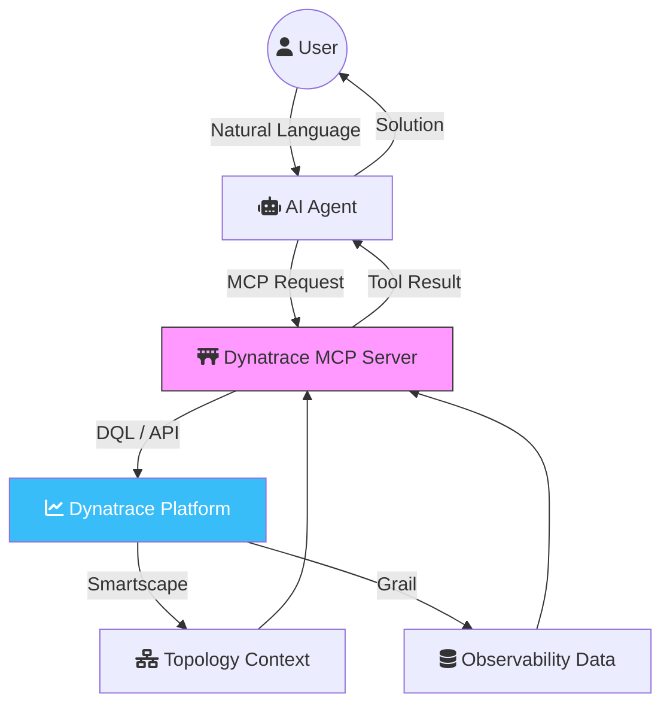

Observability has traditionally been a human-centric discipline. We build dashboards, set alerts, and dive into logs when something breaks. But in the age of agentic AI, the scale and complexity of modern infrastructure demand a new approach: **Agentic Observability**.

Enter the **Dynatrace MCP Server**. By leveraging the Model Context Protocol (MCP), Dynatrace is bridging the gap between AI assistants and the world's most powerful observability platform.

## What is Dynatrace?

Before we dive into the MCP server, let's recap why Dynatrace is a titan in the observability space. Unlike traditional monitoring tools that just collect metrics, Dynatrace is built on three core pillars:

1.  **Grail™ Data Lakehouse**: An indexless storage engine that handles logs, metrics, events, and traces at an exabyte scale.
2.  **Smartscape® Topology**: A real-time "digital twin" of your entire stack. It automatically maps every dependency from the user's click down to the CPU instruction.
3.  **Davis® AI**: A "fused AI" engine that combines Causal AI (for deterministic root-cause analysis) and Generative AI (Davis CoPilot) for natural language interaction.

## The Shift to Agentic Observability

In 2026, we aren't just writing code; we are managing fleets of AI agents (like Claude or Gemini) that help us build and maintain systems. For these agents to be effective SREs, they need more than just read-only access to documentation—they need real-time context.

The **Model Context Protocol (MCP)**, pioneered by Anthropic, provides a standard way for AI models to connect to external tools and data. The Dynatrace MCP server is the implementation of this standard, turning your observability data into a set of skills for your AI agent.

## How the Dynatrace MCP Server Works

The MCP server acts as a secure proxy. The following diagram illustrates how an AI agent interacts with your environment through this bridge:



The server acts as a secure proxy. When you ask an AI agent, *"Why is the checkout service slow?"*, the agent doesn't just guess. It uses the MCP server to:

1.  **Query DQL**: Execute Dynatrace Query Language commands to fetch specific logs or metrics.
2.  **Analyze Problems**: Retrieve Davis AI's root-cause analysis for any open problems.
3.  **Resolve Entities**: Use Smartscape to understand which pods, hosts, or services are involved.
4.  **Fetch Troubleshooting Guides**: Access internal runbooks linked to specific alerts.

### Key Tools Included in the Server:

*   **`get_problem_details`**: Fetches the full context of a Dynatrace problem, including the root cause.
*   **`execute_dql_query`**: Allows the agent to run complex queries against the Grail data lakehouse.
*   **`list_kubernetes_events`**: Pulls real-time events from K8s clusters managed by Dynatrace.
*   **`get_security_vulnerabilities`**: Checks for active CVEs in the environment.

## Use Case: The Autonomous SRE

Imagine an AI agent monitoring your Slack alerts. An alert triggers for high latency in your "Payment API."

**Without MCP:** The agent tells you there's an alert and links to a dashboard. You still have to do the work.
**With MCP:**
1.  The agent sees the alert.
2.  It calls `get_problem_details` to find that Davis AI has already identified a "Database Connection Pool Exhaustion."
3.  It calls `execute_dql_query` to see if this correlates with a recent deployment.
4.  It finds a deployment from 10 minutes ago and suggests a rollback.

**Deep Research Insight:** This is "Closing the Observability Loop." According to the *2026 State of AI in DevOps Report*, teams using agentic observability tools have seen a **65% reduction in MTTR (Mean Time To Resolution)** because the agent performs the initial 15 minutes of investigation before the human even logs in.

## Getting Started

Setting up the Dynatrace MCP server typically involves:

1.  **Dynatrace API Token**: Creating a token with the required scopes (`dql:read`, `problems:read`, etc.).
2.  **MCP Host**: Running the server as a container or via a tool like `npx` in your local environment.
3.  **Client Configuration**: Adding the server to your MCP-compliant client (like VS Code or Claude Desktop).

```json
// Example configuration for Claude Desktop
"mcpServers": {
  "dynatrace": {
    "command": "npx",
    "args": ["-y", "@dynatrace/mcp-server"],
    "env": {
      "DT_URL": "https://abc12345.live.dynatrace.com",
      "DT_API_TOKEN": "dt0c01.XXXXXXXXXXXX"
    }
  }
}
```

## Conclusion

The Dynatrace MCP server isn't just a new feature; it's a fundamental shift in how we interact with our systems. By giving AI agents the "eyes" to see our infrastructure, we empower them to be true partners in the SRE journey.

The era of "Dashboard Fatigue" is ending. The era of the **Autonomous Teammate** has begun.
