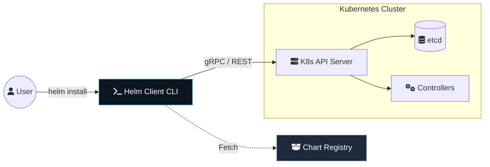

Kubernetes is powerful, but managing raw YAML manifests for complex applications is a recipe for disaster. As your infrastructure grows, you need a way to package, version, and share your application definitions. This is where **Helm** comes in.

Welcome to the first installment of the **Helm Chart Mastery** series. In this series, we will go from "Helm curious" to "Chart Architect."

## What is Helm?

Helm is often called the "Package Manager for Kubernetes." If you're familiar with `apt` for Debian or `brew` for macOS, Helm is conceptually similar but for Kubernetes resources.

### The Blueprinting Analogy
Think of a raw Kubernetes YAML file as a **Photo** of a house. It’s a snapshot of exactly how it looks—one specific color, one specific number of windows. 

A **Helm Chart**, however, is the **Blueprint**. It defines the structure of the house but leaves the specifics (the paint color, the type of windows) as variables. When you run `helm install`, you’re essentially saying: *"Build me a house using this blueprint, but use the 'Blue' paint and 'Double-Glazed' windows I specified in my values file."*

### The Problem: YAML Fatigue
Imagine deploying a microservice that requires:
- A Deployment
- A Service
- An Ingress
- Three ConfigMaps
- Two Secrets
- A ServiceAccount

To deploy this in three different environments (Dev, Staging, Prod), you would typically end up with three sets of nearly identical YAML files, differing only in minor details like image tags or replica counts. Helm solves this by introducing **templating**.

## Helm Architecture

Helm 3 (the current standard) is a client-side tool that interacts directly with the Kubernetes API server. This was a massive architectural shift from Helm 2, which relied on a server-side component called **Tiller**.

### The Security Shift: No More Tiller
In the old days (Helm 2), Tiller sat inside your cluster with high-level permissions to create and delete resources. This was a major security risk—if someone compromised Tiller, they owned the cluster. 

Helm 3 removed Tiller entirely. Now, the Helm client uses your local `kubeconfig` permissions. If you have permission to deploy a Pod, Helm can deploy it. If you don't, Helm fails. This **RBAC-first** approach is why Helm 3 is the standard for production environments.



## The Anatomy of a Helm Chart

A Helm chart is just a directory with a specific layout. Let's look at what's inside a standard chart:

```bash
my-app/
  Chart.yaml          # Metadata about the chart (version, name, app version)
  values.yaml         # The default configuration values for this chart
  .helmignore         # Files to ignore when packaging the chart
  charts/             # A directory for any dependent charts (subcharts)
  templates/          # The core Kubernetes manifest templates
    NOTES.txt         # A plaintext file that is printed after installation
    _helpers.tpl      # A place to put named template snippets
    deployment.yaml   # A template for a Kubernetes Deployment
    service.yaml      # A template for a Kubernetes Service

### The Hidden Heroes: .helmignore & Helpers
- **.helmignore**: Just like `.gitignore`, this prevents sensitive files (like local secrets or IDE configs) from being packaged into your chart and sent to a registry.
- **_helpers.tpl**: This is where you store logic. If you have a complex label or name that you use in ten different files, you define it once here as a "partial" and call it everywhere else. This is the key to **DRY (Don't Repeat Yourself)** Kubernetes management.
```

### 1. Chart.yaml
This file defines the identity of your chart. It's crucial for version control.
```yaml
apiVersion: v2
name: web-portal
description: A high-performance web portal for the DevOps blog
type: application
version: 1.2.0    # The version of the chart itself
appVersion: "2.4.5" # The version of the application inside
```

### 2. values.yaml
Think of this as the "variables" file for your infrastructure. Users override these values to customize their installation.
```yaml
replicaCount: 3
image:
  repository: nginx
  tag: stable
  pullPolicy: IfNotPresent
service:
  type: ClusterIP
  port: 80
```

## Creating Your First Chart

Let's get hands-on. Assuming you have Helm installed, run:

```bash
helm create my-first-chart
```

This generates a boilerplate chart. While it's tempting to use this as-is, the true mastery comes from building one from scratch or cleaning up the boilerplate to fit your exact needs.

### Verifying Your Chart
Before deploying, always lint and dry-run. If you're inspired by this architecture and want to set up your own professional-grade DevOps workbench on macOS or Ubuntu, check out my [Zero-Day DevOps Setup Guide](/blog/the-zero-day-devops-setup-from-fresh-os-to-production-ready).

```bash
# Check for syntax errors
helm lint ./my-first-chart

# See what the generated YAML would look like without actually deploying
helm install --dry-run --debug my-release ./my-first-chart
```

## Conclusion of Part 1

We've laid the groundwork. We understand why Helm exists, how its architecture works, and the structure of a chart. 

In **Part 2**, we will dive into the **Templating Engine**. We'll learn how to take those static YAML manifests and make them dynamic using Go templates and the `values.yaml` file.

---
_This is Part 1 of the **Helm Chart Mastery** series. Stay tuned for Part 2!_
