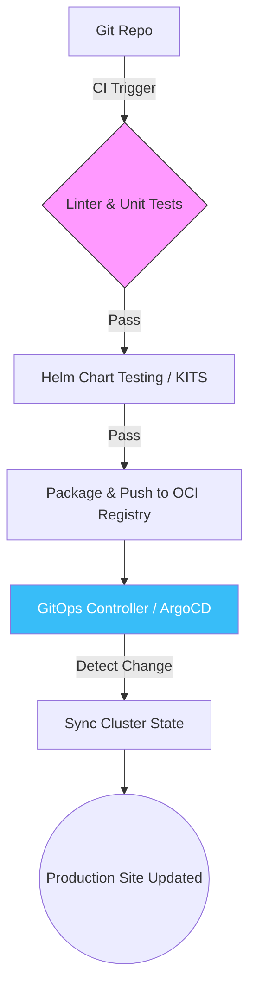

Welcome to the final chapter of the **Helm Chart Mastery** series. We've covered architecture, templating, and logic. Now, we focus on the features that take your charts from "working" to "production-ready."

## Managing Dependencies

Modern applications rarely exist in isolation. Your app might need a Postgres database or a Redis cache. Instead of bundling these into your own templates, you can declare them as **dependencies**.

In Helm 3, dependencies are declared in `Chart.yaml`:

```yaml
dependencies:
  - name: postgresql
    version: 12.1.0
    repository: https://charts.bitnami.com/bitnami
    condition: postgresql.enabled
```

### Dependency Commands:
- `helm dependency list`: View declared dependencies.
- `helm dependency update`: Download the dependencies into the `charts/` directory.

## Helm Hooks: Managing Lifecycles

Sometimes you need to perform actions at specific points in the release lifecycle. For example, running a database migration *before* the new application pods start.

Helm uses **Annotations** to define hooks:

```yaml
# templates/db-migration-job.yaml
apiVersion: batch/v1
kind: Job
metadata:
  name: {{ .Release.Name }}-db-migration
  annotations:
    "helm.sh/hook": pre-install,pre-upgrade
    "helm.sh/hook-weight": "5"
    "helm.sh/hook-delete-policy": hook-succeeded
spec:
  template:
    # ... job spec ...
```

### Common Hooks:
- `pre-install`: Executed before any resources are created.
- `post-install`: Executed after all resources are created.
- `pre-delete`: Executed before resources are deleted from Kubernetes.
- `test`: Executed when `helm test` is run.

## Production Best Practices

### 1. Versioning (SemVer)
Always follow **Semantic Versioning**. 
- Update the `version` (chart version) for every change to the templates.
- Update the `appVersion` (application version) when the underlying container image changes.

### 2. Labels & Annotations
Standardize your labels. Use the recommended Kubernetes labels:
- `app.kubernetes.io/name`
- `app.kubernetes.io/instance`
- `app.kubernetes.io/managed-by: Helm`

### 3. Security Hardening
- **Avoid Secrets in Values**: Never put plaintext passwords in `values.yaml`. Use external secret managers (like HashiCorp Vault or AWS Secrets Manager) or encrypted secrets (like SealedSecrets).
- **Resource Limits**: Always define `resources.limits` and `resources.requests` in your default values.
- **RBAC**: If your app needs to talk to the K8s API, create a dedicated `ServiceAccount` and `Role` within the chart.

## Deploying to Production: The Flow

A typical production deployment flow in 2026 looks like this:



## Deep Research Insight: Helm and OCI Registries
While Helm traditionally used "Chart Museums," the modern standard is to use **OCI (Open Container Initiative) Registries**. This allows you to store your Helm charts in the same registry as your Docker images (e.g., GitHub Container Registry, Amazon ECR, or Google Artifact Registry), simplifying your supply chain and security auditing.

## Series Conclusion

You have completed the **Helm Chart Mastery** series! 

From understanding the basic directory structure to implementing complex lifecycle hooks and production security, you now have the tools to architect professional-grade Kubernetes deployments.

**What's next?**
Take a complex application you currently manage and try to "Helm-ify" it. The best way to learn is by solving real-world constraints.

---
_Thank you for following along with the **Helm Chart Mastery** series. For more DevOps deep dives, check out the rest of the blog!_
