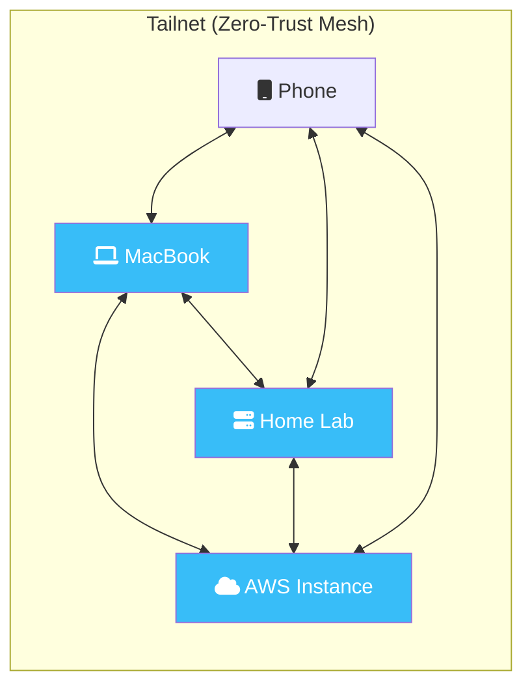

If you've ever spent hours fighting with OpenVPN configs or trying to troubleshoot NAT traversal just to access a local server, you know the pain of traditional networking. **Tailscale** changes everything. It's built on WireGuard and creates a zero-config, zero-trust mesh network that just works.

In this guide, we'll go from installation to advanced features like MagicDNS and Subnet Routing.

## How It Works: The Mesh Architecture

Traditional VPNs use a "Hub and Spoke" model, which creates bottlenecks. Tailscale creates a "Mesh" where every device communicates directly with every other device.



## 1. Installation & The CLI

While Tailscale has great GUI apps, as DevOps engineers, we live in the CLI.

### Installation
- **macOS**: `brew install tailscale`
- **Ubuntu**: `curl -fsSL https://tailscale.com/install.sh | sh`

### The "Magic" Command
To join your network (your "Tailnet"), simply run:
```bash
sudo tailscale up
```
This will provide a login URL. Once authenticated, your machine has a permanent, private IP address (usually starting with `100.x.y.z`).

## 2. Essential Commands

Once you're up and running, these are your daily drivers:

| Command | Description |
| :--- | :--- |
| `tailscale status` | See all devices on your mesh and their status. |
| `tailscale ip -4` | Get your local Tailscale IPv4 address. |
| `tailscale ping <node>` | A specialized ping that tests the direct WireGuard path. |
| `tailscale netcheck` | Diagnose your NAT and connectivity status. |
| `tailscale logout` | Disconnect and clear your credentials. |

## 3. MagicDNS: No More IPs

One of Tailscale's best features is **MagicDNS**. It automatically assigns a hostname to every device in your Tailnet.

Instead of typing `ssh 100.64.12.43`, you can simply type:
```bash
ssh workstation
```
Tailscale handles the name resolution globally across all your devices, regardless of where they are physically located.

## 4. Advanced "Power User" Features

### Exit Nodes
Ever been on a sketchy coffee shop Wi-Fi and wanted to tunnel all your traffic through your home fiber or a trusted cloud server? That's an **Exit Node**.

**On the server:**
```bash
sudo tailscale up --advertise-exit-node
```
**On your laptop:**
```bash
tailscale up --exit-node=<server-name>
```

### Subnet Routers
If you have a legacy LAN with devices that can't run Tailscale (like an old printer or a PLC), you can use a **Subnet Router** to bridge them into your mesh.

```bash
sudo tailscale up --advertise-routes=192.168.1.0/24
```

### Tailscale SSH
This is the future of server access. It allows you to SSH into your machines without managing SSH keys. Tailscale handles the authentication based on your Tailnet identity (OIDC/SAML).

```bash
sudo tailscale up --ssh
```

### Tailscale HTTPS (SSL/TLS)
Running services like Grafana or a home dashboard? Tired of the "Not Secure" browser warning for internal IPs? Tailscale can automatically provision and renew **Let's Encrypt certificates** for your MagicDNS hostnames.

1.  **Enable HTTPS** in your Tailscale admin console.
2.  **Generate a certificate** locally on your machine:
```bash
sudo tailscale cert <hostname>.<tailnet-name>.ts.net
```
This generates a `.crt` and `.key` file that you can plug directly into Nginx, Caddy, or any other web server.

## 5. Automation with `tailscale set`

You can change configurations on the fly without restarting the service using `tailscale set`. This is great for scripts or temporary changes.

```bash
# Temporarily enable/disable exit node usage
tailscale set --exit-node=my-home-server
tailscale set --exit-node=
```

## Conclusion

Tailscale is more than a VPN; it's a foundational layer for modern DevOps. It allows you to treat the entire world as one local network, secured by WireGuard and authenticated by your existing identity provider. 


**Happy Networking!**

---

**Next Steps**: Now that your mesh network is ready, learn how to use it to secure your AI operations in my [Fortress Agent Guide](/blog/2026-05-13-securing-hermes-with-tailscale).
