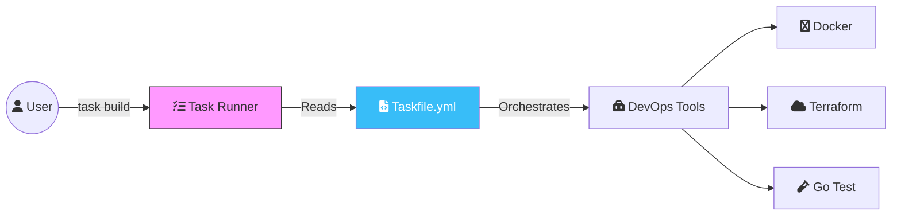

In the DevOps world, we spend a lot of time "gluing" tools together. Whether it's running Terraform, building Docker images, or linting code, we need a way to orchestrate these tasks. For decades, `make` and its `Makefile` have been the gold standard. But let's be honest: Makefiles are finicky, tab-sensitive, and designed for C compilation, not modern cloud-native workflows.

Enter **Task** (taskfile.dev). It's a modern, YAML-based task runner that is simpler, more powerful, and significantly easier to maintain.

## Why Taskfile?

Before we dive into the code, here is why Task is winning over DevOps engineers:
- **YAML Syntax**: No more "was that a tab or 8 spaces?" errors.
- **Cross-Platform**: Runs the same on Linux, macOS, and Windows.
- **Zero Dependencies**: It's a single Go binary.
- **Global & Local Variables**: Robust variable management with environment file support.
- **Modular**: You can "include" Taskfiles from other directories.



## Level 1: Basic Taskfile (Simple Orchestration)

At its simplest, a `Taskfile.yml` defines a list of tasks.

```yaml
version: '3'

tasks:
  hello:
    cmds:
      - echo "Hello DevOps World!"
  
  build:
    desc: Build the application binary
    cmds:
      - go build -v main.go
```

Running `task build` executes the command. Running `task --list` gives you a clean menu of your documented tasks.

## Level 2: Medium Taskfile (Variables & Dependencies)

In a real DevOps scenario, you need to handle variables and ensure tasks run in the right order.

```yaml
version: '3'

vars:
  BINARY_NAME: "my-app"
  DOCKER_REPO: "digitaldave/{{.BINARY_NAME}}"

tasks:
  clean:
    desc: Remove build artifacts
    cmds:
      - rm -f {{.BINARY_NAME}}

  build:
    desc: Build the binary
    deps: [clean] # Runs 'clean' before building
    cmds:
      - go build -o {{.BINARY_NAME}} .

  docker:build:
    desc: Build the Docker image
    deps: [build]
    vars:
      TAG: { sh: git rev-parse --short HEAD }
    cmds:
      - docker build -t {{.DOCKER_REPO}}:{{.TAG}} .
      - docker tag {{.DOCKER_REPO}}:{{.TAG}} {{.DOCKER_REPO}}:latest
```

**Key Features here:**
- **`vars`**: Centralized configuration.
- **`sh` subcommands**: Dynamically set variables using shell commands (like getting a git hash).
- **`deps`**: Create a dependency chain so you don't forget to build before you containerize.

## Level 3: Advanced Taskfile (The Enterprise Pipeline)

Advanced usage involves modularity and protecting your environment with preconditions.

```yaml
version: '3'

includes:
  terraform: ./infra/Taskfile.yml # Modularize your infra tasks

tasks:
  deploy:prod:
    desc: Deploy to production (Safety first!)
    prompt: Are you sure you want to deploy to PROD? # Interactive confirmation
    preconditions:
      - sh: "[ $NODE_ENV == 'production' ]"
        msg: "NODE_ENV must be set to production!"
    cmds:
      - task: docker:build
      - task: terraform:apply
      - echo "Production deployment complete!"
```

## The "Everything-as-Code" Example

Let's imagine a microservice project called **"WhaleWatch"**. Here is the `Taskfile.yml` that handles its entire lifecycle:

```yaml
version: '3'

dotenv: ['.env'] # Load environment variables from a file

vars:
  VERSION: "1.0.0"

tasks:
  setup:
    desc: Install all development dependencies
    cmds:
      - npm install
      - go mod download
      - brew bundle check || brew bundle install

  test:
    desc: Run the full test suite with coverage
    cmds:
      - go test ./... -coverprofile=coverage.out
      - go tool cover -html=coverage.out -o coverage.html

  infrastructure:up:
    desc: Bring up local development database
    cmds:
      - docker-compose up -d postgres redis
    status:
      - docker ps | grep postgres # Only runs if postgres isn't already running

  watch:
    desc: Run app with live-reload for development
    cmds:
      - air # Using 'air' for Go live reload
```

## Conclusion

Taskfile.dev is more than just a Makefile replacement; it's a productivity multiplier for DevOps teams. It allows you to document your complex operational workflows in a readable format that is executable by anyone on the team.

**Deep Research Insight**: The `status` and `sources` fields in Task are game-changers. They allow Task to determine if a command actually *needs* to run by checking the fingerprint of input files or the output of a check command. This "idempotency" is the cornerstone of efficient CI/CD pipelines.

Stop writing spaghetti bash scripts and cryptic Makefiles. Switch to **Task** and bring some YAML sanity to your automation!
