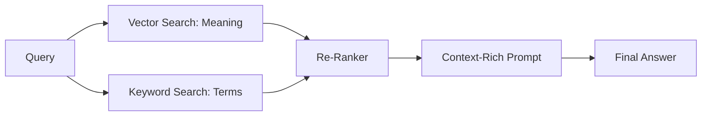

## 1. THE DIGITAL LIBRARIAN ANALOGY

In Part 1, we built the engine. Now, we give it a memory. Think of **Retrieval-Augmented Generation (RAG)** as a high-speed digital librarian. Instead of the model guessing an answer from its training, it runs into your private library (your Obsidian Vault), pulls out the exact book you need, and reads the relevant pages to you.

This is the difference between a generic assistant and a **Digital Twin** that knows exactly how you configure your Kafka clusters.

---

## 2. THE RAG PIPELINE: FROM NOTES TO VECTORS

To make your notes "searchable" by an AI, we must convert them into math. This is the **Embedding Lifecycle**:

1.  **Ingestion**: Hermes watches your `~/ObsidianVault`. When a new `.md` file appears, the sync loop triggers.
2.  **Chunking**: Large notes are split into smaller, semantic chunks (e.g., 500 characters with 50-character overlap).
3.  **Embedding**: Each chunk is passed through an embedding model (like `nomic-embed-text`) which assigns it a unique coordinate in "Knowledge Space."
4.  **Vector Storage**: These coordinates are stored in the Open WebUI internal database.

---

## 3. MASTERING THE '#' COMMAND

The primary way to interact with your knowledge in Open WebUI is the `#` command. 

### 3.1 Scenario: Troubleshooting Kafka
Instead of asking "How do I fix Kafka?", you type:
> "Analyze #KAFKA-MONITORING-MASTERY.md and tell me why my lag is increasing."

Open WebUI will:
*   Perform a **Semantic Search** (Vector) to find context.
*   Perform a **Keyword Search** (BM25) to find exact terms like "Lag" or "Offset."
*   Provide a synthesized answer based *only* on your mastery notes.

---

## 4. HYBRID RETRIEVAL: THE GOLD STANDARD

In 2026, we don't rely on vector search alone. Open WebUI uses **Hybrid Retrieval**. 

This ensures that if you search for a specific error code (like `504 Gateway Timeout`), the system finds the exact text match even if the "meaning" of the error is broad.

---

## 5. CONCLUSION: THE FEEDBACK LOOP

By connecting your Obsidian vault, you have created a **Perpetual Learning Machine**. As you learn new DevOps skills and document them, Hermes automatically "absorbs" that knowledge 15 minutes later. 

In **Part 3**, we will take this a step further: moving from "Reading" your data to "Executing" commands on your server.

**Stay Autonomous.**

---
*This post was drafted by the Hermes AI Agent as part of the ongoing "Mastery" series for the DigitalDave DevOps Command Center.*
