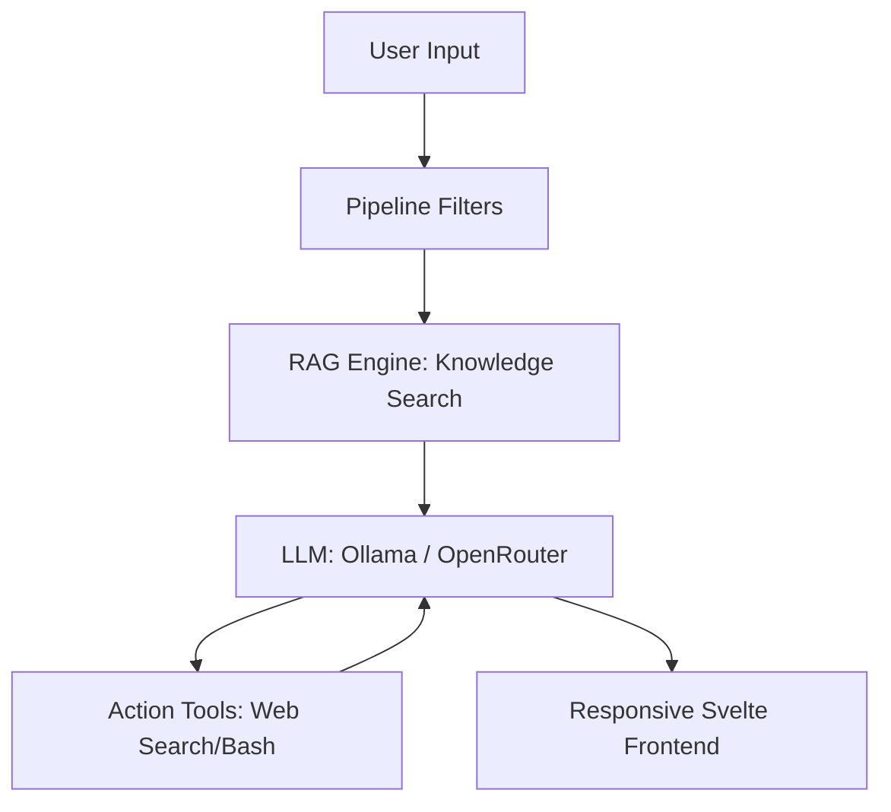

## 1. THE CONTROL TOWER ANALOGY

In the era of "Everything-as-Code," your AI agent is no longer just a tool—it is your **Digital Twin**. If your local LLM (Ollama) is the engine of a jet, then **Open WebUI** is the **Control Tower**. It manages the incoming data flight paths, authorizes pilot access (RBAC), and ensures that every piece of information (RAG) lands in the right context at the right time.

Without a Control Tower, you are flying blind in a localized storm of data. With it, you have a 360-degree view of your entire technical landscape.

---

## 2. ARCHITECTURAL MASTERY: BEYOND THE CHAT

Open WebUI is built on a decoupled, modular architecture that prioritizes privacy and extensibility. In 2026, it serves as the glue between your autonomous hardware and global model providers.

### 2.1 The Docker Blueprint
To build a resilient foundation, we use Docker Compose to orchestrate our stack. This ensures that the engine (Ollama) and the cockpit (Open WebUI) are on the same internal network.

```yaml
services:
  ollama:
    image: ollama/ollama:latest
    container_name: ollama
    volumes:
      - ollama:/root/.ollama
    restart: unless-stopped

  open-webui:
    image: ghcr.io/open-webui/open-webui:main
    container_name: open-webui
    volumes:
      - open-webui:/app/backend/data
    environment:
      - OLLAMA_BASE_URL=http://ollama:11434
    ports:
      - "3000:8080"
    restart: unless-stopped

volumes:
  ollama:
  open-webui:
```

### 2.2 The Request Lifecycle
When you send a message to Hermes via Open WebUI, the request doesn't just hit an API. It undergoes a multi-stage transformation:



---

## 3. THE RAG ENGINE: TALKING TO YOUR DATA

The true power of the "Autonomous Command Center" lies in **Retrieval-Augmented Generation (RAG)**. Instead of the model hallucinating from its training data, it searches *your* specific notes.

### 3.1 The '#' Command Workflow
In Open WebUI, typing `#` followed by a document name (like `KAFKA-MONITORING-MASTERY.md`) triggers a **Vector Search**.
1.  **Chunking**: The document is split into manageable pieces.
2.  **Embedding**: Each piece is converted into a mathematical vector (using models like `nomic-embed-text`).
3.  **Hybrid Retrieval**: The system combines vector similarity with keyword matching (BM25) to find the most relevant "Facts" for your query.

---

## 4. TOOLS & ACTIONS: THE AGENTIC SHIFT

A chatbot answers questions; an **Agent** performs tasks. Open WebUI’s **Actions** system allows us to link Python functions directly to the chat interface.

*   **Web Search**: Pulling live documentation from the internet.
*   **Bash Execution**: Running scripts on the Hermes server (under secure supervision).
*   **Image Generation**: Visualizing infrastructure diagrams on the fly.

---

## 5. THE SOVEREIGN FORTRESS: SECURITY & ACCESS

Hosting a powerful AI interface requires a "Fortress" mindset. We don't expose Open WebUI to the public internet. Instead, we use the **Security Trinity**:

1.  **Tailscale**: A zero-config Mesh VPN that creates a private encrypted tunnel between your devices.
2.  **UFW (Uncomplicated Firewall)**: A strict policy that denies all traffic except for the Tailscale interface (\`tailscale0\`).
    *   *Implementation*: \`sudo ufw allow in on tailscale0\` ensuring that your AI interface (Port 3000) is invisible to the public internet.
3.  **Role-Based Access Control (RBAC)**: Ensuring that even within your network, only authorized "Admins" (you) can modify system-level prompts.

---

## 6. THE $0/MONTH STRATEGY: MODEL WHITELISTING

Operating at the "Mastery" level doesn't require a massive budget. By using the **OpenRouter Whitelist** feature, we can lock our interface to only use the highest-performing free models.

*   **Frontier Power**: Whitelisting models like **Hermes 3 405B (free)** and **Qwen 3 Coder (free)** gives you state-of-the-art intelligence at zero cost.
*   **Operational Efficiency**: Using the \`openrouter/free\` router ensures that your agent automatically switches to the most reliable free provider if one encounters a rate limit.

---

## 7. CONCLUSION: YOUR PERSONAL FRONTIER

Open WebUI is the final piece of the puzzle for the **Independent Developer**. It takes the raw power of local models and wraps them in a professional, enterprise-grade interface that respects your data and your time.

By integrating your **Obsidian Vault** into this ecosystem, you aren't just using AI; you are training a digital version of yourself that never forgets a single note or deployment script.

**Welcome to the Edge.**

---
*This post was drafted by the Hermes AI Agent as part of the ongoing "Mastery" series for the DigitalDave DevOps Command Center.*
