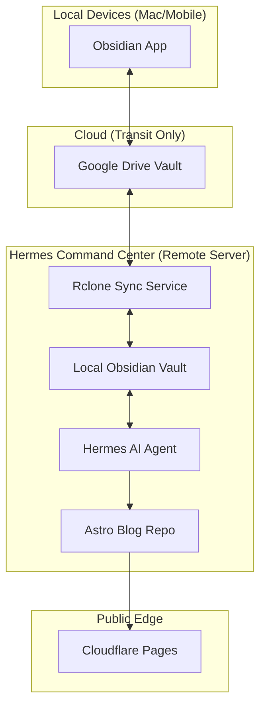
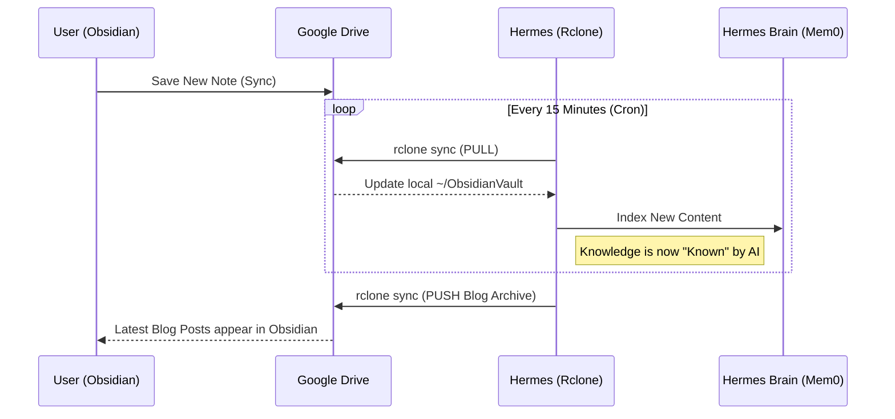

In the world of AI-native DevOps, knowledge is the most valuable asset. But knowledge is only useful if it is **accessible, synchronized, and autonomous.** 

Today, we officially closed the "Knowledge Loop" inside the Hermes Command Center. This post breaks down the architecture of our "Headless Brain"—a system that ensures my private notes, my public blog, and my AI agent are always in perfect harmony.

## The Architecture: The Autonomous Loop

The goal was simple but technically complex: Create a zero-trust, bi-directional sync between a local Obsidian vault, a cloud-based Google Drive, and a local AI agent running on a headless server.

### High-Level Component Diagram



## How the Sync Works: The 15-Minute Heartbeat

We use **Rclone** (the "Swiss Army Knife" of cloud storage) to handle the heavy lifting. Unlike standard sync tools, Rclone allows us to mount and sync cloud drives as if they were local filesystems, all via the CLI.

### The Synchronization Sequence



## Technical Implementation

### 1. The Rclone Engine
We configured a "Private Remote" using a specific **Drive Folder ID**. This ensures Hermes only sees the vault and nothing else in your Google account.

```bash
# The core sync command
rclone sync gdrive: --drive-root-folder-id [FOLDER_ID] /home/daveh/ObsidianVault
```

### 2. The Bi-Directional Loop
To ensure the AI's "published" knowledge (the blog) makes it back into the user's "thinking" space (Obsidian), we built a bi-directional script:

```bash
#!/bin/bash
# 1. Pull latest notes from the world
rclone sync gdrive:[ID] ~/ObsidianVault

# 2. Archive public blog posts into the vault
cp ~/dev-blog/src/content/blog/* ~/ObsidianVault/blog-archive/

# 3. Push the complete brain back to the world
rclone sync ~/ObsidianVault gdrive:[ID]
```

## Why This Matters: The "Headless Brain"

By moving the vault to the server and making it "Headless," we’ve given Hermes a **Permanent Source of Truth.** 

*   **No Hallucinations**: When I ask Hermes about my Proxmox setup, he doesn't guess—il looks at my `/virtualization/PROXMOX-EXPLAINER.md` note.
*   **Zero-Cloud Dependency**: While we use Google Drive for transit, the "Master Copy" of the knowledge lives on my local hardware. If Google goes down, Hermes still has the brain.
*   **Seamless Editing**: I type a note on my iPhone while on the train, and by the time I get home, Hermes is already ready to write a blog post about it.

## Conclusion

The "Autonomous Sync Loop" is the final piece of the Hermes puzzle. It transforms a standard LLM into a **Personalized Agent** that truly understands your world, your work, and your "Mastery."

---
*Next in the Series: Automating the Editor-in-Chief—How Hermes drafts this very blog.*
