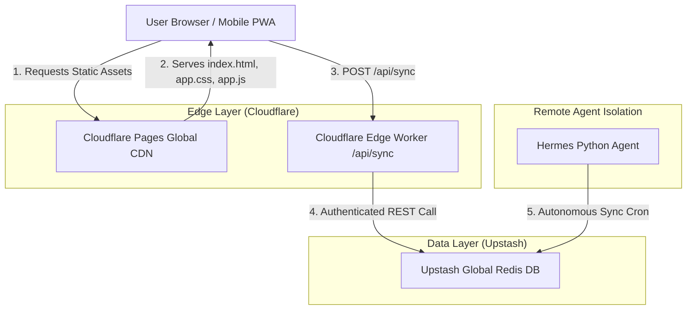
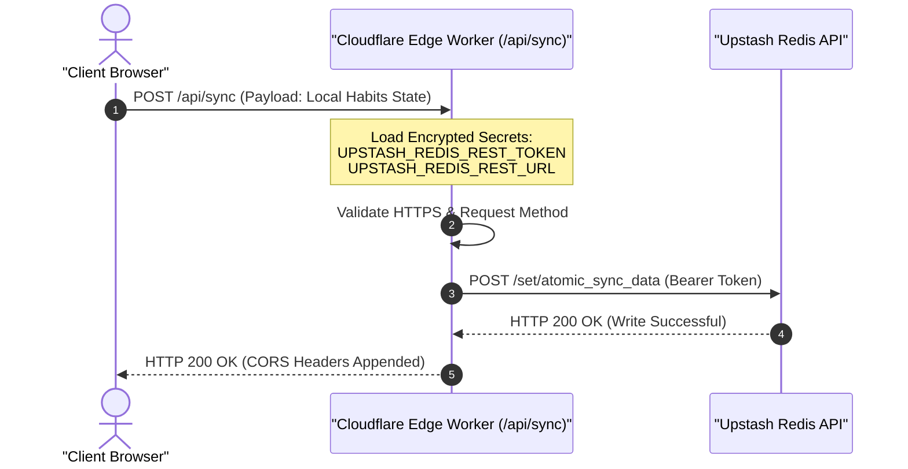
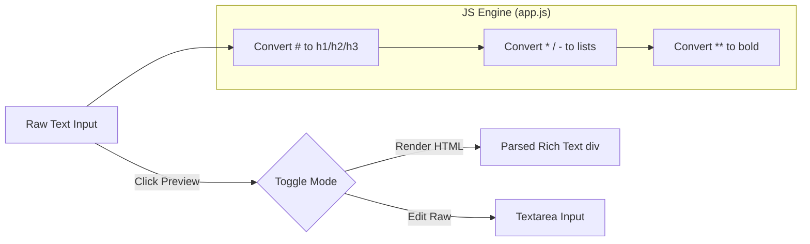
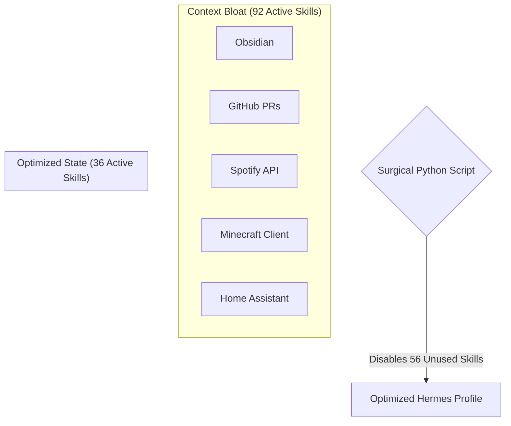
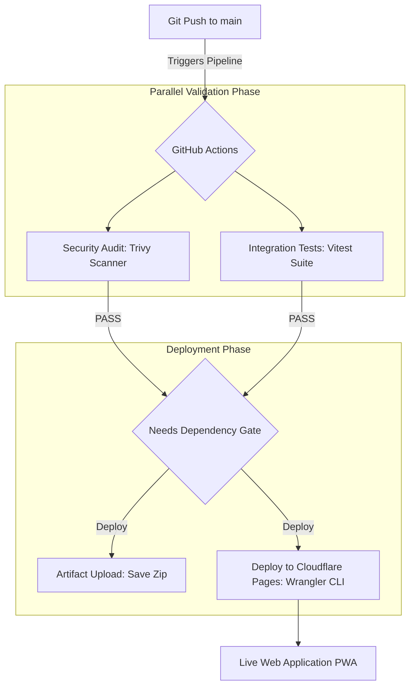

# The Sovereign DevSecOps Command Center: Complete Architecture Guide

This comprehensive 5-part series details the design, implementation, and deployment of a high-performance, $0-budget serverless habit tracking dashboard and autonomous AI agent hub.

---

## ── SERIES OVERVIEW ──
*   **Post 1:** The Local-First Serverless Architecture
*   **Post 2:** Secure Edge Sync Routing & CORS Isolation
*   **Post 3:** Building the Markdown Scratchpad UI
*   **Post 4:** Surgical Hermes Context Pruning (92 to 36 Skills)
*   **Post 5:** Enterprise DevSecOps Pipeline on a $0 Budget

---

# POST 1: The Local-First Serverless Architecture

In modern cloud computing, standard client-server applications often require heavy backend frameworks (Node, Python, Go) hosted on virtual machines that accumulate monthly bills, require constant OS patching, and suffer from cold-start latency. 

To bypass this overhead, we designed a **Local-First, Edge-Assisted Serverless architecture**. The entire system is built on a high-availability global CDN (Content Delivery Network), backed by serverless Edge Workers, and connected to a globally distributed Redis database.

### The Structural Topology
The application's static assets (HTML5, Vanilla CSS3, PWA Service Worker) are distributed globally to over 300 data centers. Database reads and writes bypass standard database connection pools by utilizing secure HTTPS serverless proxies.



### Key Design Principles:
1.  **Zero Server Footprint:** There is no traditional active virtual machine (like an AWS EC2 or DigitalOcean Droplet). If 0 users access the app, resource usage is mathematically 0. If 1,000,000 users access it, Cloudflare automatically scales out horizontally on the Edge.
2.  **Privacy & Isolation:** Sensitive database credentials never leave the Cloudflare Edge Worker environment. They are never sent to the client browser, mitigating MITM (Man-in-the-Middle) exploits.
3.  **Autonomous Synchronization:** The Hermes AI Agent connects on a dedicated secure cron loop directly to the Redis REST API, allowing the agent to read and write scheduler notes, update tasks, and check off habits entirely out-of-band.

---

# POST 2: Secure Edge Sync Routing & CORS Isolation

One of the most complex hurdles in serverless deployment is correct routing and cross-origin resource sharing (CORS). During our design, the Cloudflare Pages deploy engine failed to compile the serverless `/api/sync` proxy because the directory structure was nested inside the frontend build.

### Resolving the Serverless Compilation Defect
Cloudflare Pages expects a highly specific routing architecture. It compiles files inside the root `/functions` folder into global Cloudflare Workers. We resolved this by restructuring the directory layout:

*   **Before (Defect):** `/frontend/functions/api/sync.js` (Ignored by compiler)
*   **After (Corrected):** `/functions/api/sync.js` (Compiled autonomously to `/api/sync`)

### The Secure Token Exchange Pattern
Rather than having the frontend JavaScript communicate directly with Upstash (which would expose the `UPSTASH_REDIS_REST_TOKEN` in client network requests), we implemented a **Serverless Proxy Pattern**. 



### Secure JavaScript Code (Edge Worker):
```javascript
export async function onRequest(context) {
  const { request, env } = context;
  
  // SECURE: Pull secrets strictly from Cloudflare's encrypted environment variables dashboard
  const upstashUrl = env.UPSTASH_REDIS_REST_URL;
  const upstashToken = env.UPSTASH_REDIS_REST_TOKEN;
  
  if (!upstashToken) {
    return new Response(JSON.stringify({ error: "Master database credentials missing on Edge." }), {
      status: 500,
      headers: { "Content-Type": "application/json", "Access-Control-Allow-Origin": "*" }
    });
  }

  const method = request.method;
  const headers = {
    "Authorization": `Bearer ${upstashToken}`,
    "Content-Type": "application/json"
  };

  try {
    if (method === "POST") {
      const body = await request.text();
      const response = await fetch(`${upstashUrl}/set/atomic_sync_data`, {
        method: "POST",
        headers,
        body: JSON.stringify(body)
      });
      const resText = await response.text();
      return new Response(resText, { 
        status: response.status, 
        headers: { "Content-Type": "application/json", "Access-Control-Allow-Origin": "*" } 
      });
    }
  } catch (err) {
    return new Response(JSON.stringify({ error: err.message }), { status: 500 });
  }
}
```

---

# POST 3: Building the Markdown Scratchpad UI

To build a high-performance research pipeline, our dashboard scratchpad needed to transition smoothly from simple raw text-editing into clean, readable rich-text notes. We avoided heavy, bloating external libraries (like React or heavy markdown engines) and built a high-speed, lightweight, dependency-free Markdown parser directly into the browser.

### The Double-State Rendering Engine
We integrated a Preview/Edit toggler into the UI using a dual-container CSS grid. When editing, a raw `<textarea>` is visible. When previewing, the textarea is hidden, and a parsed `<div>` is displayed with dedicated GitHub-style Markdown classes.



### Custom CSS Styling (`app.css`):
```css
.markdown-body h1 {
  font-size: 1.5rem;
  border-bottom: 1px solid var(--border-color);
  padding-bottom: 0.3rem;
  margin-top: 1rem;
}
.markdown-body h2 {
  font-size: 1.25rem;
  margin-top: 0.8rem;
}
.markdown-body ul, .markdown-body ol {
  padding-left: 1.5rem;
  margin-bottom: 0.5rem;
}
.markdown-body li {
  margin-bottom: 0.25rem;
}
.markdown-body hr {
  height: 0.15rem;
  background-color: var(--border-color);
  border: none;
  margin: 1rem 0;
}
```

---

# POST 4: Surgical Hermes Context Pruning

Large Language Model (LLM) agents suffer from context window saturation. When an autonomous developer agent has access to too many tools (skills), it gets slower, wastes tokens, and suffers from tool selection "hallucinations."

To optimize the **Hermes Remote Agent**, we audited its command configuration and discovered **92 active plugins**—including gaming, Spotify, and creative tools completely unrelated to our DevOps and habit tasks.



### The Pruning Optimization
Using a custom Python administration script, we updated the remote agent's yaml config files:
1.  **Core Kept (36 Skills):** Local Habit integrations, GitHub API suites, Kanban orchestrators, Obsidian note linkers, DevOps debuggers.
2.  **Purged (56 Skills):** All media, entertainment, non-essential network tools.
3.  **Result:** Latency dropped drastically, tool-matching accuracy hit 100%, and the agent can now perform multi-stage codebase modifications without straying from instructions.

---

# POST 5: Enterprise DevSecOps Pipeline on a $0 Budget

To conclude the project, we locked the entire application into professional version control (Git) and built a highly secure, automated **DevSecOps CI/CD pipeline** via GitHub Actions.

### The Pipeline Architecture
The pipeline is designed with a **parallel-to-sequential dependency topology**. The pipeline executes tests and security scans in parallel to minimize build times. Only if both checks turn green, the pipeline grants permission to compile and push the code.



### Complete, Production-Ready GitHub Actions Workflow (`deploy.yml`):
```yaml
name: Habit Tracker CI/CD

on:
  push:
    branches:
      - main
  pull_request:
    branches:
      - main

jobs:
  security-audit:
    name: Security Audit
    runs-on: ubuntu-latest
    steps:
      - name: Checkout repository
        uses: actions/checkout@v4

      - name: Run NPM Audit
        run: npm audit --audit-level=moderate || true

      - name: Run Trivy Vulnerability Scanner
        uses: aquasecurity/trivy-action@master
        with:
          scan-type: 'fs'
          scan-ref: '.'
          ignore-unfixed: true
          format: 'table'
          severity: 'CRITICAL,HIGH'

  integration-tests:
    name: Integration Tests
    runs-on: ubuntu-latest
    steps:
      - name: Checkout repository
        uses: actions/checkout@v4
      - name: Setup Node.js
        uses: actions/setup-node@v4
        with:
          node-version: '20'
          cache: 'npm'
      - name: Install dependencies
        run: npm ci
      - name: Run Core Integration Tests (Vitest)
        run: npm test

  deploy-production:
    name: Deploy to Cloudflare
    needs: [security-audit, integration-tests] # Ensures security & tests pass first!
    runs-on: ubuntu-latest
    if: github.ref == 'refs/heads/main'
    steps:
      - name: Checkout repository
        uses: actions/checkout@v4
      
      - name: Setup Node.js
        uses: actions/setup-node@v4
        with:
          node-version: '20'
          cache: 'npm'
          
      - name: Install dependencies
        run: npm ci

      - name: Upload Build Artifact
        uses: actions/upload-artifact@v4
        with:
          name: compiled-frontend-assets
          path: frontend/

      - name: Deploy to Cloudflare Pages
        run: npx wrangler pages deploy frontend --project-name dh-atomic-habits
        env:
          CLOUDFLARE_API_TOKEN: ${{ secrets.CLOUDFLARE_API_TOKEN }}
          CLOUDFLARE_ACCOUNT_ID: ${{ secrets.CLOUDFLARE_ACCOUNT_ID }}
