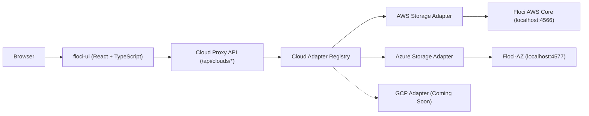

# Local Cloud Emulation Reimagined: Multi-Cloud Development with flocli and Floci UI

Modern cloud-native engineering relies heavily on managed cloud services. However, testing these pipelines during local development has traditionally been challenging. Developing directly against public cloud providers introduces network latency, unexpected cloud bills, and credential management overhead. While emulators like LocalStack have helped bridge this gap for single-cloud (AWS) environments, the modern enterprise is increasingly multi-cloud, requiring a unified, lightweight solution for AWS, Azure, and GCP.

This is where **flocli** and the native **Floci** emulation engine redefine the developer experience.

---

## What is flocli?

`flocli` is a high-performance, developer-focused local cloud infrastructure emulator designed as a drop-in replacement for LocalStack, powered by the native GraalVM-compiled Floci engine. It delivers rapid startup times, minimal memory consumption, and native multi-cloud support across AWS, Azure, and GCP resources.

Combined with **Floci UI**—a local-first, metadata-driven multi-cloud runtime explorer—developers can inspect, deploy, and verify multi-cloud resources from a single unified workspace.



---

## Core Architecture Principles

Unlike traditional tools that require separate dashboard engines for each cloud provider, the `flocli` stack operates on a clean Service Provider Interface (SPI) design pattern:

1. **The UI is Cloud-Agnostic**: The frontend does not contain hardcoded logic for specific cloud providers. It renders interfaces dynamically based on schema definitions sent by the backend.
2. **The Proxy enforces Isolation**: The Cloud Proxy API maps internal implementation details to a normalized schema interface.
3. **SPI-Driven Adapters**: Custom adapters perform translation between the normalized schema and the underlying service engine (such as AWS S3 or Azure Blob Storage).
4. **Native Runtime Execution**: The native GraalVM binaries process protocol requests under lightweight Docker containers.

---

## Setting Up Your Multi-Cloud Environment with Docker Compose

Running the entire `flocli` suite—including the AWS emulator, Azure emulator, GCP emulator, and the visual dashboard—is fully orchestrated through Docker Compose. Below is the clean, production-ready `docker-compose.yml` to spin up your local multi-cloud emulation environment:

```yaml
version: '3.8'

services:

  floci:
    image: floci/floci:latest
    container_name: flocli_local
    ports:
      - "4566:4566"
    volumes:
      - "/var/run/docker.sock:/var/run/docker.sock"
    environment:
      - DEBUG=1
      - DOCKER_HOST=unix:///var/run/docker.sock
    networks:
      - flocli_network

  floci-az:
    image: floci/floci-az:latest
    container_name: flocli_az_local
    ports:
      - "4577:4577"
    networks:
      - flocli_network

  floci-gcp:
    image: floci/floci-gcp:latest
    container_name: flocli_gcp_local
    ports:
      - "4588:4588"
    networks:
      - flocli_network

  flocli-ui:
    image: floci/flocli-ui:latest
    container_name: flocli_ui
    ports:
      - "3050:3000"
    environment:
      - FLOCI_ENDPOINT=http://floci:4566
      - FLOCI_AZ_ENDPOINT=http://floci-az:4577
      - FLOCI_GCP_ENDPOINT=http://floci-gcp:4588
    networks:
      - flocli_network
    depends_on:
      - floci
      - floci-az
      - floci-gcp

networks:
  flocli_network:
    driver: bridge
```

Start the entire environment in the background:

```bash
docker compose up -d
```

Once up, configure your local environment shell session to route AWS calls to the emulator:

```bash
export AWS_ENDPOINT_URL=http://localhost:4566
export AWS_ACCESS_KEY_ID=flociadmin
export AWS_SECRET_ACCESS_KEY=flociadmin
export AWS_DEFAULT_REGION=us-east-1
```

---

## Managing the Emulator Stack with the floci CLI

While running the containers directly via Docker Compose is incredibly clean, `floci` also ships with a native, high-performance CLI tool to control and debug your local emulation environment effortlessly.

### Basic Stack Operations

Manage container lifecycles, stream logs, and verify environment health:

```bash
# Check the status of active services
floci status

# View and follow aggregated emulator logs
floci logs --follow

# Stop all running emulators securely
floci stop

# Run local environment health diagnostics
floci doctor
```

### Stateful Emulation & Data Persistence

By default, local resources are kept in ephemeral memory. If you are running long-running verification tests, you can enforce disk persistence to keep your mock databases and storage buckets active across host reboots:

```bash
# Start the stack with data persisted to a local path
floci start --persist ./data
# All cloud state now survives container restarts
```

### Save and Restore State with Snapshots

To build robust testing scenarios or share clean starting points with other developers on your team, you can take instant snapshots of your entire emulated infrastructure:

```bash
# Save your current local state as a snapshot
floci snapshot save my-snapshot

# Restore a previously saved state instantly
floci snapshot restore my-snapshot
```

---

## Real AWS Athena Queries, Locally with floci-duck

AWS Athena is one of the most useful services in the analytics stack: point it at an S3 bucket, register a schema in Glue, write a SQL query, and get results back without provisioning a single server. The catch is it costs $5 per TB scanned, and every iteration of your ETL or pipeline logic burns real money in production.

`flocli` eliminates that cost entirely. It emulates the full Athena + Glue + S3 stack locally, and the SQL is executed for real by DuckDB, via **floci-duck**, a lightweight Rust sidecar that `flocli` manages automatically.

### The Athena Architecture

You do not call `floci-duck` directly; the sidecar is an internal implementation detail managed entirely by `flocli`:

```text
Your code (boto3 / AWS CLI / @aws-sdk/client-athena)
│
▼
flocli  :4566   ← standard AWS API surface (StartQueryExecution / GetQueryResults / Glue DDL)
│
▼
floci-duck     ← DuckDB executor (started automatically on first query)
│
▼
S3 (also on :4566)   ← data in, results out
```

On the first `StartQueryExecution` call, `flocli` communicates with your local Docker daemon (via the mounted `/var/run/docker.sock`), pulls `floci/floci-duck:latest`, and starts the container. Subsequent queries reuse it. From your code’s perspective, you are just talking directly to the Athena endpoint.

### 1. Uploading Data and Registering the Schema

Create an S3 bucket, upload your data, and register the table in the local Glue Catalog exactly as you would against real AWS:

```bash
# Create S3 Bucket and Upload CSV
aws s3 mb s3://my-data-lake
echo 'id,region,amount
1,us-east,99.50
2,eu-west,87.00
3,us-east,210.00' | aws s3 cp - s3://my-data-lake/sales/data.csv

# Create Glue Database
aws glue create-database --database-input '{"Name":"analytics"}'

# Create Glue Table pointing to the S3 path prefix
aws glue create-table \
  --database-name analytics \
  --table-input '{
    "Name": "sales",
    "StorageDescriptor": {
      "Location": "s3://my-data-lake/sales/",
      "InputFormat": "org.apache.hadoop.mapred.TextInputFormat",
      "SerdeInfo": { "SerializationLibrary": "org.apache.hadoop.hive.serde2.lazy.LazySimpleSerDe" },
      "Columns": [
        {"Name":"id",     "Type":"int"},
        {"Name":"region", "Type":"string"},
        {"Name":"amount", "Type":"double"}
      ]
    }
  }'
```

### 2. Running a Query with Python (boto3)

With the schema registered, use the Athena client exactly as you would in production, changing only the target endpoint:

```python
import boto3
import time

session = boto3.Session(
    aws_access_key_id='flociadmin',
    aws_secret_access_key='flociadmin',
    region_name='us-east-1',
)
athena = session.client('athena', endpoint_url='http://localhost:4566')

# 1 — Start query execution
resp = athena.start_query_execution(
    QueryString='SELECT region, SUM(amount) AS total FROM sales GROUP BY region ORDER BY total DESC',
    QueryExecutionContext={'Database': 'analytics'},
    ResultConfiguration={'OutputLocation': 's3://my-data-lake/results/'},
)
qid = resp['QueryExecutionId']

# 2 — Poll until execution is complete
while True:
    status = athena.get_query_execution(QueryExecutionId=qid)
    state = status['QueryExecution']['Status']['State']
    if state == 'SUCCEEDED':
        break
    if state in ('FAILED', 'CANCELLED'):
        raise RuntimeError(f"Query {state}")
    time.sleep(0.5)

# 3 — Fetch query results
results = athena.get_query_results(QueryExecutionId=qid)
for row in results['ResultSet']['Rows']:
    print([col.get('VarCharValue', '') for col in row['Data']])
```

### 3. Under the Hood: What floci-duck Actually Does

When a `StartQueryExecution` call arrives, `flocli`:

1. Reads every Glue table schema registered in the target database.
2. Generates dynamic `CREATE OR REPLACE VIEW` statements mapping each table to its S3 directory via DuckDB's native high-performance readers (`read_csv_auto`, `read_parquet`, or `read_json_auto`), automatically selected based on the Glue `InputFormat` or SerDe metadata.
3. Sends the SQL statement to the `floci-duck` sidecar container wrapped inside a `COPY (...) TO 's3://...' FORMAT CSV` transaction.
4. Writes the raw execution results directly back to your designated output S3 path.
5. Serves `GetQueryResults` calls by reading that output CSV and formatting it into the standard Athena `ResultSet` schema.

Because this translation is fully transparent, your application scripts, BI tools, and data pipelines never need to know that DuckDB is executing queries instead of real Athena. It supports Parquet files seamlessly, matching column projection and predicate pushdowns to keep resource consumption ultra-low.

---

## Multi-Cloud Scope & Status

The `flocli` ecosystem provides a unified interface while acknowledging exactly which services are supported, avoiding fake mock datasets or pre-populated demo rows.

### Normalized Storage View
The first fully unified metadata-driven service is `storage`. Both S3 buckets and Azure Blob containers are normalized into a single layout:

* **AWS S3 Buckets**: Mapped as a storage resource type `bucket`.
* **Azure Blob Containers**: Mapped as a storage resource type `container`.
* **GCP Cloud Storage**: (Coming soon) Mapped as a storage resource type `bucket`.

Normalized storage resources expose a consistent JSON shape to the frontend proxy:

```json
{
  "id": "poc-storage-resource",
  "name": "data-payloads",
  "cloud": "aws",
  "service": "storage",
  "type": "bucket",
  "region": "us-east-1",
  "createdAt": "2026-06-02T08:30:00Z",
  "metadata": {}
}
```

This lets developers browse folder prefixes, upload, download, and delete objects across multiple cloud providers through a single dashboard component.

---

## Verifying an Integration Pipeline (AWS Example)

To illustrate how `flocli` behaves in a real DevOps workflow, here is a complete verification walkthrough deploying a Serverless Pub-Sub pipeline locally.

### Step 1: Deploy Infrastructure with Terraform

`flocli` is designed as a drop-in replacement for LocalStack. Your Terraform configurations only need to override the API endpoint:

```hcl
provider "aws" {
  region                      = "us-east-1"
  access_key                  = "mock_key"
  secret_key                  = "mock_secret"
  skip_credentials_validation = true
  skip_metadata_api_check     = true
  skip_requesting_account_id  = true

  endpoints {
    s3       = "http://localhost:4566"
    sns      = "http://localhost:4566"
    sqs      = "http://localhost:4566"
    lambda   = "http://localhost:4566"
    dynamodb = "http://localhost:4566"
  }
}
```

Initialize and apply the configuration to the local emulator:

```bash
terraform init
terraform apply -auto-approve
```

### Step 2: Trigger the Event Stream

Create a sample JSON payload and copy it to the local S3 bucket. This triggers an asynchronous event stream: S3 -> SNS -> SQS -> Lambda:

```bash
# Generate sample payload
echo '{"event": "Verification", "data": "flocli integration test."}' > sample.json

# Copy payload to local S3 bucket
aws --endpoint-url=http://localhost:4566 s3 cp sample.json s3://poc-s3-bucket/sample.json
```

### Step 3: Verify Persistence

The Lambda function processes the event and writes metadata to a local DynamoDB table. Scan the table to verify successful pipeline execution:

```bash
aws --endpoint-url=http://localhost:4566 dynamodb scan --table-name poc_table
```

---

## The Path Forward: True Multi-Cloud Observability

The `flocli` ecosystem bridges the gap between local speed and cloud complexity. With a modular runtime, low-overhead container packaging, and a metadata-driven UI, it offers a solid foundation for cross-platform local development.

By adopting `flocli`, engineering teams can dramatically decrease onboarding times, eliminate cloud testing bills, and build robust automated pipelines that run exactly the same way in local environments as they do in production.
